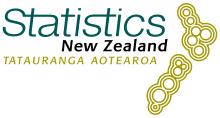
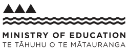
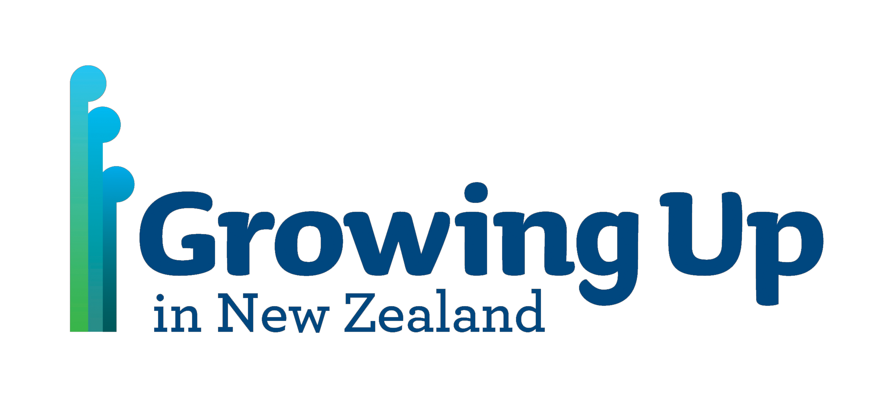
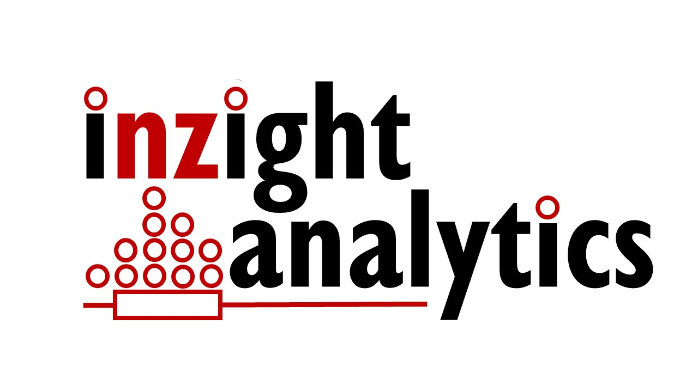

# Our Sponsors

Development of iNZight is made possible by funding opportunities from these organisations:

///HTML:

  

  

  

  

  

  

  

///

If you would like to support iNZight, please get in touch! We are especially open to working with organisations to develop and implement new functionality that makes iNZight better suited to your environment.
