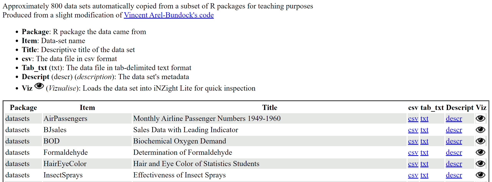

# How can I make online datasets open up in iNZight Lite automatically? {#how}
As an example, we will use the little data set hosted online at https://www.stat.auckland.ac.nz/~wild/data/Census-at-School_1st20.csv.

If you [__CLICK HERE__](http://lite.docker.stat.auckland.ac.nz/?url=https://www.stat.auckland.ac.nz/~wild/data/Census-at-School_1st20.csv&land=visualize) this data set to open in iNZight Lite in Visualize mode with the first variable plotted. 
You can then continue exploring this dataset in visualize mode in the usual way. (To see the raw data, go __File > Display Dataset__.)

The url linked to "CLICK HERE" that made this example work is: 
[http://lite.docker.stat.auckland.ac.nz/?url=https://www.stat.auckland.ac.nz/~wild/data/Census-at-School_1st20.csv&land=visualize](http://lite.docker.stat.auckland.ac.nz/?url=https://www.stat.auckland.ac.nz/~wild/data/Census-at-School_1st20.csv&land=visualize)

The form of the link you need is one of: 
&emsp;&ensp;http://lite.docker.stat.auckland.ac.nz/?url={file}  
&emsp;&ensp;http://lite.docker.stat.auckland.ac.nz/?url={file}&land=visualize  
&emsp;&ensp;http://lite.docker.stat.auckland.ac.nz/?url={file}&land=timeSeries  

where you need to replace __{file}__ by the url address of the data file, e.g., https://www.stat.auckland.ac.nz/~wild/data/Census-at-School_1st20.csv. The data file has to be hosted publicly. There is no provision for any sort of login access.

Generally speaking the ___file name must end in a file-name extension___, e.g. .csv, or .xlsx, that iNZight Lite recognizes. Lite uses this to figure out what the file type is so that it can be imported properly. [An exception is files from Google sheets which are discussed below.]

__What "&land=" does:__ 
&emsp;&ensp;If __"&land=visualize"__ is included Lite will "land" in Visualize mode with the first variable plotted. 
&emsp;&ensp;If __"&land=timeSeries"__ is included Lite will "land" in the time series module with the first series plotted 
&emsp;&ensp;If "&land=" is not included, Lite will "land" at the usual startup screen.

This is a feature of Lite that can easily be expanded if someone approaches us with a compelling use-case.

# How can I instantly add visualization capabilities to my online data repository? {#repositories}

Below is a screenshot from the top of the webpage [https://www.stat.auckland.ac.nz/~wild/data/Rdatasets/](https://www.stat.auckland.ac.nz/~wild/data/Rdatasets/)  
_On the webpage_, if you click on the little eye icon by any dataset, that dataset opens up in iNZight Lite. This page was constructed by linking each little eye icon image to a url of the form described above.<.br>
[going to the webpage and using your browser's "view source" to see the html code] 

{.borderbox .width700}

# How to have Google Forms/Sheets data open up in iNZight Lite {#google-sheets}

[This webpage by Daniel Barnett and Emma Wilson](https://daniel-barnett.github.io/stats_teachers_day_2019/google_forms_tutorial.html) shows collecting data with Google Forms (used to gather data from students in class), which is accumulated into a Google Sheet, and which is then opened up in iNZight Lite so they are their teacher can then immediately analyse it in iNZight Lite in the same classroom session by clicking a link. It also links to an automated iNZight Lite link generator.

[This video by Anna Ferguson](https://www.youtube.com/watch?v=xyrUpBfAJVQ) leads the viewer through the same sorts of process with lots of great teaching ideas along the way.

