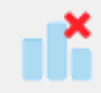

# When I resized the window my plot disappeared{#disappearing-plot}

This is mainly an issue with dotplots. Click the __Redraw plot icon__ shown below ...

&emsp;&ensp;(you can always hover over the icons to see what they do)

# Unwanted colour segmentation in a bar chart{#unwanted-col-bar}

You have a colour-by setting that is still active. Go to __Remove Additions icon__ (_see below_) then check __Remove colour-by__ and then click __OK__.

&emsp;&ensp;(_you can also get to it by going_ __Plot > Remove additions ...__)
  
# Plot didn’t change when I reordered categories and clicked "Reorder"{#reord-cat}

___Reordering categories___ using __Variables > Categorical Variables > Reorder levels ...__ does not create a new graph, it creates a new variable (e.g. myvarname.reord). To get the new (reordered) graph you have to drag/select the new variable.

# How can I get an interactive version of a plot? {#interactive}

Most iNZight plots involving a single graph on a page, have an interactive version available.

look for this little icon ...
 
 &emsp;&ensp;
(blue) there ___is___ an interactive version available_.

&emsp;&ensp;(grey) there is ___no___ interactive version available.

Clicking on the (blue) icon results in an interactive plot popping up in your default browser. If that is a modern browser like Chrome, Firefox or Safari (but not Internet Explorer) this will then give you an interactive version of the graph that lets you query it in various ways like hovering over bars or clicking them. Explore!

The interactive plots can be saved using the browsers' capability for saving a page, but there is a better way (_as follows_)

# Saving your graph as File Type: Interactive HTML{#save-interactive}

___To save a plot___ click the __little disk icon__ or go __Plot > Save Plot__
You will have to supply a name for the file and select File type __Interactive HTML__.
Once saved, the file will automatically open up in your default browser as above.

You can give such files to others. They can be included in other webpages. They do not need to be connected to iNZight to work.

__Notes__

1. By default variables used in making the plot are exported with the plot so they show up with hover-over etc.
2. The __Save Plot__ dialog _for Interactive HTML_ allows other variables to also be exported with the plot so that they too are available for interactivity
3. The __Save__ under the __File__ menu is for saving data files, not for saving plots

# Playing over a set of plots is jerky or too fast/slow {#play}

Windows users can expect jerky transitions between plots in single-window mode. Change to dual-window mode (see [Preferences](../../user_guides/file_options/#preferences)).

 &emsp;&ensp; Play speed is controlled by the Set-timing-options button (tiny clock face) immediately to the left of the Play button.

# Dotplot issues {#dotplot1}

## Dotplot issues {#dotplot2}

# RStudio: plots are not displaying correctly {#rstudio}

Unfortunately there are some differences with RStudio's built-in graphics device, which means some of iNZight's graphs to not display correctly. If you are using R to access iNZight's functions (i.e., by calling `iNZightPlot()`) please use the default R application instead of RStudio, if possible, until we can resolve these issues.

Known issues include:
* dot plots do not display correctly
* interactive plots do not render correctly

# The text and/or points in the VIT modules are too large/unreadable {#unreadable}

This problem has mostly been encountered on Retina MacBook Pros, and is caused by the high resolution of the screen.
This appears to have been a bug in a previous version of XQuartz, and updating this seems to fix the problem.
[Download the latest version here](http://xquartz.macosforge.org/downloads/SL/XQuartz-2.7.8.dmg).

If the above doesn't work, you can use the Preferences to adjust the scaling:

1. Click __FILE__ &gt; __Preferences ...__

2. Adjust the sliders to modify the values (we suggest `ps = 7` and `dpi = 220` for retina Macbook Pros)

3. Click __OK__. A new graphics windows will open up (you can close the old one if it doesn't automatically).

4. Repeat the process if you want to try out different values.

These values will be saved for future sessions. If you have trouble saving (a message will inform you) please contact
<a href="mailto:inzight_support@stat.auckland.ac.nz?subject=[iNZight Technical Enquiry] VIT Preferences">inzight_support@stat.auckland.ac.nz</a>
for assistance.

**UPDATE**: this seems to have been fixed in a new release of XQuartz.
