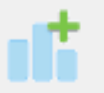

# When I resized the window my plot disappeared{#disappearing-plot}

This is mainly an issue with dotplots. Click the __Redraw plot icon__ shown below ...

&emsp;&ensp;(you can always hover over the icons to see what they do)

# Saving graphs: How do I save my graph from iNZight for use in another document? {#save-graph}
 &emsp;&ensp; Click on the __Save Plot__ icon (or go __Plot > Save Plot__). There many formats available, e.g. pdf, png, … ([See also saving as Interactive HTML files](#save-interactive))  
&emsp;&ensp; In Windows if you are using dual-windows mode, or start up a new graphics window (see below), the graphics window itself offers additional saving and copy/paste options.

# Copy/paste: How do I copy and paste my graph from iNZight into another document? {#copy-paste}
Copy and paste only works in Windows. (Otherwise you have either to use screen shots or [save a graphics file](#save-graph) as above.) 
If you are operating in _dual-windows mode_, the separate R plotting window itself enables you to copy as a _Bitmap_ or as a _Metafile_ by right-clicking or using the __File__ menu ___on the plotting window___ (_Copy as Metafile does not work for dot plots_).  
But if you are in the default _single window mode_ ... 
 &emsp;&ensp;  you will have to open a new graphics window by clicking on the New Graphics Window icon at left (or go __Plot > New Graphics Window__)  

&emsp;&ensp; and then click the Redraw icon to get your plot into the new plotting window.

# I want a different type of plot {#other-plots}
Once you have selected your variables, iNZight instantly delivers a graph with the default plot-type for the combination of variable-types you have specified. In most cases there are many other appropriate choices for plot type. To see (and get) them ...   
 &emsp;&ensp; use __Add to Plot__ and under __Customise Plot Apearance__ (the default initial screen) use the  __Plot type__ selection box. To look quickly at all possibile plots you can click into the box and roll the mouse wheel to scroll through the available plots.

# Titles and axis labels: How do I change them? {#Change-titles-labels}
 &emsp;&ensp; In __Add to Plot__ select __Axes and labels__.

# Barplots/charts: Unwanted colour segmentation in a bar chart{#unwanted-col-bar}

You have a colour-by setting that is still active. Go to __Remove Additions icon__ (_see below_) then check __Remove colour-by__ and then click __OK__.

&emsp;&ensp;(_you can also get to it by going_ __Plot > Remove additions ...__)
  
# Barplots/charts: Plot didn’t change when I reordered categories and clicked "Reorder"{#reord-cat}

___Reordering categories___ using __Variables > Categorical Variables > Reorder levels ...__ does not create a new graph, it creates a new variable (e.g. myvarname.reord). To get the new (reordered) graph you have to drag/select the new variable.

# Dotplots: When I resized the window my plot disappeared {#dotplot-disappearing}
See general item on this [above](#disappearing-plot). 

# Dotplots: I see columns of dots that look like they are suspended in mid-air {#dotplot-hover-midair}
iNZight stacks points that are close together but not identical. This problem occurs when the points are discretely spaced but too big to drop down onto the axis. Either ___reduce the___ __Point Size__ until they drop down,
or widen the plotting window and click the Redraw icon 
  

# Dotplots: How can I add labels to points in the plot? {#dotplot-labels}
 &emsp;&ensp; Under __Add to Plot__ select __Identify points__. Ensure the __Text Labels__ box is checked and select a variable to provide the labels. There are several ways of choosing which points are to have labels attached.

# Playing over a set of plots is jerky or too fast/slow {#play}

Windows users can expect jerky transitions between plots in single-window mode. Change to dual-window mode (see [Preferences](../../user_guides/file_options/#preferences)).

 &emsp;&ensp; Play speed is controlled by the Set-timing-options button (tiny clock face) immediately to the left of the Play button.

# Interactive: How can I get an interactive version of a plot? {#interactive}

Most iNZight plots involving a single graph on a page, have an interactive version available.

look for this little icon ...
 
 &emsp;&ensp;
(blue) there ___is___ an interactive version available_.

&emsp;&ensp;(grey) there is ___no___ interactive version available.

Clicking on the (blue) icon results in an interactive plot popping up in your default browser. If that is a modern browser like Chrome, Firefox or Safari (but not Internet Explorer) this will then give you an interactive version of the graph that lets you query it in various ways like hovering over bars or clicking them. Explore!

The interactive plots can be saved using the browsers' capability for saving a page, but there is a better way (_as follows_)

# Interactive: Saving your graph as Interactive HTML files {#save-interactive}

 &emsp;&ensp; Click on the _Save Plot_ icon (or go __Plot > Save Plot__).  
&emsp;&ensp; You will have to supply a name for the file and select File type __Interactive HTML__.  
&emsp;&ensp; Once saved, the file will also automatically open up in your default browser as above.

You can give such files to others. They can be included in other webpages. They do not need to be connected to iNZight to work.

__Notes__

1. By default variables used in making the plot are exported with the plot so they show up with hover-over etc.
2. The __Save Plot__ dialog _for Interactive HTML_ allows other variables to also be exported with the plot so that they too are available for interactivity
3. The __Save__ under the __File__ menu is for saving data files, not for saving plots

# RStudio: plots are not displaying correctly {#rstudio}

Unfortunately there are some differences with RStudio's built-in graphics device, which means some of iNZight's graphs to not display correctly. If you are using R to access iNZight's functions (i.e., by calling `iNZightPlot()`) please use the default R application instead of RStudio, if possible, until we can resolve these issues.

Known issues include:
* dot plots do not display correctly
* interactive plots do not render correctly

# The text and/or points in the VIT modules are too large/unreadable {#unreadable}

This problem has mostly been encountered on Retina MacBook Pros, and is caused by the high resolution of the screen.
This appears to have been a bug in a previous version of XQuartz, and updating this seems to fix the problem.
[Download the latest version here](http://xquartz.macosforge.org/downloads/SL/XQuartz-2.7.8.dmg).

If the above doesn't work, you can use the Preferences to adjust the scaling:

1. Click __FILE__ &gt; __Preferences ...__

2. Adjust the sliders to modify the values (we suggest `ps = 7` and `dpi = 220` for retina Macbook Pros)

3. Click __OK__. A new graphics windows will open up (you can close the old one if it doesn't automatically).

4. Repeat the process if you want to try out different values.

These values will be saved for future sessions. If you have trouble saving (a message will inform you) please contact
<a href="mailto:inzight_support@stat.auckland.ac.nz?subject=[iNZight Technical Enquiry] VIT Preferences">inzight_support@stat.auckland.ac.nz</a>
for assistance.

**UPDATE**: this seems to have been fixed in a new release of XQuartz.
