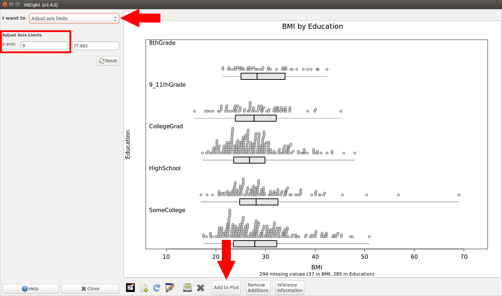

# Dotplots and Histograms for groups don't show group labels {#group-labels-missing}

On some graphics devices*, the group labels aren't being printed to the screen:

[{.width600}](img/plotting_factorlabels1.png)


In iNZight version 2.4.2, a workaround was added that allows you to place the group labels inside the plot.

To do this,
1. Go to __Add to Plot__ > __Customise Labels__
2. Check the box that says __Display inside graph__ (see image below, left)
3. OPTIONAL: if the labels overlap the points on the graph, you can head to __Add to Plot__ > __Adjust axis limits__, and reduce the minimum x-axis value (see image below, right)

[{.width300}](img/plotting_factorlabels2.png)
[{.width300}](img/plotting_factorlabels3.png)
(click image to enlarge)


*This issue is known to occur on the following devices:
- RStudio's built-in device
- Cairo Device (used by iNZight) on
  - Linux,
  - Mac, potentially only if installed manually using R's `install.packages` command.

Please let us know if you experience it on anything else.


# I can't get bar charts to colour by a variable, they just appear one colour (pink) {#barchart-colours}

__The problem:__
This is most likely due to a bug in the CRAN version of [`cairoDevice`](https://github.com/lawremi/cairoDevice).
It will most likely occur if you have installed iNZight using R's `install.packages` command.
The [bug has been fixed](https://github.com/lawremi/cairoDevice/issues/2), but is only available from GitHub via
```
devtools::install_github("lawremi/cairoDevice")
```
This, however, requires several build tools which can be a nuisance to install, so building from GitHub probably
isn't a viable solution.

__The workaround:__
The issue only occurs (as far as we are aware) in the built-in graphics device; opening a new device by clicking
the "new plot window" button
(either from the [plot toolbar](https://www.stat.auckland.ac.nz/~wild/iNZight/user_guides/plot_options/?topic=plot_toolbar)
or the Plot menu) should display the bars in all their glorious colours.


# The text and/or points in the VIT modules are too large/unreadable  {#unreadable}

<div class="note">UPDATE: this seems to have been fixed in a new release of XQuartz.</div>

This problem has mostly been encountered on Retina MacBook Pros, and is caused by the high resolution of the screen.
This appears to have been a bug in a previous version of XQuartz, and updating this seems to fix the problem.
[Download the latest version here](http://xquartz.macosforge.org/downloads/SL/XQuartz-2.7.8.dmg).

If the above doesn't work, you can use the Preferences to adjust the scaling:

1. Click __FILE__ &gt; __Preferences ...__

2. Adjust the sliders to modify the values (we suggest `ps = 7` and `dpi = 220` for retina Macbook Pros)

3. Click __OK__. A new graphics windows will open up (you can close the old one if it doesn't automatically).

4. Repeat the process if you want to try out different values.

These values will be saved for future sessions. If you have trouble saving (a message will inform you) please contact
<a href="mailto:inzight_support@stat.auckland.ac.nz?subject=[iNZight Technical Enquiry] VIT Preferences">inzight_support@stat.auckland.ac.nz</a>
for assistance.

# I can't copy or save dot plots  {#cant-copy-dots}

We are aware of this, and are working on a solution.

In the meantime, if you want to save a dotplot, you'll need to take a screenshot.
