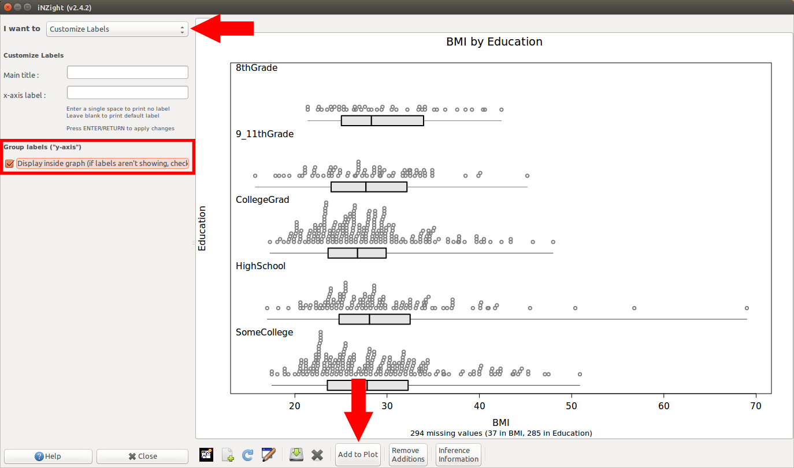

# Dotplots and Histograms for groups don't show group labels {#group-labels-missing}

On some graphics devices*, the group labels aren't being printed to the screen:

[{.width600}](img/plotting_factorlabels1.png)

In iNZight version 2.4.2, a workaround was added that allows you to place the group labels inside the plot.

To do this,
1. Go to __Add to Plot__ > __Customise Labels__
2. Check the box that says __Display inside graph__ (see image below, left)
3. OPTIONAL: if the labels overlap the points on the graph, you can head to __Add to Plot__ > __Adjust axis limits__, and reduce the minimum x-axis value (see image below, right)

[{.width300}](img/plotting_factorlabels2.png)
[{.width300}](img/plotting_factorlabels3.png)

*This issue is known to occur on the following devices:
- RStudio's built-in device
- Linux Cairo Device (as used by iNZight)

Please let us know if you experience it on anything else.

# I'm not getting complete plots

This issue was fixed with __iNZightVIT v2.0.3__. Running the __UPDATE_iNZightVIT__ file should fix the issue.

If not:

1. Go to __File__ &gt; __Home__. This will take you back to the __iNZightVIT__ start-up window

2. Click __Start iNZight__ and iNZight will load up instantly

This works like a "Reset", but is much faster than crashing out and restarting from scratch

# The text and/or points in the VIT modules are too large/unreadable

This problem has mostly been encountered on Retina MacBook Pros, and is caused by the high resolution of the screen.
We do not yet have a perfect solution, but for now we have implemented a tool to help get things looking as good as possible.

1. Click __FILE__ &gt; __Preferences ...__

2. Adjust the sliders to modify the values (we suggest `ps = 7` and `dpi = 220` for retina Macbook Pros)

3. Click __OK__. A new graphics windows will open up (you can close the old one if it doesn't automatically).

4. Repeat the process if you want to try out different values.

These values will be saved for future sessions. If you have trouble saving (a message will inform you) please contact
<a href="mailto:inzight_support@stat.auckland.ac.nz?subject=[iNZight Technical Enquiry] VIT Preferences">inzight_support@stat.auckland.ac.nz</a>
for assistance.
