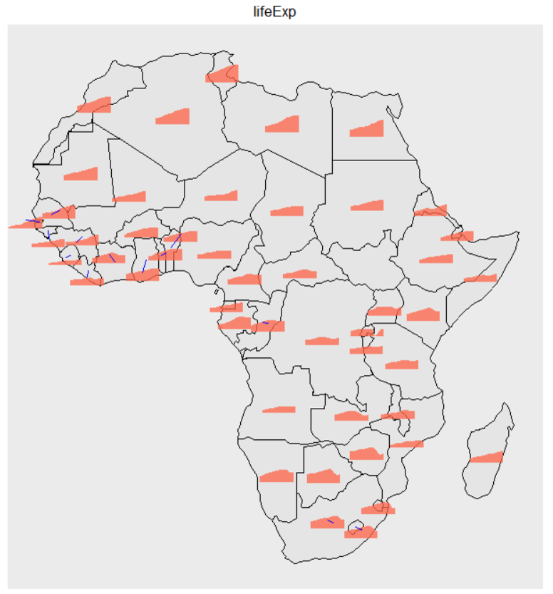

# About Presenting Data on Maps
(_This article gives an overview of plotting data on maps. It is not software documentation. The software documentation is_ [ here ...](../../user_guides/add_ons/?topic=maps))

Plotting data on maps is a specialised area that is quite different from normal graphing. This article describes the sorts of data we can present using maps and ways in which we can use maps in constructing data visualisations to help ourselves and others better understand that data. 

We start by outlining the types of data that are appropriate for presentation on maps and then go on to show ways of visualizing data using maps; addressing important issues about using maps for data visualization as they arise.   

_Everything you see illustrated in this article is very fast and easy to obtain using iNZight's Maps module_. 

 
 ## The types of data most commonly plotted on maps

 The two types of data most commonly plotted on maps are ___location___ (or coordinate) data and ___regional___ data.

* [__Location data:__](#Location) This is data on things that have happened at particular _geographical __locations___. The most widely understood way of specifying a location is by its ___Latitude___ and ___Longitude___, though there other location coordinate-systems. Additional variables give information about what happened there,
  * __Example:__  the data below on earthquakes in New Zealand in the year 2000 where we have information about where the epicentre of the quake was (latitude and longitude), how deep underground it was, how strong it was, when it occurred, and several other variables. 

 {.width600}

 
* [__Regional data:__](#Regional) This is (region-level) data on different geographical regions. By regions we mean things like countries of the world; or states/counties/electoral districts within a country. The associated variables usually give summary measures for each region,  
    * __Example:__ the table extract below shows data on different countries of the world which includes: the year the data relates to, average life expectancy, population size, and GDP per capita.

 {.width500}

(<i>In this data</i>, continent <i>could also be used as a region variable if our data was recorded at the level of continents</i>)

	
___Statistical exploration of data using maps___ is typically concerned with ___finding patterns in the data that are related to geography___, leveraging off what we can see about what is close to what (or far from what), and the reminders the maps give us of our own general knowledge about different locations. We are particularly looking for patterns that make some sort of sense (or are interesting) geographically, and any notable exceptions to those patterns.

## Plotting Location data   {#Location}

With location data we start by plotting the locations (latitudes and longitudes) on the map using some form of plotting symbol (e.g. a circle). But doing that that just shows us the locations for which we have data. It does not communicate any of the information we have about what happened at each of those locations. So we need ways of putting the additional information from some of these other variables onto the map as well.

 {.width600}

(<i>We have sized by the intensity of the earthquake and coloured by its depth </i>)

### Adding more information than just locations

(_for static, dynamic  and interactive maps_)  
___Relate the values of different variables___ to some of the following:  
&emsp;&emsp; - ___Size_:__ 	the size of the plotting symbol   
&emsp;&emsp; - ___Colour_:__ the colour of the plotting symbol  
&emsp;&emsp; - ___Shape_:__ 	the shape of the plotting symbol   
&emsp;&emsp; - ___Opacity_:__ the opacity vs. transparency of the plotting symbol  
&emsp;&emsp; - ___Labels_:__ Put labels by the points (names, numbers)  
Also,  
&emsp;&emsp; - ___Connect points by lines_:__ if the data is in time order this conveys information on the order in which  
&emsp;&emsp;&emsp;&emsp; things happened (and, e.g., trace the migration path of a whale)  
&emsp;&emsp; - ___Have the points appear sequentially in time order_:__ another way of conveying the sequence of events (_not implemented in iNZight yet_)  

(_for [interactive maps](#InteractLoc) only_)  
&emsp;&emsp; - ___Hover over_:__ 	Display the values of variables when the mouse hovers over a point  
&emsp;&emsp; - ___Select/Brush_:__ 	When points on the map are selected in some way, initiate some sort of new display.  
&emsp;&emsp;&emsp;&emsp; This make be as simple as showing labels and variable values, or we could throw up some new graph,  
&emsp;&emsp;&emsp;&emsp;  or highlight related features in another graph

   
### Subsetting/Faceting
  
&emsp;&emsp; - ___Array of maps_:__ let’s you see a lot of maps at once and compare them  
&emsp;&emsp; - ___Playing through a sequence of maps_:__ Can be good for looking at changes (e.g. over time)
 

 {.width871}

(<i>Here we have a different map for every month of the year</i>)

 {.width400}

(<i>Small animated gif to show the effect of playing through subsets (here =  playing through the months)</i>)

###Interactive Map plots {#InteractLoc}

__Example__  
Here is an interactive version of the February plot. This one responds to hovering over points, and selecting a set of points by left-clicking and dragging. Which variables get displayed when hovering is controlled by te "Variables to display" dialog a the top of the frame. When a set of points is selected by dragging, their data values appear in the Table.  Clicking on "Table" at the top of the frame toggles between removing the Table and bringing it back again.  

<iframe src="../../img/user_guides/advanced/aboutmaps/FebQuakes.html" style="border:2px;" height="800" width="1200"></iframe>

###Contour plotting
  
(cf. the contours of equal atmospheric pressure ("isobars") on a weather map, or of equal altitude on a topographical map -- _Still to be written- not implemented in iNZight yet_)

## Plotting Regional data {#Regional}

Typically people colour regions of a map according to the value of a (single) variable. Such maps have historically been called ___choropleth maps___. If the colouring has been done according to the values of a continuous variable the result is sometimes called a _heat map_. <small>(Different shading patterns are sometimes used as an alternative to using different colours.)</small>

 {.width500}

   

### Issues:
* __Matching data points with regions on a map:__ Mapping software typically draws regional maps using so-called ___shape files___ which contain the boundary of each region (as the vertices of a polygon) and the names of the regions.  To produce a choropleth map, the shape file is used to draw the outlines of each region. Then a variable in the data set containing the names of the regions has to be matched with a corresponding naming-variable in the shape file so the program knows what observations in the data file correspond to what regions on the map.  
   * Several sets of name variables are often included in a shape file (e.g. the set off full names and a parallel set of common abbreviations) to make it more likely that there will be a set of names that matches with the region-name variable in a data set. Otherwise the names in the data set will have to be changed to conform with one of the naming conventions available in the shape file.
* __Labels:__  Viewers will seldom reliably know which regions are which just by looking at the map so name-labels are often added (e.g. the names of each state or their abbreviated form). The numeric value of the plotted variable might also be added for each region.

 {.width500}

* __Scales:__ Each map only displays the values of a single variable (in addition to region), but we can look at the behaviour of several variables at the same time if we put several maps on the same page, one for each variable.

 {.width700}

(<i>GDP per capita and Life Expectancy are measured on very different scales</i>)

&nbsp;

* Then the issue of what to do about scales becomes important. Are the scales the variables are measured on comparable? (e.g., are they all percentages?)
 * ___Non-comparable scales case_:__ When the scales are not comparable (as with GDP per capita and Life Expectancy in the plots above) we translate values to colours in graphs independently of one another

  {.width700}

(<i>One map shows the proportion of medical centres accepting Medicaid and the other accepting Military Insurance</i>)

 * ___Comparable scales_:__ But when the different variables are measured on the same scale (as in the plots above where both variables are proportions), we generally want to translate variable-values to colour values in the same way for all of the graphs
 
  
  
* __Distortions due to land area:__ Colouring regions misleadingly makes large unpopulated areas look more important than smaller highly populated areas (e.g. US political maps produced in this way misleadingly make the unpopulated centre regions of the country look much more important contributors to election results than the heavily populated coastal regions)
  * __Alternatives__ that try to get around this problem__:__
      * __Colour superimposed symbols rather that the regions themselves:__ Use colour shapes (e.g. disks) centred at the centre of each region and size the shapes proportional to population
      * __Cartograms:__ distort the shapes in the map so the region sizes are approximately proportional to population sizes (_not implemented in iNZight yet_)
      * __Dots:__ pepper regions with coloured dots, with each dot representing the same number of people  (_not implemented in iNZight yet_)

{.width600}

(<i>Shading versus population-sized centroids</i>)

	  
* __Conveying several variables on a single map__
  * There are a variety of multivariate glyphs that can be used as superimposed objects (instead of colouring regions)
* __Changes over time (or values of some other variable):__ 
  * __Playing through a sequence of maps:__ Can be good for looking at changes over time  
  * __Superimpose glyphs__ that are a mini time-series 
      * Interactive graphs link to more detailed time series in various ways
 
 {.width871}

(<i><b>Playing through a sequence</b> of maps, <b>one for each year</b> - animated gif</i>)

 &emsp;
 
{.width400}

(<i>Drawing a mini time-series for each country</i>)

 
### Interactive Plots {#InteractReg}
 
Preview of Example (_still image_)

{.width700}

(<i>Linking countries and detailed time series</i>)

__Example__ of an interactive plot for showing changes over time with time series
 
There is a great deal of interactivity besides hover-over in this plot. Clicking on a Country (but not on the little icon within the country) highlights the detailed time-series plot for that country on the right. Holding down the shift key while you click enables you to add countries. You can likewise hover over the set of time series on the right-hand plot to discover details, or click (or shift-click) to link back to the map on the left. You can also pan (click and drag) and zoom (mouse wheel) on the map plot to get closer to small areas.

<iframe src="../../img/user_guides/advanced/aboutmaps/AfricaOverTime_Spark.html" style="border:2px;" height="800" width="1200"></iframe>

__Example__ of an interactive plot for showing changes over time using a "movie"

Click "Table" to remove the table. You can change the year using the slider at the upper-right, or play across years by clicking play button just under it. You can change the variable being represented on the map by changing "Variable to display". Panning and zooming works here to0.
 

<iframe src="../../img/user_guides/advanced/aboutmaps/AfricaOverTime_Shaded2.html" style="border:2px;" height="800" width="1200"></iframe>

### Some more issues

(_yet to discuss_)

* Map projections
* Colour palettes – what’s good for what
* Compensating for deficiencies in colour perception – augmenting maps with complementary plots/tables

