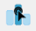

# Maps

### If you have never used the Maps module

Plotting data on maps is a specialised area that is quite different from normal graphing. The article [here](../../user_guides/add_ons/?topic=aboutmaps) tells you about the sorts of data that we can present using maps and ways in which we can use maps in constructing data visualisations.

[[ VLITE ??  || 
The Maps module is not part of the initial installation of iNZight. It downloads and installs automatically the first time you try to launch it by going  __Advanced > Maps__]] 

## Selecting data type

The iNZight Maps module can handle two types of data, ___Coordinate___  data and ___Regional___ data. The first step is to tell the program whether you have _Coordinate data_  or _Regional data_. 

The program behaves differently depending on this choice. The documentation deals first with Coordinate data and then with Regional data.

 * ___Jump to ...___ [Coordinate data](#coordinates) |  [Regional data](#regions)
 
The __nzquakes__ data obtained available from __File__ > [[ VLITE ?? __Dataset Examples__ || __Example data__ ]] and selecting the 
 __Maps__ [[ VLITE ?? category || module ]] is an example of _coordinate data_. The __NSSATS__ data also available there, is an example of _regional data_.

## Geographical Co-ordinate Data  {#coordinates}

iNZight will try to guess the __Latitude__ and __Longitude__ variables  automatically, but you will have to select them manually if they have nonstandard names.

Once you've selected those, ___click_ "OK"__ and iNZight will plot your data on a map.

 {.width700}

[___This only works if you are connected to the internet___ because iNZight Maps ___downloads___ appropriate [Stamen map](https://stamen.com/opensource/) tiles (via ggmap) to form the background of the plot]

Plot appearance can be changed and information about other variables added to the plot using the following controls.
* Click on the __"+"__ ___buttons___ to expand the option panels

###__Extra Plot Options__: 
iNZight Maps ___downloads___ appropriate Stamen map tiles (via ggmap) to make the background of the plot
 
__Map-type:__ options are ___terrain___ (_default_ - coloured terrain map with some features named), ___terrain-background___ (no added names), ___toner-lite___ (white map on grey background) and ___toner___ (white map on black background).

__Overall point size__ (_Slider_)__:__ scale everything drawn on top of the plot/map to a chosen multiple of their current sizes (default =1)

### __Colour__: 

_Either choose a ..._  
&emsp;&ensp;__Point colour:__ select a single colour to apply to all of the points  
_Or select the names of a ..._  
&emsp;&ensp;__Colour by _variable___ to differentially colour points according the values of the chosen variable.

___Additional options__ which appear once a __Colour-by__ variable has been selected_:
* __Palette__ for selecting a colour palette
* __Reverse palette__ (_check-box_)__:__ Reverse the way the values of the colour-by variable are mapped to colours (smallest-to-biggest/biggest-to-smallest)
* __Use percentiles__ (_check-box_)__:__ Apply the colour range according to the percentiles of the colour-by variable instead of its raw values.
* __Cycle levels__ (_categorical colour-by variable_)__:__ Clicking the arrow icons results in just the points from one category at a time being highlighted, with the others dimmed
* __Cycle quantiles__ (_numeric colour-by variable_)__:__ Behaves in the same way with just the points in a quantile being highlighted. By default just 4 quantiles are used (useful if the colour-by variable is highly skewed), but …
 *	__\#quantiles__ allows you to change 4 to some other number of quantiles
* __Back cycle _icon___ results in all of the points being highlighted again

### __Size__: 

__Overall__ (_slider_)__:__ Multiply the current size of each point by value chosen (default value 1)

__Size by:__ Select a variable to differentially size the points by  (i.e., size according to the values of the chosen variable)

___Additional option__ which appears once a __Size-by__ variable has been selected_:
* __Resize method:__ make the area of the point either ___proportional___ to the value of the size-by variable, or ___emphasize___ (map the smallest values to a hard-coded small point-size and the largest to a large size – sometimes useful when the ratio largest/smallest is not very big)

### __Transparency/Opacity__: 

__Overall__ (_slider_)__:__ Adjust the transparency levels of all of the points uniformly (default value 0 = no change; maximum makes all points completely transparent) 

__Opacify by:__ (Opacity is the opposite of transparency) Select a variable to differentially set the opacity the points by (high values map to most visible, low to most transparent)

___Additional option__ which appears once a __Opacify-by__ variable has been selected_:

* __Reverse opacification__ (_check-box_)__:__ Reverse the way the values of the opacify-by variable are mapped to opacity/transparency levels

[[ VLITE ??  - __Connect points by lines__: Select to reveal the line colour selection and draw lines between points
||
]]
### __Point Symbol__: 

__Symbol:__ Select from _circle_, _square_, _diamond_, _triangle_ and _inverted triangle_

__Filled in symbols__ (_check-box_)__:__ Click to fill in all symbols

__Symbol by:__ Can be done according to a categorical variable which has 5 or fewer categories  
* __Symbol line width:__ Line-width multiplier

### Connect Points:

__Connect points with lines__ (_check-box_)__:__ Check the box to draw lines between points. Connected in the order they appear in the data file. 

### __Sub-setting__: 

___Works the same way___ as in the ___main part of iNZight___, you can generate subsets by selecting a variable from either one or both of the subset menus.

Subset selection ___sliders___ and ___play buttons___ _appear_ once a subset-by variable has been selected.
 
### Interactive Coordinate Maps

{.width36}
When you click on the ___Interactive plot icon___ (immediately above), iNZight makes a temporary interactive html file and opens it using your default browser.

* Interactive versions of the maps are ___not available when there is more than one map___ in the plotting window 

To save a permanent file, click on the ___Save Plot icon___, or go __Plot > Save Plot__.  
Choose the __interactive HTML__ as your file type.

These files work independently of iNZight

___
___

## Data on Geographical Regions {#regions}

{.width300}

In many cases, you might have data with regional information (where "region" can be countries, states, provinces, electorates, etc.).

iNZight allows you to display this information on a map of outlines, with each region coloured according to the value of a chosen variable. (Some alternative representations  are also catered for.)

* _Jump to ..._ [Selecting a map](#SelectMap) | [Plotting data on the map](#PlotOnMap) | [Multiple observations per region](#MultiObs) | [Interactive maps](#InteractiveRMaps)

## .... Selecting a  Map {#SelectMap}

{.width600}

### Select Map

Choose either __Use inbuilt Map__ (_default_) to use one of the maps already in iNZight  
&emsp;&ensp;(choose from a selection of maps of _Continents_, several _Countries_, and _World_ maps)   
or __Import Shapefile__ to start up a dialog for reading a shape file stored on your computer

Then click … __Import Map__

### Select Variables
When a map has been imported, iNZight will also try to find a variable in your data file which best matches one of the region-naming variables on the map. It will display the names it has found beside __Data variable__ and __Map variable__. Selection boxes allow you to select replacement variables for these two roles.
* ___Selection boxes___ allow you to ___change the variables___ used for each of these two roles.

___It will also draw the map___. Regions for which _data is present_ in the data set are shaded _green_.  
Any Regions which have _no data_ are shaded _orange_.

{.width800}

__Unmatched Data:__  
The names of any Regions in the data that are not represented in the map will be listed here once the map has been imported. You can decide to use the map anyway or exit maps and go back to your data to do something about the non-matching names. 

__Multiple observations for each region were found: (_only appears when this is true_)__  
This often happens when, for example, we have observations for a region for several different years with different years corresponding to different rows in the data set.  
  The module will then try to find a variable that “explains” the multiple observations. We are called it a "_sequence variable_"  
&emsp;&ensp;* __Select sequence variable:__ If an “explaining variable” is found its name will be displayed in the selection box. You have the freedom to change it

__Use Map__ (_Button_)__:__ __Click__ to tell the program "___I want to use this map___"  
    * The program will then replace the map-selection command panel with a new command panel for plotting. An unshaded map with the appropriate boundaries will appear (as follows)

{.width500}

## .... Plotting data on the Map {#PlotOnMap}

If you are using this module for the ___first time___ it is best to ___ignore___ the __Map Options__ and __Extra Plot Options__ paragraphs initially and see how the plotting of variables works. So that is what we are going to discuss next.
* _Jump to_ ... [Map Options](#MapOptions) | [Extra Plot Options](#ExtraPlotOptions)

### Select Variable/s to display
Click on the name of the desired variable and it will display on the map

{.width600}

If you ___select several variables___ you will get a map plot for each of those variables …

{.width500}

__Regions__ _radio button_ gives ___shaded maps___ … 
 
{.width600}

 
__Centroids__ _radio button_  gives …

{.width600}

___Additional options___ _that become available_ ___when Centroids___ _is turned on_:  
&emsp;&ensp;__Size by:__  (_typically use a relevant population-size variable_)  
&emsp;&ensp;__Overall size__ (_slider_)__:__ makes the disks bigger or smaller uniformly  
&emsp;&ensp;__Transparency of map__ (_slider_): transparency of map outlines  

{.width300}

### Map Options {#MapOptions}

__Current Map:__ Opportunity to change your mind and select a different map   
__Regional selection boxes:__  use to remove regions from the plotted map  
__Projection__ (_dropdown list_)__:__ Opportunity to change the map projection (default is the projection suggested by the shapefile)

### Extra Plot Options: {#ExtraPlotOptions}

__Plot Title:__ change plot title  
__Palette:__ change colour palette  
___Check boxes_: Dark__ (makes sea go dark), __Grid Lines__ (use to add), __Axis labels__ (use to add)  
__Map Scales:__ Choices for _independent scales_/_same scale_ to be used across a set of plots   
__Font Size__ (_slider_):
__Region Labels__ (_check box_)__:__ add labels  
___Additional options___ _that become_ ___available when Region Labels___ _are turned on_ :  
&emsp;&ensp;Selection box for selecting ___variable___ to use ___for labelling___   
&emsp;&ensp;__Region label font size:__ (_slider_)

### Dataset has multiple observations per region {#MultiObs}
(_only appears when this is true_)

{.width600}
 
* __Single value:__ display just the last value  
___Additional options___ _that become available_ ___when_ Single Value__ _is chosen_:  
&emsp;&ensp;__Value of ... variable__ (_slider_) __:__ choose value of the explaining variable (e.g. year)   
&emsp;&ensp;___Play button___ and ___playback timer button_:__ controls playing through the values/images 
* __Aggregate:__ display an aggregate of the values (e.g. mean, median)  
* __All Values:__ display mini time-series glyph ("___sparklines___") for each region  
___Additional options___ _that become available_ ___when_ All Values__ _is chosen_:  
&emsp;&ensp;__Sparklines__ can be plotted for  ___Absolute___ (the raw numbers), ___Relative___ (ratio to the first value), ___Percent Change___ (between successive observations)  
&emsp;&ensp;__Overall size__ (_slider_) __:__ controls size of the sparkline glyphs  
&emsp;&ensp;__Transparency of map__ (_slider_)__:__ transparency of map outlines

{.width600}

___
 
### Interactive Maps {#InteractiveRMaps}

{.width36}
When you click on the ___Interactive plot icon___ (immediately above), iNZight makes a temporary interactive html file and opens it using your default browser.

* Interactive versions of the maps are ___not available when there is more than one map___ in the plotting window 

To save a permanent file, click on the ___Save Plot icon___, or go __Plot > Save Plot__.  
Choose the __interactive HTML__ as your file type.

These files work independently of iNZight
