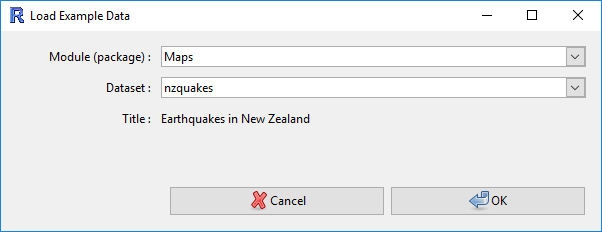
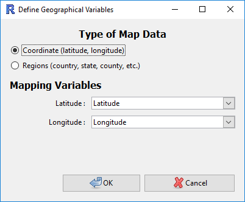
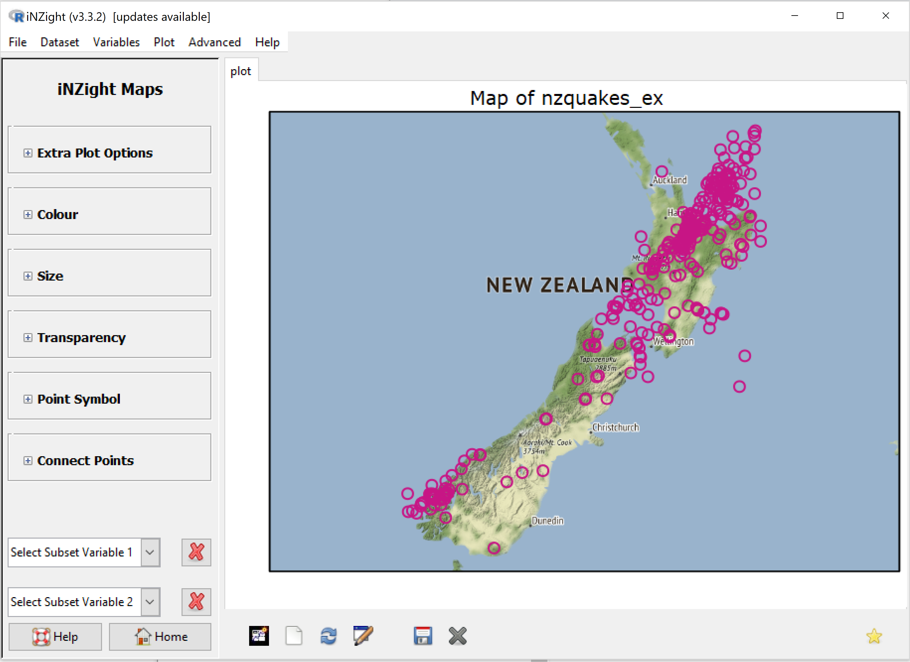
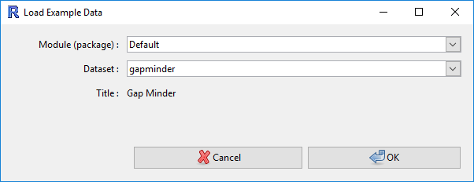
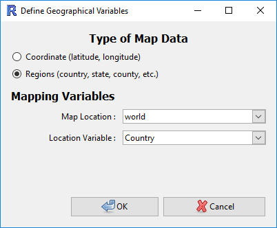
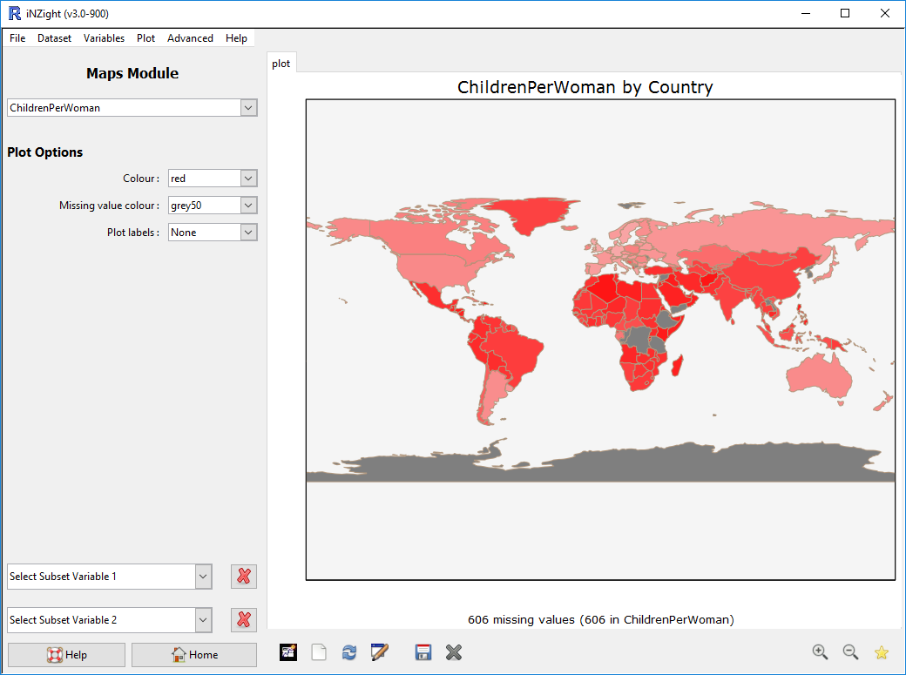
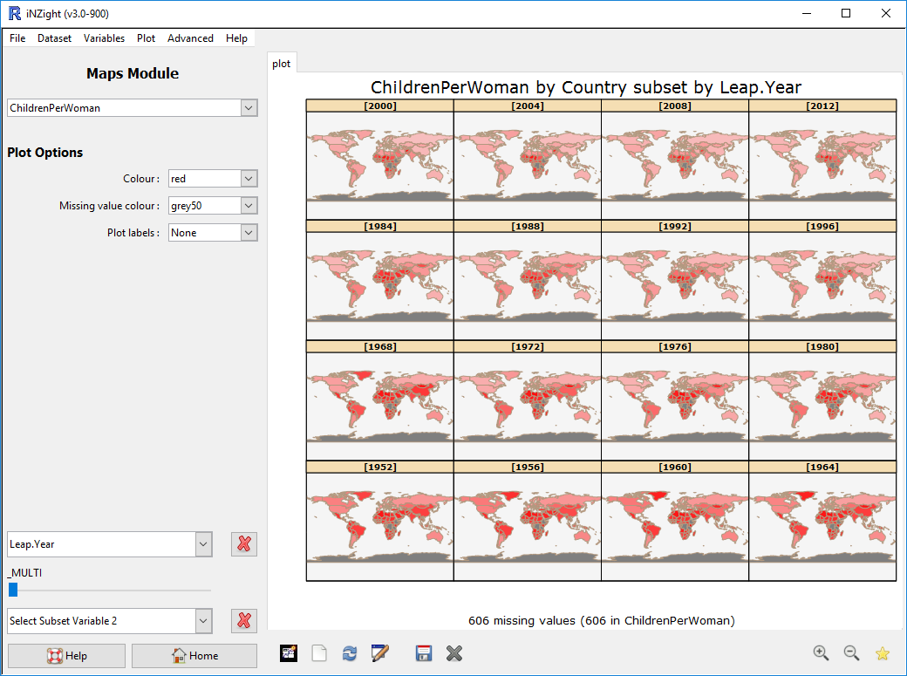
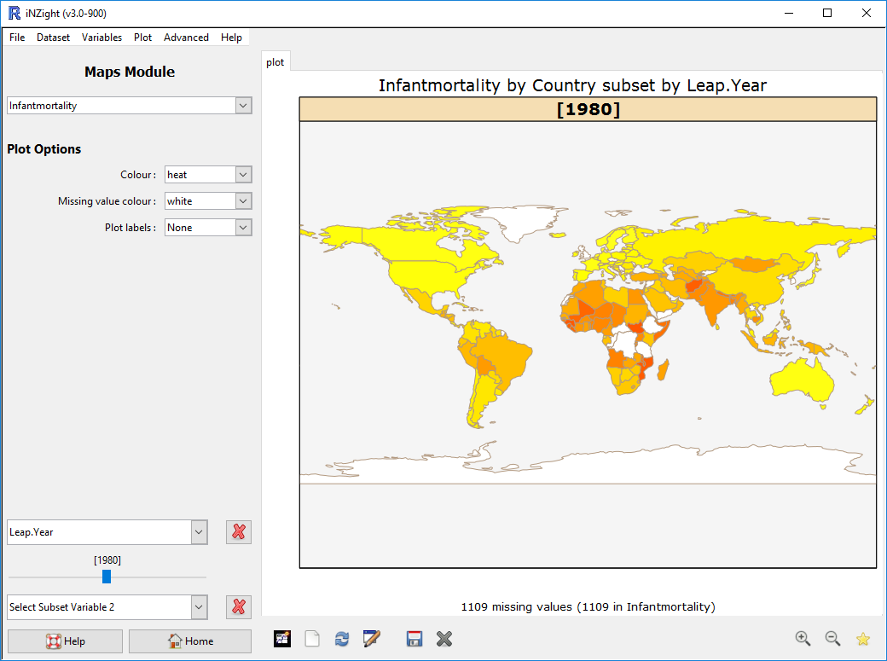

# Maps

The Maps Module aims at making it easy to visualise geographical data on a map, and investigate patterns of variables.
There are two situations that iNZight can handle:

1. [Each observation has a __co-ordinate__ value](#coordinates), or
2. [The data are associated with __regions__](#regions) (such as __Countries__, __states__, etc).

## Geographical Co-ordinate Data  {#coordinates}

Co-ordinates give a unique position of any point on the Earth.
The __latitude__ defines the __vertical y position__ (North/South), while the __longitude__ defines the __horizontal x position__ (Eash/West).

In this example, we will be using the __New Zealand Quakes 2000__ data, which you can load by going to __File__ > __Example data__, selecting the __Maps__ module, and choosing the data __nzquakes__ (see screenshot below).

Once this is loaded, you can launch the Maps module from __Advanced__ > __Maps__.

  NOTE: The first time you launch it, you'll need to download the module - this will happen automatically.

## Selecting the Variables

When you launch the maps module, you'll be presented with a window to let you select the variables to use.

First, make sure the __Coordinate__ option is selected, and then specify the Latitude and Longitude variables (iNZight will try to guess these automatically, but you might need to select them manually if they have nonstandard names).

Once you've selected those, click "Ok" and iNZight will plot your data on a map!

 {.width600}

## Coding More Variables

Once you've got a map displayed, you can explore trends by coding features of the plot:

- __Colour by__: points will be coloured by the chosen variable.

- __Size by__: the area of each point will be proportional to the value of the chosen variable.

- __Opacify by__: the opacity (how visible the points are) will be proportional to the value of the selected variable.

- __Sub-setting__: as with the main iNZight program, you can generate subsets by selecting a variable from either one or both of the subset menus.

## Plot Options

- __Map type__: iNZight Maps uses Google to provide the map, of which there are several type to choose from:

    - __roadmap__ - this is the default, and, not surprisingly, shows roads
    - __satellite__ - this map type uses satellite imagery
    - __terrain__ - this map type shows the terrain
    - __hybrid__ - combines road map and satellite maps

- __Colour__: allows you to select the colour of points (only if __Colour by__ is empty)

- __Point size__: this lets just adjust the overall size of points

- __Transparency__: this adjusts the overall transparency of points, where 0 is fully visible, to 1 is fully invisible.

- __Zooming__: You can zoom in on an area of points by clicking the __zoom__ icon (magnifying glass) in the plot toolbar (bottom right of the screen), and then clicking a point on the map to zoom in to.

### And there's more to come!

The maps module is still being developed, and there's a lot we are waiting to release!

- __Colour palettes__: this will give you a far better choice of colours, letting you customise your plot even more.

## Geographical Regions {#regions}

In many cases, you might have data with regional information (where "region" can be countries, states, provinces, electorates, etc.).
iNZight allows you to display this information on a map of outlines, with each region coloured depending on a chosen variable.

In this example, we will be using the __Gap Minder__ data, which you can load by going to __File__ > __Example data__, selecting the __Default__ module, and choosing the data __gapminder__ (see screenshot below).

Once this is loaded, you can launch the Maps module from __Advanced__ > __Maps__.

  NOTE: The first time you launch it, you'll need to download the module - this will happen automatically.

## Selecting the Variables

When you launch the maps module, you'll be presented with a window to let you select the variables to use.

First, make sure the __Regions__ option is selected, and then specify the following information:

- __Map Location__: this is the overall location of your data. For this example, the Gap Minder dataset contains data on countries, so we have selected the __world__ map.

- __Location Variable__: this dropdown tells iNZight which variable in the dataset contains the geographical location. In the Gap Minder dataset, the variable __Country__ contains the names of countries.

Once you've selected those, click "Ok" and iNZight will load the necessary files.

## Plotting Variables

To generate a map and display your data, select a variable from the dropdown at the top-left of the window. Here, we have chosen __ChildrenPerWoman__.

 {.width600}

## Sub-setting the data

As with the main iNZight program, you can view multiple subsets easily by selecting a sub-setting variable. In the image below, we have selected __Leap.Year__, which contains a factor version of the year for each record.
This allows us to see how the average number of children per woman changes over time.

 {.width600}

## Plot Options

There are several plot options available in this module.

- __Colour__: you can adjust the colour used on the map from here. At the bottom, there are two options, __heat__ and __terrain__, which offer alternative colour palettes. The screenshow below uses the __heat__ palette.

- __Missing value colour__: To make missing values more or less visible, you can modify the colour used to shade those regions.

- __Plot labels__: this lets you add labels to the plot. The options are __Name__, which adds the region names, __Value__, which adds the value of the chosen variable, and __Both__, which adds the Name and Value.

- __Zooming__: You can zoom in on a region by clicking the __zoom__ icon (magnifying glass) in the plot toolbar (bottom right of the screen), and then clicking a point on the map to zoom in to.

 {.width600}
