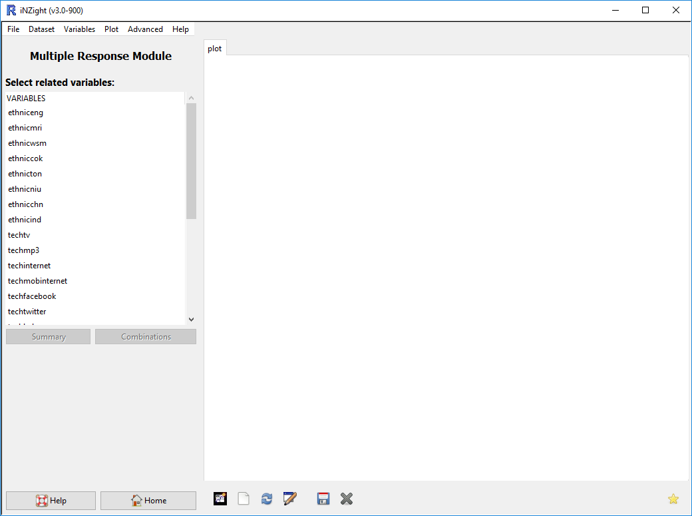
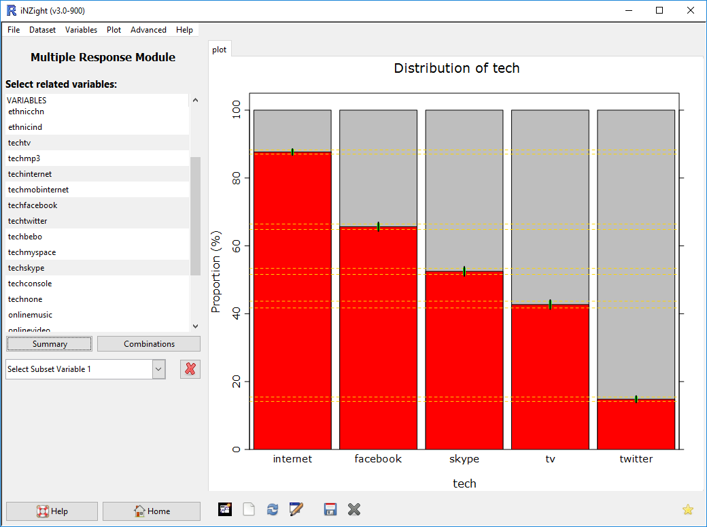
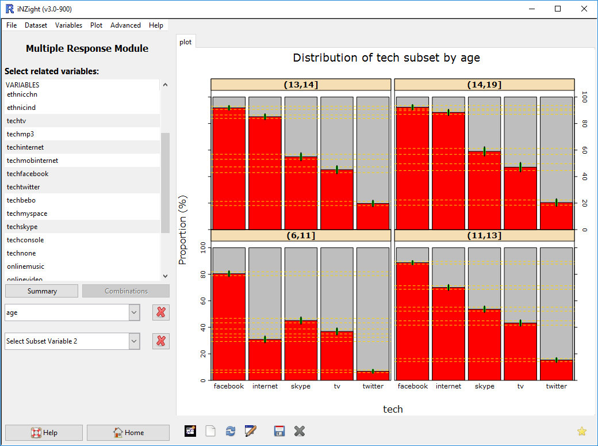
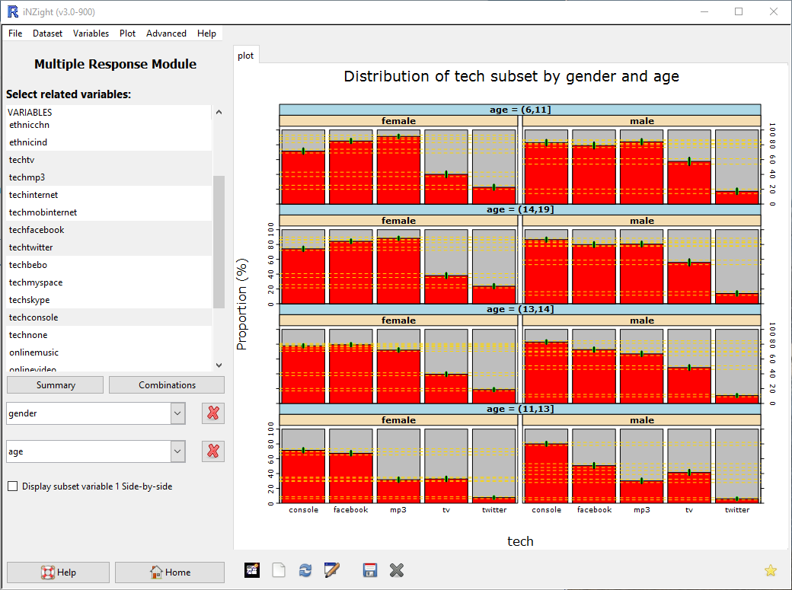
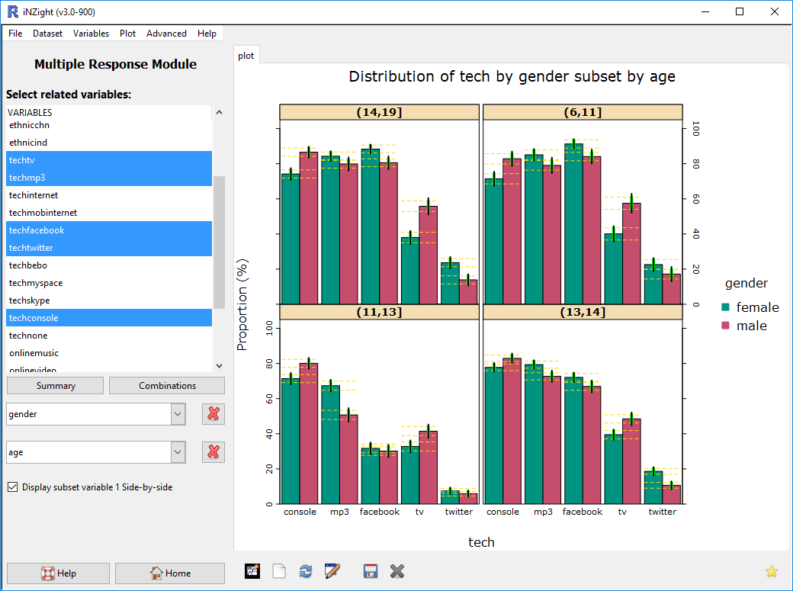

# Multiple Response

A module that provides the ability for analysing data with multiple (binary) response options. Think of this as a checkbox answer, as opposed to a radiobox:

<h3>Standard factor variable</h3>
  <form>
    What's your favourite fruit?
    

      <input type="radio" name="radio" value="apple"> Apple
      <input type="radio" name="radio" value="banana"> Banana
      <input type="radio" name="radio" value="pear"> Pear
      <input type="radio" name="radio" value="orange"> Orange
    

  </form>

  <h3>Multiple Response variable</h3>
  <form>
    What fruit do you like?
    

      <input type="checkbox" name="radio" value="apple"> Apple
      <input type="checkbox" name="radio" value="banana"> Banana
      <input type="checkbox" name="radio" value="pear"> Pear
      <input type="checkbox" name="radio" value="orange"> Orange
    

  </form>

The first only lets you provide one option, so the variable only has one column in the dataset:

| person.id | fav_fruit |
| ---------:| --------- |
| 1         | pear      |
| 2         | apple     |
| 3         | orange    |
| 4         | apple     |

The second, however, needs a column for each possible answer:

| person.id | fruit_apple | fruit_banana | fruit_pear | fruit_orange |
| ---------:| -----------:| ------------:| ----------:| ------------:|
| 1         | 1           | 0            | 1          | 0            |
| 2         | 1           | 0            | 1          | 1            |
| 3         | 1           | 1            | 1          | 1            |
| 4         | 1           | 0            | 0          | 0            |

Analysing these are going to require two difference approaches, and that's where the Multiple Response module comes in!

__Quick note on coding__: in the table above, we've used 1's and 0's to code whether or not someone checked the box. This is the easiest way, however you can also provide "yes" (=1) or "no" (=0) if you prefer.

## Getting Started

First, you'll need to load an appropriate dataset (i.e., one that has data coded like the table above).
For this example, we will be using the __Census at School 5000__ dataset, which you can load by going to __File__ > __Example data__, select __Multiple response__ as the module, and __census.at.school.5000__ for the data.
Once you've loaded this, you can go to __Advanced__ menu and click __Multiple Response__, which will load the module.

 {.width600}

The __Census at School 5000__ dataset contains several variables, each with multiple responses.
Here, we will investigate __tech__: each student was asked to select all technologies they have used.

## Generating Graphs

Once you've loading the Multiple Response window, you'll be able to select variables to compare.
In our example, we will use the variable __tech__, and select the respones __tv__, __internet__, __facebook__, __twitter__, and __skype__.

HINT: To select multiple variables, hold the <code>CTRL</code> key (or Command on Mac).

 {.width600}

The Summary and Combinations buttons will give you summary tables of the data, and a "visual" graph of the combinations occurring in the dataset.

## Sub-setting the Graph

As with the main iNZight module, you can split the graph into several __subsets__ to better explore trends.
In the example below, we have selected __age__ as the sub-setting variable. Because age is a numeric, iNZight has divided it into four groups.

 {.width600}

To delve further into trends, you can use two sub-setting variables.
First, we'll pick a new set of responses: __tv__, __mp3__, __facebook__, __twitter__, and __console__.
The first sub-setting variable is __gender__, and the second is __age__.

 {.width600}

If we want to more easily compare the first sub-setting variable, we can check the box __Display subset variable 1 side-by-side__:

 {.width600}
