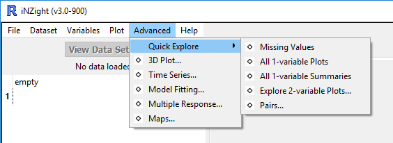

# Quick Explore

This menu provides several exploratory analysis tools for quick familiarisation to a new data set.

## Missing Values

Plots and summary tables of the extent to which variables and combinations of variables have missing values.

## All 1-variable Plots

Steps through and plots every (single) variable in the data set.

## All 1-variable Summaries

Summaries for every (single) variable in the data set.

## Explore 2-variable Plots

Takes a user-selected variable and then steps through plotting every other variable in the data set against it.

## Pairs

Takes a set of user-specified variables and plots every variable against every other variable as a matrix of plots. There is an option to colour using another variable. (Uses __R__'s `gpairs` package).
