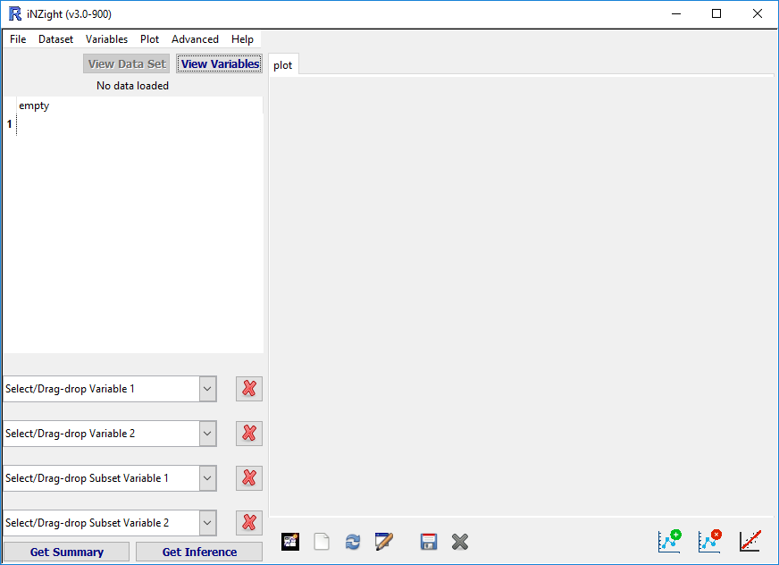
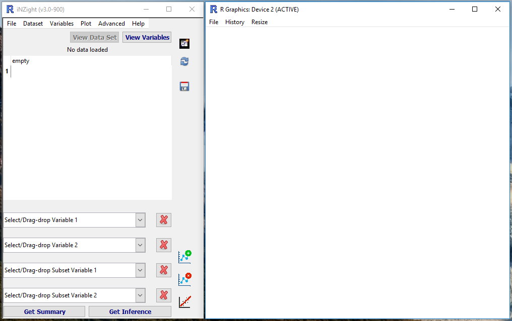

# Extra Features

Once you're familiar with the basics of iNZight, you can try out some of the more advanced features.
Some of them have been documented on this page.

- [iNZight Display Mode](#display-mode)
- [Colour Specification](#colours)

## iNZight Display Mode  {#display-mode}

iNZight (> 3.0) has two display modes: the traditional all-in-one window, as well as a separate graphics window and a narrow control panel (like VIT).
The two are shown here:

  
  

To switch between the two, go to __File__ > __Preferences__, and check the box __"Use dual-window display mode"__.

## Colour Specification  {#colours}

In many of the Colour specification windows, you can either select from the menu, or type in a value of your own. Colours can specified by the name of [any colour known by R](http://research.stowers-institute.org/efg/R/Color/Chart/ColorChart.pdf),
or alternatively by using hexadecimal (HEX) codes.

To specify a HEX code, you enter a hash "#" followed by 6 digits (numbers 0-9 and/or letters A-F).
The 6-digit HEX code is divided into three 2-digit codes that specify red, green, and blue, respectively. 00 corresponds to 0%, and FF corresponds to 100%. Some examples are:

- \#000000 = black
- \#FFFFFF = white
- #0000CC
  #009900
  #FF0000
  #c09040

### Opacity

You can also specify opacity when using HEX codes. This is done simply by adding two additional digits (forming an 8-digit code), where 00 = 0% opacity = completely invisible.

<!-- ### Colour palettes

Thanks to the [`colorspace`](https://cran.r-project.org/web/packages/colorspace/index.html) package,
if you colour by a variable (Add to Plot > Code more variables), you can specify your own colour palette from __Add to Plot__ > __Change plot appearance__ > __Colour palette__ > __Advanced__.

A new window will open in which you can create your own palette, including colour-blind options.  -->
