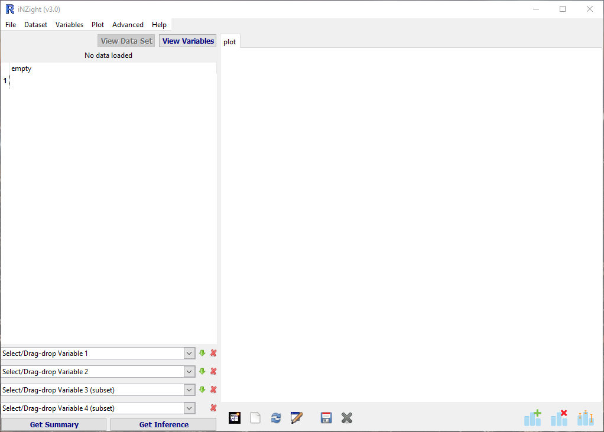
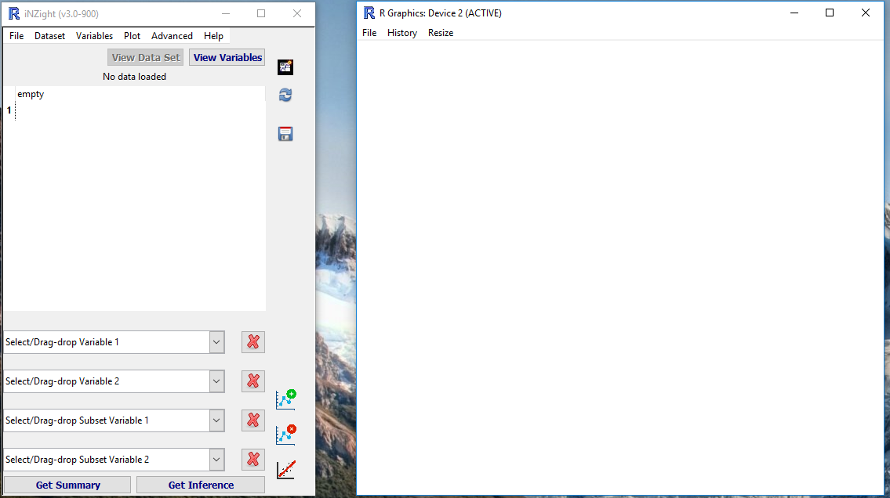
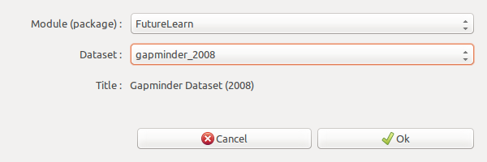

# Extra Features

Once you're familiar with the basics of iNZight, you can try out some of the more advanced features.
Some of them have been documented on this page.

- [iNZight Display Mode](#display-mode)
- [Colour Specification](#colours)
- [Export Interactive HTML Graphs](#interactive)

## iNZight Display Mode  {#display-mode}

iNZight (> 3.0) has two display modes: the traditional all-in-one window, as well as a separate graphics window and a narrow control panel (like VIT).
The two are shown here:

///HTML:

  
  

///

To switch between the two, go to __File__ > __Preferences__, and check the box __"Use dual-window display mode"__.

## Colour Specification  {#colours}

In many of the Colour specification windows, you can either select from the menu, or type in a value of your own. Colours can specified by the name of [any colour known by R](http://research.stowers-institute.org/efg/R/Color/Chart/ColorChart.pdf),
or alternatively by using hexadecimal (HEX) codes.

To specify a HEX code, you enter a hash "#" followed by 6 digits (numbers 0-9 and/or letters A-F).
The 6-digit HEX code is divided into three 2-digit codes that specify red, green, and blue, respectively. 00 corresponds to 0%, and FF corresponds to 100%. Some examples are:

- \#000000 = black
- \#FFFFFF = white

///HTML:
<ul>
  <li>
    #0000CC
    #009900
    #FF0000
    #c09040
  </li>
</ul>
///

### Opacity

You can also specify opacity when using HEX codes. This is done simply by adding two additional digits (forming an 8-digit code), where 00 = 0% opacity = completely invisible.

***
## Export Interactive HTML Graphs developmental {#interactive}

A new feature of iNZight is the ability to export plots as SVG and Interactive HTML pages. It's still a work-in-progress that was part of a student's summer project. Please play around with it and let us know what you like, what doesn't work so well, and any other feedback you have!

Let's load the `gapminder-2008` data from the FutureLearn module:

__File__ &gt; __Example Data__ and select the Gapminder 2008 dataset:

Now plot some variables. Here we're using ChildrenPerWoman and Infantmortality, coloured by Region and sized by Populationtotal, but you can use whichever you prefer.

Now click the "Save" icon in the [plot toolbar](../plot_options/?topic=plot_toolbar), or from the Plot menu.

* __File type__: choose "Interactive HTML"
* __Save location__: You can leave this as default, which is the iNZightVIT/Saved Plots folder in your Documents.
* __File name__: choose something appropriate
* __Additional variable__: We've selected "Country" as an additional variable to export, so we can use it to label points.

Once you click save, you might be prompted to install additional packages. Click "Yes" and wait while that happens, then you can save again.

The HTML file will open in your browser.
///HTML:
<iframe src="../../img/user_guides/interact/gapminder_2008.html" border="0" frameborder="0" style="width:100%;height:1000px"></iframe>
///

* __Hover your mouse over points__ to see details about that observation
* __Click points__ to add to selection, and "View Table" to see the rows of the data set for those observations
* __Click-and-drag__ to select a region of points
* __Click a legend label__ to highlight points in that group

[Click here to open the file](../../img/user_guides/interact/gapminder_2008.html)
