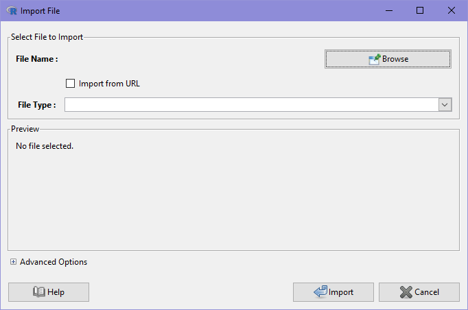

# Loading data

The first thing you need to do after starting iNZight is to load a data set to work with. We've made this as easy as possible, and iNZight recognizes several file types, including CSV and Excel (on Windows).

## Loading your own data

If you have a data set you would like to load into iNZight, go to the **File** menu
and select **Import Data**. This will open the following window:

In the window that pops up, click **Open**, and then use the browser to find your data, and click **OK**.
Click **OK** again, and your data will appear in iNZight.

## Example data sets

To make it even easier to get started with iNZight, we've implemented a Example Datasets tool that allows you to quickly load several data sets that are used in the examples throughout the website.

To load an example data set, go to the **File** menu and click **Example Data**. You'll be presented with this window:

In the example above, we've selected the "Census at School 500" dataset from the Default iNZight module. We will be using this dataset a lot for many of our examples.

## Video Demonstration

The following **_video_** demonstrates this process to load the data set
_Census at School-500.csv_ which you can find in the **Data** folder
that came with iNZight.

///HTML:

NOTE: the video was made using an older version of iNZight, so there will be some minor differences in the appearance.

///

///VIDEO: https://www.youtube.com/embed/og88LeHxupA ///
