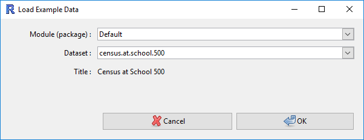

## Plotting One Variable

Using iNZight, it is easy to create a graph of your variables. Simply __drag and drop__ a variable name into the "Variable 1" slot, and iNZight will automatically draw the appropriate graph depending on the type of variable:

- __Numeric variables__: these will produce a __dot plot__.

- __Categorical variables__: also referred to as __factors__, these will produce a __bar plot__.

You can also obtain a numeric summary of the variable by clicking the __Get Summary__ button at the bottom of the iNZight window. Note that you have to have dragged a variable into Variable 1 first.

The following ___video___ demonstrates how to use iNZight to plot a single variable.

NOTE: the video was made using an older version of iNZight, so there will be some minor differences in the appearance.

///VIDEO: https://www.youtube.com/embed/idEQ6VULiu4 ///

## You can follow along

1. Load the Census at School 500 data set from __File__ > __Example Data__:

  

2. __Click and drag__ the variable _height_ to the __Variable 1__ slot to produce a dot plot.

3. __Click and drag__ the variable _cellsource_ to the __Variable 1__ slot to produce a bar plot.

4. Click the __Get Summary__ button to get a text summary of the graph.
