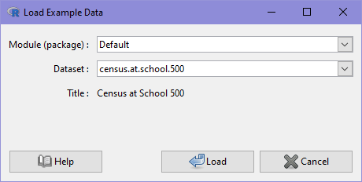

## Plotting One Variable

Using iNZight, it is easy to create a graph of your variables. Simply **drag and drop** a variable name into the "Variable 1" slot, and iNZight will automatically draw the appropriate graph depending on the type of variable:

- **Numeric variables**: these will produce a **dot plot**.

- **Categorical variables**: also referred to as **factors**, these will produce a **bar plot**.

You can also obtain a numeric summary of the variable by clicking the **Get Summary** button at the bottom of the iNZight window. Note that you have to have dragged a variable into Variable 1 first.

The following **_video_** demonstrates how to use iNZight to plot a single variable.
///HTML:

NOTE: the video was made using an older version of iNZight, so there will be some minor differences in the appearance.

///

///VIDEO: https://www.youtube.com/embed/idEQ6VULiu4 ///

## You can follow along

1. Load the Census at School 500 data set from **File** > **Example Data**:

2. **Click and drag** the variable _height_ to the **Variable 1** slot to produce a dot plot.

3. **Click and drag** the variable _cellsource_ to the **Variable 1** slot to produce a bar plot.

4. Click the **Get Summary** button to get a text summary of the graph.
