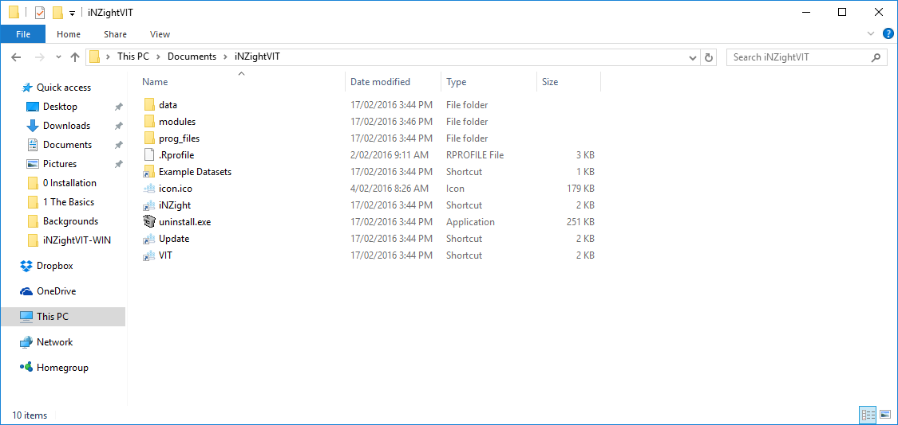

# Updating iNZight

We are continually working on iNZight by creating new features and fixing issues here and there. To ensure you stay up-to-date with the latest changes, you can update your copy of iNZight by running the automatic updater.

## On Windows

To update iNZight, either:

1. Go to __Start__ > __All files__ > __iNZightVIT__, and click __Update__, or

2. Assuming you installed iNZight to the default directory, go to __My Documents__ > __iNZightVIT__ and double-click __Update__. This is shown below:

   {.width600}

3. If you can't find the __iNZightVIT__ folder in either of those locations, go to the directory where you installed iNZight. If you didn't install iNZight, you might need to ask your system administrator to do it for you.

## On Mac

Open the iNZightVIT folder and double-click on __Update iNZightVIT__.

If you are running a later version of Mac OS X (Mountain Lion or higher) you may get an "Unknown Developer" warning the first time you run the updater.
In this case, simply __right click__ on the __Update iNZightVIT__ icon and click __Open__, and then in the window that pops up, click __Allow__. In future, you should be able to simply double-click the file to run the updater.

