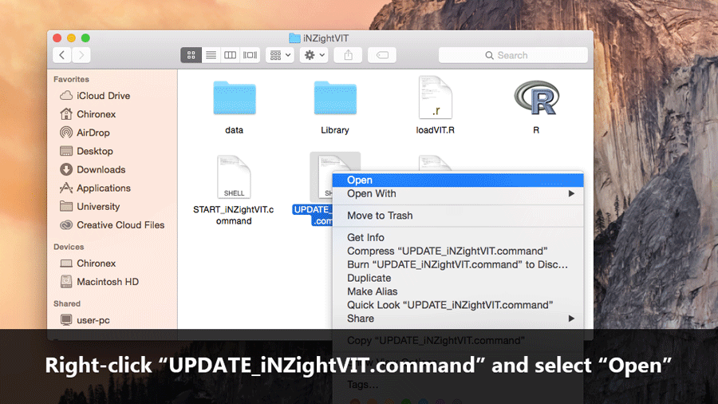

# Updating iNZight

We are continually working on iNZight by creating new features and fixing issues here and there. To ensure you stay up-to-date with the latest changes, you can update your copy of iNZight by running the automatic updater.

To update iNZight, simply __double click__ the __UPDATE\_iNZightVIT__ file.

## Mac Users

If you are running a later version of Mac OS X (Mountain Lion or higher) you may get an "Unknown Developer" warning the first time you run the updater.

In this case, simply __right click__ on the __UPDATE\iNZightVIT.command__ icon and click __Open__, and then in the window that pops up, click __Allow__. In future, you should be able to simply double-click the file to run the updater.

