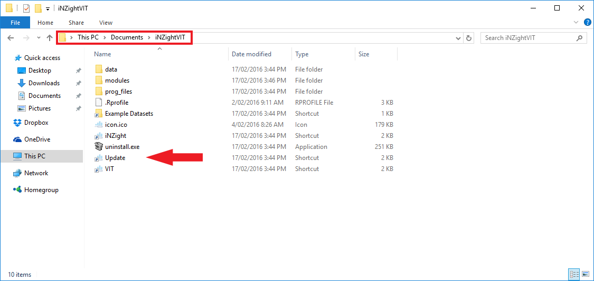

# Updating iNZight

We are continually working on iNZight by creating new features and fixing issues here and there. To ensure you stay up-to-date with the latest changes, you can update your copy of iNZight by running the automatic updater.

## On Windows

To update iNZight, either:

1. Go to **Start** > **All files** > **iNZightVIT**, and click **Update**, or

2. Assuming you installed iNZight to the default directory, go to **My Documents** > **iNZightVIT** and double-click **Update**. This is shown below:

 {.width600}

3. If you can't find the **iNZightVIT** folder in either of those locations, go to the directory where you installed iNZight. If you didn't install iNZight, you might need to ask your system administrator to do it for you.

## On Mac

Open **Applications** &gt; **iNZightVIT** and double-click on **Update**.

///HTML:

  

    <strong>Unknown Developer Warning</strong>
  

  

    

      If you're unable to start iNZight due to an "Unknown Developer" warning,
      simply __Right-click__ the Update icon, and click __Open__.
      In the window that pops up, click __Open__ to allow iNZight to update.
    

    
You should only have to do this the first time you run the updater.

  

///
