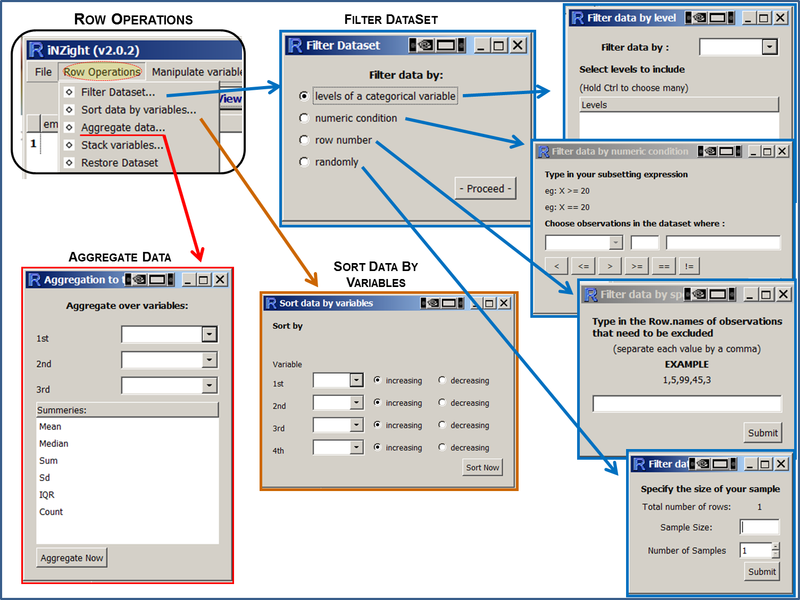

# Dataset ("Row") Operations

{.width700}

## Notes

__Restore Dataset__ restores the data set to the way it was when it was initially imported.

Using __Row Operations__ > __Filter Dataset__ and selecting row number, you can exclude a range of row numbers as follows:
- Entering 101:1000 (and then __Submit__) will exclude all rows from 101 to 1000
- Similarly, 1, 5, 99, 101:1000 will exclude rows 1, 5, 99, and everything from 101 to 1000
