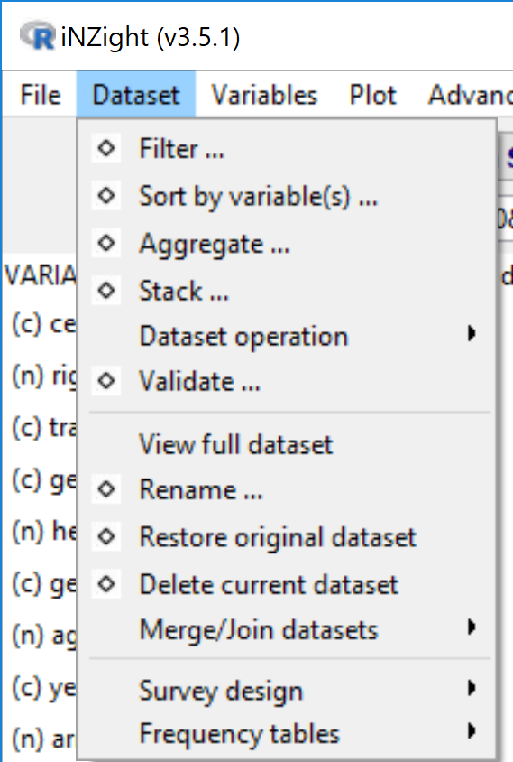
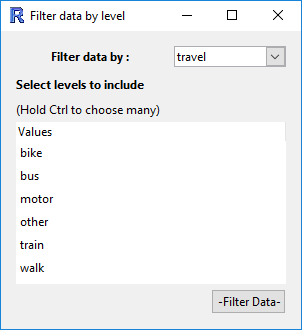

# Dataset ("Row") Operations

{.borderbox}

## Filter Dataset

This tool provides several methods for filtering the dataset.
The window that opens has four options for you to choose from:

1. __Levels of a categorical variables__
  {.fright .nobox .halfwidth}

  After selecting a categorical variable from the drop down box, you can select which levels you want to retain in the data set.

2. __Numeric condition__
  {.fright .nobox .halfwidth}

  This allows you to define a condition with which to filter your data.

  For example, you could include only the observations of `height` over 180 cm by
  - selecting `height` from the drop down menu,
  - clicking on the `>` symbol, and
  - entering the value `180` in the third box.

3. __Row number__
   {.fright .nobox .halfwidth}

  Exclude a range of row numbers as follows:
  - Entering 101:1000 (and then __Submit__) will exclude all rows from 101 to 1000
  - Similarly, 1, 5, 99, 101:1000 will exclude rows 1, 5, 99, and everything from 101 to 1000

4. __Randomly__
  {.fright .nobox .halfwidth}

  Essentially, this allows you to perform bootstrap randomisation manually.

  The current behaviour is this:
  - "Sample Size", _n_, is the number of observations to draw for each sample,
  - "Number of Samples", _m_, is the number of samples to create in the new data set.
  - The output will be a data set with _n_ x _m_ rows, which _must be smaller than the total number of rows in the data set_.
  - The observations are drawn randomly _without replacement_ from the data set.

#### {.clear}
## Sort data by variables
{.fright .nobox}

Sort the rows of the data by one or more variables. The ordering will be nested, so that the data is first ordered by "Variable 1",
and then "Variable 2", etc. For categorical variables, the ordering will be based on the order of the variable (by default, this will be alphabetical unless manually changed in "Manipulate Variables" > "Categorical Variables" > "Reorder Levels").

#### {.clear}
## Aggregate data
{.fright .nobox}

This function essentially allows you to obtain "summaries" of all of the numeric variables in the data set for combinations of categorical variables.

- _Variables_: if only one variable is specified, the new data set will have one row for each level of the variable.

  If two (or more) are specified, then there will be one row for each combination.
  For example, the categorical variables `gender = {male, female}` and `ethnicity = {white, black, asian, other}` will
  result in a data set with 2x4 rows.

- _Summaries_: each row will have the chosen summaries given for each numeric variable in the data set.

  For example, if the data set has the variables `gender (cat)` and `height (num)`, and if the user selects `Mean` and `Sd`,
  then the new data set will have the columns `gender`, `height.Mean` and `height.Sd`.
  In the rows, the values will be _for that combination of categorical variables_;
  the row for `gender = female` will have the mean height _of the females_, and the standard deviation of height _for the females_.

A visual example of this would be do drag `height` into the Variable 1 slot, and `gender` into the Variable 2 slot.
Clicking on "Get Summary" would provide the same information. The advantage of using Aggregate is that the summaries are calculated _for every numeric variable in the data set_, not just one of them.

#### {.clear}
## Stack variables
{.fright .nobox}

Convert from _table form_ (rows corresponding to subjects) to _long form_ (rows corresponding to observations).

In many cases, the data may be in tabular form, in which multiple observations are made but placed in different _columns_.
An example of this may be a study of blood pressure on patients using several medications. The columns of this data set may be:
`patient.id`, `gender`, `drug`, `Week1`, `Week2`, `Week3`. Here, each patient has their own _row_ in the data set, but each row contains three observations of blood pressure.

| patient.id | gender | drug | Week1 | Week2 | Week 3 |
| ----------:| ------ | ---- | -----:| -----:| ------:|
| 1          | male   | A    | 130   | 125   | 120    |
| 2          | male   | B    | 140   | 130   | 110    |
| 3          | female | A    | 120   | 119   | 116    |

We may want to convert to _long form_, where we have each observation in a new row, and use a categorical variable to differentiate the weeks.
In this case, we would select `Week1`, `Week2`, and `Week3` as the variables in the list. The new data set will have the columns
`patient.id`, `gender`, `drug`, `Stack.variable` ("Week"), and `stack.value` ("blood pressure").

| patient.id | gender | drug | stack.variable | stack.value |
| ----------:| ------ | ---- | -------------- | -----------:|
| 1          | male   | A    | Week1          | 130         |
| 1          | male   | A    | Week2          | 125         |
| 1          | male   | A    | Week3          | 120         |
| 2          | male   | B    | Week1          | 140         |
| 2          | male   | B    | Week2          | 130         |
| 2          | male   | B    | Week3          | 110         |
| 3          | female | A    | Week1          | 120         |
| 3          | female | A    | Week2          | 119         |
| 3          | female | A    | Week3          | 116         |

Of course, you can rename the variables as appropriate using "Manipulate Variables" > "Rename Variables".

#### {.clear}
## Restore Dataset

Restores the data set to the way it was when it was initially imported.
