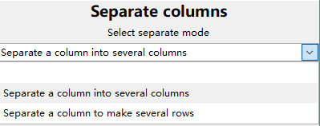
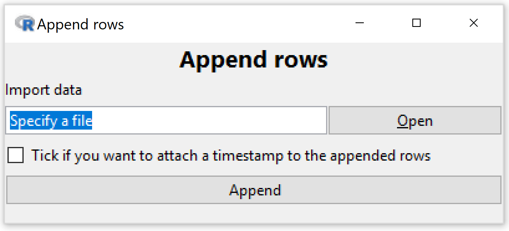
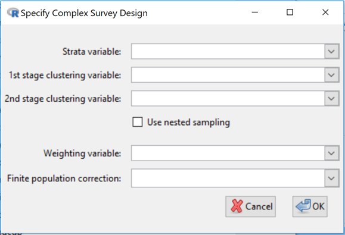
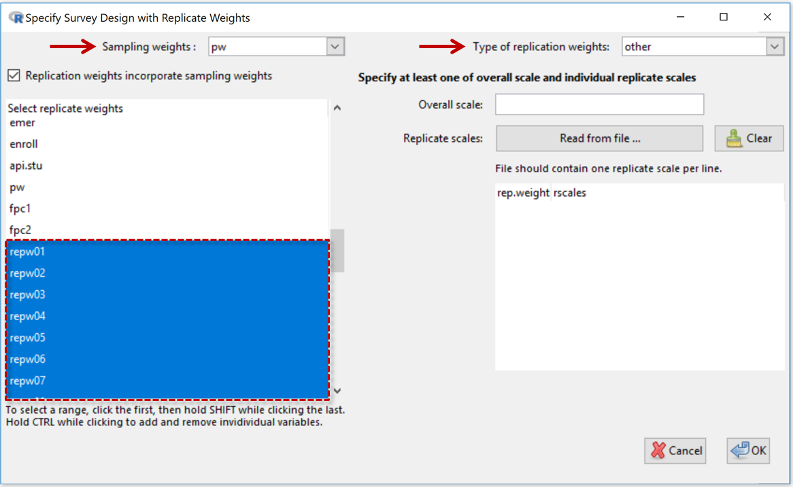
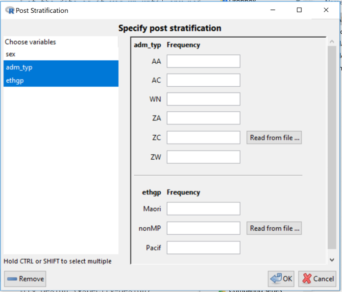
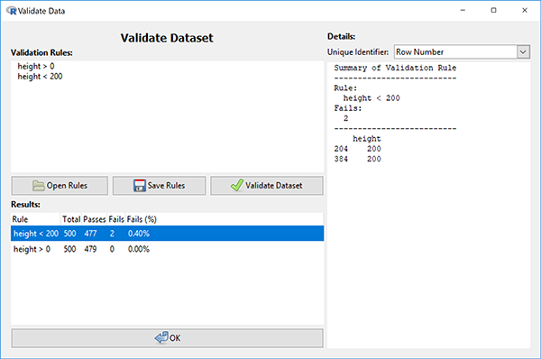

# Dataset Menu
(_Organise and restructure your data, specify special structures, and filter out unwanted observations_)

## Contents

[[ VLITE ??  || The Maps module is not part of the initial installation of iNZight. It downloads and installs automatically the first time you try to launch it by going to the __Advanced > Maps__ ]]

[[ VLITE ?? __ LITE page__ || __ DESKTOP PAGE__ ]]

{.fright .borderbox .width300}
* [Filter ...](#filter) (_dataset_)
* [Sort (_dataset_) by variable(s) ...](#sort)
* [Aggregate ...](#aggregate) (_data_)
* [Stack ...](#stack) (_variables_)
* [Dataset operations:](#datasetop)
&emsp;&ensp;&bull; [Reshape dataset](#reshape)
&emsp;&ensp;&bull; [Separate column (into) ...](#separate)
&emsp;&ensp; &bull; [Unite columns ...](#unite)
* [Validate ...](#validate) (_dataset_)
* __View full dataset__
* __Rename ...__ (_dataset_)
* [Restore original dataset](#restore)
* __Delete current dataset__

* [Merge/Join datasets:](#merge)
&emsp;&ensp;&bull; [Join datasets](#join)
&emsp;&ensp;&bull; [Append rows](#append)

* [Survey design](#svydesign) (_for data from complex survey designs_)
&emsp;&ensp;&bull; [About survey data](#about)
&emsp;&ensp;&bull; [Specify design ...](#specify-design)
&emsp;&ensp;&bull; [Specify replicate design ...](#specify-rep-design)
&emsp;&ensp;&bull; [Post stratify ... (_or rake or calibrate_)](#post-stratify)
&emsp;&ensp;&bull; [Remove design ...](#remove)

* [Frequency  tables](#freqtables) (_values plus frequencies data format_)
&emsp;&ensp;&bull; Expand table
&emsp;&ensp;&bull; Specify frequency column
&emsp;&ensp;&bull; Remove frequency column

#### {.clear}

{.fright}
## Filter Dataset {#filter}
This tool provides several methods for filtering the dataset.
The window that opens has four options for you to choose from:
* [Levels of a categorical variable](#levcatvar)
* [Numeric condition](#numcond)
* [Row number](#rownumber)
* [Randomly](#randomly)
 
 

#### {.clear}

{.fright}
####(Filter by) Levels of a categorical variable  {#levcatvar}
After selecting a categorical variable from the drop down box, you can select which levels you want to retain in the data set.
 
 
 
 
 
 
 
 
 

#### {.clear}

{.fright}
####(Filter by) Numeric condition  {#numcond}
  This allows you to define a condition with which to filter your data.
  For example, you could include only the observations of `height` over 180 cm by
  - selecting `height` from the drop down menu,
  - clicking on the `>` symbol, and
  - entering the value `180` in the third box.

 
 
 
 
 

#### {.clear}

{.fright}
####(Filter by) Row number {#rownumber}
  Exclude a range of row numbers as follows:
  - Entering 101:1000 (and then __Submit__) will exclude all rows from 101 to 1000
  - Similarly, 1, 5, 99, 101:1000 will exclude rows 1, 5, 99, and everything from 101 to 1000
 
 
 
 
 

  #### {.clear}

{.fright}
####(Filter by) Randomly  {#randomly}
 Essentially, this allows you to perform bootstrap randomisation manually.
 The current behaviour is this:
  - "Sample Size", _n_, is the number of observations to draw for each sample,
  - "Number of Samples", _m_, is the number of samples to create in the new data set.
  - The output will be a data set with _n_ x _m_ rows, which _must be smaller than the total number of rows in the data set_.
  - The observations are drawn randomly _without replacement_ from the data set.

 #### {.clear}

## Sort data by variables {#sort}
{.fright}
Sort the rows of the data by one or more variables
* The ordering will be nested, so that the data is first ordered by "Variable 1",
and then "Variable 2", etc.
* For categorical variables, the ordering will be based on the order of the variable (by default, this will be alphabetical unless manually changed in "Manipulate Variables" > "Categorical Variables" > "Reorder Levels").
 
 
 
 
 
 

#### {.clear}

{.fright}
## Aggregate data  {#aggregate}
This function essentially allows you to obtain "summaries" of all of the numeric variables in the data set for combinations of categorical variables.
- _Variables_: if only one variable is specified, the new data set will have one row for each level of the variable.
  If two (or more) are specified, then there will be one row for each combination.
  For example, the categorical variables `gender = {male, female}` and `ethnicity = {white, black, asian, other}` will result in a data set with 2x4 rows.
- _Summaries_: each row will have the chosen summaries given for each numeric variable in the data set.
  For example, if the data set has the variables `gender (cat)` and `height (num)`, and if the user selects `Mean` and `Sd`,
  then the new data set will have the columns `gender`, `height.Mean` and `height.Sd`.
  In the rows, the values will be _for that combination of categorical variables_;
  the row for `gender = female` will have the mean height _of the females_, and the standard deviation of height _for the females_.
A visual example of this would be do drag `height` into the Variable 1 slot, and `gender` into the Variable 2 slot.
Clicking on "Get Summary" would provide the same information. The advantage of using Aggregate is that the summaries are calculated _for every numeric variable in the data set_, not just one of them.
 
 

#### {.clear}

## Stack variables {#stack}
{.fright}

Convert from _table form_ (rows corresponding to subjects) to _long form_ (rows corresponding to observations).

In many cases, the data may be in tabular form, in which multiple observations are made but placed in different _columns_.
An example of this may be a study of blood pressure on patients using several medications. The columns of this data set may be:
`patient.id`, `gender`, `drug`, `Week1`, `Week2`, `Week3`. Here, each patient has their own _row_ in the data set, but each row contains three observations of blood pressure.

| patient.id | gender | drug | Week1 | Week2 | Week 3 |
| ----------:| ------ | ---- | -----:| -----:| ------:|
| 1          | male   | A    | 130   | 125   | 120    |
| 2          | male   | B    | 140   | 130   | 110    |
| 3          | female | A    | 120   | 119   | 116    |

We may want to convert to _long form_, where we have each observation in a new row, and use a categorical variable to differentiate the weeks.
In this case, we would select `Week1`, `Week2`, and `Week3` as the variables in the list. The new data set will have the columns
`patient.id`, `gender`, `drug`, `Stack.variable` ("Week"), and `stack.value` ("blood pressure").

| patient.id | gender | drug | stack.variable | stack.value |
| ----------:| ------ | ---- | -------------- | -----------:|
| 1          | male   | A    | Week1          | 130         |
| 1          | male   | A    | Week2          | 125         |
| 1          | male   | A    | Week3          | 120         |
| 2          | male   | B    | Week1          | 140         |
| 2          | male   | B    | Week2          | 130         |
| 2          | male   | B    | Week3          | 110         |
| 3          | female | A    | Week1          | 120         |
| 3          | female | A    | Week2          | 119         |
| 3          | female | A    | Week3          | 116         |

Of course, you can rename the variables as appropriate using "Manipulate Variables" > "Rename Variables".

#### {.clear}
## Dataset operations  {#datasetop}

It offers three types of tools for the users to modify their dataset:
&emsp;&ensp; &bull; [Reshape dataset](#reshape)
&emsp;&ensp; &bull; [Separate column](#separate)
&emsp;&ensp; &bull; [Unite columns](#unite)

#### {.clear}

### Reshape dataset {#reshape}
 
* [Wide to long](#widetolong)
* [Long to wide](#longtowide)

 

#### {.clear}

####(Reshape) Wide to long {#widetolong}
This allows you to select a column or multiple columns from your dataset.
* One new column (default name `key`) is populated by the column name(s) of the selected column(s)
* The other new column (default name `value`) will contain the column value from the selected columns.
* The selected column(s) will be removed and two new columns will be added to the dataset.
* A preview panel shows what the new dataset will look like.

 
 
 
 
 

####(Reshape) Long to wide {#longtowide}
You can select a column to spread out into multiple columns (the column is named `key` in the example).
It will use the column values of the selected column as a set of names for new columns.

You then select another column with corresponding values to be put into the new columns (the column is named `value` in the example).

 
 
 
 
 
 
 
 

### Separate column into ... {#separate}

* [Separate a column into several columns](#sepcols)
* [Separate a _column into several rows](#sepcolsrows)
 
 

####Separate a column into several columns {#sepcols}

Allows you to separate a column into several columns using a user-defined separator.
* It will separate at every instance of the separator until no further separators are found

If no separator is found, the additional columns formed will contain `NA`s.

___In the example on to the  right___, we have asked to separate column __A__  using an underscore (“_”) as a separator.

Because only column __A__ is being separated, column __B__ (or any other columns) is left unchanged in the resulting new dataset

The maximum number of fields in column __A__ after separation is 3 ("A_0.7K_2K") so column __A__ in the original dataset is being replaced by 3 columns with default column names (Col1, etc).

* Expanding __Change column names__ (click the "+") allows you to change the default column names to something else.
 
 

####Separate a column into several rows {#sepcolsrows}

Instead of forming more columns this version of Separate keeps the same number of columns, with the same names, but writes more rows.

___Using the same data as in the example above___, the entry "A_0.7K_2K" in column __A__ in the original dataset results in 3 rows in column __A__  in the new dataset.

* The corresponding entries in any other columns (e.g. column __B__ in the example) ___are duplicated___.
 
 
 
 
 
 
 

### Unite columns {#unite}

Allows you to select multiple columns and “unite” them using a defined separator (defaults to “_”). The united column name will be the combination of the selected columns with a “.” in between.

_In this example, column “v1999” and column “v2000” are united by “_”. The new column name is “v1999.v2000”._

* It is allowable to have ___no separator___. Just clear the ___Enter the separator___ field (delete the “_”)
 
 
 
 
 
 

## Merge/Join datasets  {#merge}
&emsp;&ensp;&bull; [Join datasets](#join)
&emsp;&ensp;&bull; [Append rows](#append)

### Join Datasets {#join}

This "joins", or brings together, information in two data sets: the current dataset in iNZight and a newly imported dataset (read in using the __Import data__ facility) shown at the mid-right.

__Left Join:__ The most important joining method is called a ___Left Join___, the main purpose of which is to add new variables to the original dataset by extracting the information from the new dataset.

__Matching rows__: The main problem is to identify what pieces of information belong together. The most straightforward case occurs where there is a variable in the original dataset which is a unique identifier. If that variable is also in the imported dataset (even if under a different name) we can use it to match up the data which belongs to the same unit/entity.

To partially automate the process, iNZight looks for variables with the same name in both datasets (_originally x1, x2, and x3 in the Example to the right_) and offers those for determining matches.

_In the Example, we have rejected x3 using the delete button beside it and so have effectively told the program that it is units with the same values of both x1 and x2 that belong together._

* The __Preview__ panel shows us the effects of our choices

___Click___ the __Join__ button at the bottom once you are happy with the way the data is being joined.

___The details of how the data is treated depend on the type of Join___ and we will [document that](#jointypes) after finishing describing the Example.

_In the Example, x4 is a new variable so that has been added to the preview-dataset. A complication is x3 which is in both datasets but with different values for the "same" units. So the program has decided to make two variables, one for the x3 values from the original dataset and one for the x3 values from the new dataset._

####Types of Join {#jointypes}
__Left Join__
- The joined dataset has rows corresponding to ___all of the rows in the original dataset___ and all of its columns.
- Rows of the ___new___ dataset ___that do not have a match___ in the original dataset ___are not used___.
- The joined dataset ___also has the columns from the new dataset___ that were not used for matching.
* Rows in the original that ___have no match___ in the newly imported dataset get `NA`s for the additional columns
* __Warning: __ Rows from the original dataset that have ___more than one match___ in the new dataset generate multiple rows in the joined dataset (which invalidates many simple analyses). For example, if there are 3 matches then the original (single) row will be replaced by 3 rows. The cell-values for the additional columns will be obtained from the new data set and the values for the original columns from repeating the original cell values.

__How other joins differ from the Left Join__

* __Inner Join:__ Only use rows corresponding to matches between the two datasets

* __Full Join (Outer Join):__ Also use all the non-matching rows from both data sets

[__Right Join:__ iNZight does not have this. Just import the datasets in the reverse order and use a left join.]

The following are just used to filter data. No columns are added to the join from the new dataset.
* __Semi Join:__ Use only rows in the original which have  ___a match___ in the new

* __Anti Join:__ Use only rows in the original which have  ___no match___ in the new

 
 
 
 
 
 
 

### Append rows {#append}

Adds to the bottom of the original dataset rows from a newly imported dataset (imported using the Import facility provided).
* The column names from both datasets are matched so the right data goes into the right columns
* Columns that appear in one dataset and not the other _will_ appear in the result
* An error will be reported and not appending will be possible if two column names match but their types (e.g. numeric or categorical) do not match

* If the Tick-box option is selected a timestamp variable called __When__\___Added__ will be added to the dataset recording when the new observations were added
* If there is already a variable called __When__\___Added__ present in the original data (must be of type date-time, "(t)" in View Variables) the new timestamps will be appended to that existing variable

___Where data is periodically being added to a dataset___, this facility can be used to keep track of when each row was added -- thus facilitating analyses of the data as it was up until any particular time point

#### {.clear}

##Survey design  {#svydesign}
&emsp;&ensp;&bull; [About survey data](#about)
&emsp;&ensp;&bull; [Specify design ...](#specify-design)
&emsp;&ensp;&bull; [Specify replicate design ...](#specify-rep-design)
&emsp;&ensp;&bull; [Post stratify ... (_or rake or calibrate_)](#post-stratify)
&emsp;&ensp;&bull; [Remove design ...](#remove)

####About survey data {#about}

It is important that specialist methods be applied when analyzing data obtained using complex survey designs. Failure to do so typically leads biased estimates and incorrect standard errors, confidence intervals and p-values.

___When a survey design has been defined___ almost all relevant parts of iNZight will ___apply analysis and graphics methods appropriate___ for data obtained using ___this survey design___ by applying functions in R's [survey package](http://r-survey.r-forge.r-project.org/survey/).

__Important difference__ for __Get Summary__. Whereas, generally, iNZight's __Get Summary__ provides summary information about the dataset itself, when a survey design is specified __Get Summary__ provides estimates of population quantities -- clearly labeled as such. (Raw summaries of survey data are often meaningless because of unequal probabilities of selection.)

Regular statistical software analyses data as if the data were collected using simple random sampling. Many surveys, however, are conducted using more complicated sampling methods. Not only is it often nearly impossible to implement simple random sampling, more complex methods are more efficient both financially and statistically. These methods use some or all of _stratified sampling_, _cluster sampling_ and _unequal sampling rates_ whereby some parts of a population are sampled more heavily (i.e. with _higher probabilities of selection_) than others parts. These sampling features have to be allowed for in the analysis. While sometimes it may be possible to get reasonably accurate results using non-survey software, there is no practical way to know beforehand how far wrong the results from non-survey software will be.
* See [Brief introduction to survey analysis ideas](survey-notes.html)
* For an in-depth account, see [__"_iNZight and Sample Surveys_"__](https://homepages.ecs.vuw.ac.nz/~rarnold/STAT392/iNZightManual/_book/) by [Richard Arnold](https://www.wgtn.ac.nz/sms/about/staff/richard-arnold).

Survey designs are typically specified to analysis programs either by [specifying a survey design](#specify-design) in terms of weighting, strata and clustering variables etc in the data set, or by selecting a set of variables in the dataset containing so-called [replicate weights](#specify-rep-design). [Post-stratification/raking/calibration](#post-stratify) facilitate using additional population information (external to the survey data) to improve survey estimates. This is done after a survey design has been specified (by either method).

####Specify design {#specify-design}
Specifying a survey design in terms of weighting, strata and clustering variables etc.

iNZight’s survey methods cater for simple random sampling, stratified random sampling (random sampling within each population stratum), cluster sampling and multistage cluster sampling, and complex  designs involving cluster sampling within population strata.
* __Strata variable:__ If [stratified sampling](survey-notes.html#stratified) has been performed, use to select the variable that specifies which stratum each observation comes from. (This variable can be either numeric or categorical.)
* __1st stage clustering variable:__ If [cluster sampling](survey-notes.html#cluster) has been performed, use to select the 1st-stage clustering variable; this specifies which [1st-stage cluster](survey-notes.html#multistage) each observation comes from. (Clustering variables can also be either numeric or categorical.)
* __2nd stage clustering variable:__ If two or more stages of cluster sampling have been performed, use to select the 2nd-stage clustering variable (specifies which [2nd-stage cluster](survey-notes.html#multistage) each observation comes from). Any further levels of cluster sampling (3rd stage, etc., are not used)
* __Use nested sampling:__ Quite often, compilers of survey data "reuse" cluster names from stratum to stratum. Let us take, as an example, a survey in which American states for the starts and counties form the clusters. Sampled counties from Washington State may be given a County value of 1, 2, ... and counties from Arizona may also be given a County value of  1, 2, ... Clearly County 1 from Washington refers to an entirely different county from County 1 from Arizona even though they have the same value of the County variable.
-- ___Click___ the __Use nested sampling__ check-box if cluster labels are being recycled/reused in the data.
* __Weighting variable:__ If the sampling design used unequal probabilities of selection, use this to select a variable containing the ___sampling weight___ (1 over the probability of selection) for each observation. Certain estimates will be wrong if the sampling weights do not add up to the population size, in particular estimated _population_ or _subpopulation  __totals___ and estimated _population_ or _sub__population sizes___. Sampling weights are often _adjusted_ to allow for _unit non-response_.
* __Finite population correction:__ Use this when descriptive inferences are wanted about properties of the finite population being sampled and the sample size is an appreciable proportion of the population size (e.g. > 5 or 10%). If stratified sampling has not been used, this variable should contain an estimate of the size of the population being sampled, repeated for every observation. If stratified sampling has been used, the values of this variable should contain an estimate of the size of the population stratum being sampled (differing across strata but constant within each stratum).
As an alternative to using population/stratum sizes, proportions _of the total population_ being sampled can be used.

For more information on quantities referred to in the dialog box see the documentation of the [svydesign](http://r-survey.r-forge.r-project.org/survey/html/svydesign.html) function in R's survey package.

####Specify replicate design {#specify-rep-design}
Because making public factors like cluster membership can make it easier than survey agencies are comfortable with to identify individuals, many agencies do not distribute such information to outsiders. Instead they distribute sets of so-called _replicate weights_, slightly varying copies of the sampling weights variable that still enable survey analysis programs to make the proper adjustments to analyses of survey data.

* __Sampling Weights:__ See variable selection box at the top-left
* __Replication weights incorporate sampling weights__ (_checkbox_)__:__ This should be ___checked if___ the replicate weights already include the sampling weights (which is usually the case). ___Uncheck this___ if the replicate weights are very similar in size to the sampling weights.
* __Select replicate weights:__ The large (lower) panel on the left-hand side displays the names of the variables in the dataset. Use to select the replicate-weights variables. In the example shown the replicate-weights variables were called _repw01_, _repw02_, _repw03_, ...

__Right-hand panel__
* __Type of replication weights:__  Depends on the type of replicate weights the person who compiled the dataset has used. Select from list - _BRR_, _Fay_, _JK1_, _JKn_, _bootstrap_, _other_.
* __Overall scales:__  Only used for Types _bootstrap_ and _other_.

For more information on quantities referred to above
* see the documentation for the [svrepdesign](http://r-survey.r-forge.r-project.org/survey/html/svrepdesign.html) function in R's survey package and also [here](http://r-survey.r-forge.r-project.org/survey/example-svrepdesign1.html)
* see also the [section on replicate weights](https://homepages.ecs.vuw.ac.nz/~rarnold/STAT392/iNZightManual/_book/Complex-Designs.html#replicate-weights-for-variance-estimation) in [__"_iNZight and Sample Surveys_"__](https://homepages.ecs.vuw.ac.nz/~rarnold/STAT392/iNZightManual/_book/) by [Richard Arnold](https://www.wgtn.ac.nz/sms/about/staff/richard-arnold)..

####Post stratify {#post-stratify}
This allows for ___poststratifying/raking/calibrating___ a design that has already been defined using either of the methods above above.
(Technically the design is updated using the <a href="http://r-survey.r-forge.r-project.org/survey/html/calibrate.html">calibrate</a> function in R's survey package.)

This allows a data-analyst to improve estimation by augmenting the information in the survey data by adding information on the whole population where this is available from other sources. Categorical variables in the data set are offered as possible poststratification/raking/calibration candidates. Corresponding population counts can be input by typing or reading from files.

In the example in the screenshot, there are 3 categorical variables in the data set offered as possible candidates and 2 have been selected. The design would then be calibrated using user-supplied information on population counts for the all the categories of both __admin\_type__ and __ethgp__.

This is fine when you only want to use information about single variables, but what if you have population information on the cross-classification (all possible combinations) of __admin\_type__ and __ethgp__, say? Then you would have to create a new variable in the dataset, called say __admin\_type.ethgp__ that has all these combinations. This can be done with __Variables > Categorical Variables > Combine categorical variables__.

___Warning_:__ Currently the new variables have to be set up before specifying a survey design. If you only think about it later yu will need to use __Remove design__ (next item), set up new variables and then re-specify the design.

For more information on quantities referred to in the dialog box [see here ...](http://r-survey.r-forge.r-project.org/survey/example-poststrat.html).

####Remove design {#remove-design}
Discard design information and ___revert to using standard methods of analysis___

{.borderbox .fright .width400}
##Frequency tables (_values plus frequencies data format_) {#freqtables}

When a __frequency column__ is specified, graphics and summaries respond to a combinations-of-variables-plus-their-frequencies data structure. Only categorical variables are retained.

The __expand table__ option can be used to work with both numeric and categorical variables. The storage and efficiency savings of working with a unique combinations of variables plus frequencies will typically be very much smaller here.
         

## Validate Dataset {#validate}

Often, we want to validate that the data in a dataset adheres to our expectations about how that data should behave based on external real world-knowledge.

* ___Validating a data set necessarily requires user-supplied validation rules___.

For example, we expect the heights of humans are not negative or someone cannot work for more than 24 hours in a single day.

The validation window gives us the ability to define or import rules, and check whether the data conforms to those rules identifying any exceptions.

* In the validation window, rules can be ___typed___ into the __Validation Rules__ text box in the top left ___or imported___ from a text file using the __Open Rules__ button.

Using the first example, the rule to check whether heights are above 0 can be written in this textbox as `height > 0` in this text box (given there is a variable named `height` in our dataset).

* __To check all of the rules__ that have been defined in this textbox, ___click___ the __Validate Dataset__ button.

The results of each rule are presented in a table at the bottom of the window and show the number of observations that were checked ("Total"), the number of passes and failures ("Passes" and "Fails" respectively), and the fail percentage ("Fails (%)"). Initially this table is sorted by failure percentage, but you can click on other column headers to order the list in other ways.

* The __Unique Identifier__ selection box at the top right of the validation window allows you to select the name of a variable that contains unique identifiers for the units/cases/rows in the data set.

This is more useful than employing row numbers (the default setting) because unique-identifier values remain unchanged in the data when rows are deleted whereas row numbers will change.

* __Double clicking on a row _of the results table___ will generate a ___detailed breakdown___ of the results in the __Details__ section on the right-hand side of the window.

This breakdown will provide details about the observations which failed on that particular rule, giving the row numbers (or unique-identifier values if a unique-identifier has been selected) of these observations and the values used to assess the rule.

Validation rules or changes to imported rule files are ___discarded___ once the validation window is closed.

* If you would like to store the set of rules you have defined or save any changes to an imported rule file, this can be done using the __Save Rules__ button.

They are saved into a text file on your computer that can be imported again using the "Open Rules" button or viewed using a text editor.

The rules you use to validate the dataset do not need to be simple comparisons between a variable and a static value as in the previous example. ___More complex rules___ can be built by performing calculations on the variables, e.g. `weight / height^2 < 50` will verify that each observation's body mass index is below 50. The values of each variable contained in the calculation as well as the end result are provided in the detailed breakdown.

* Instead of comparisons between a variable/calculation and a static value, we can ___compare against___ another variable or ___a calculation based on the data___.

For example, to check that the income of an individual (contained in variable `Income`) is no more than 1000 times their number of hours per week (contained in variable `Hours`), we can use the following rule: `Income <= Hours * 1000`. This will calculate a different value to compare income against for each observation.

For more information on what is possible using validation rules, the vignettes and help files of the underlying R package (validate) might be useful: [Introduction to Validate vignette](https://cran.r-project.org/web/packages/validate/vignettes/introduction.html#validation-rule-syntax) and [Validate package (in particular, the syntax section of the reference manual)](https://cran.r-project.org/web/packages/validate/index.html).

#### {.clear}

## Restore Dataset {#restore}

Restores the data set to the way it was when it was initially imported.
