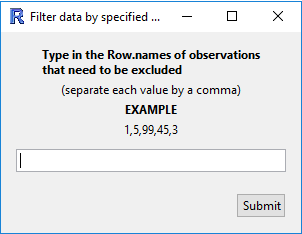
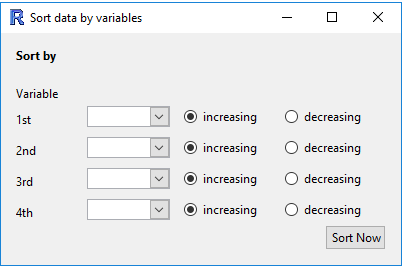
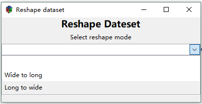
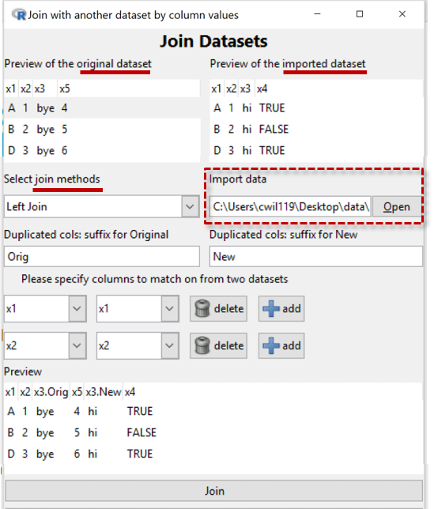

# Dataset ("Row") Operations
{.fright .borderbox}
* [Filter](#filter) data ...
* [Sort (dataset) by variables ...](#sort)   
* [Aggregate](#aggregate) data   
* [Stack](#stack) variables   
* [Dataset operations:](#datasetop)   
&emsp;&ensp;- [Reshape dataset](#reshape)   
&emsp;&ensp;- [Separate column into ...](#separate)   
&emsp;&ensp; - [Unite columns](#unite)   
* [Validate](#validate) dataset
* __Rename__ dataset 
* __Restore original dataset__    
* __Delete current dataset__ 
* [Merge datasets:](#merge)  
&emsp;&ensp;- [Join datasets](#join)     
&emsp;&ensp;- [Append rows](#append)     
* __Specify survey design__  
* __Remove (survey) design__  
* __Expand table__ 

{.fright}
## Filter Dataset {#filter}
This tool provides several methods for filtering the dataset.
The window that opens has four options for you to choose from:

1. __Levels of a categorical variables__
  {.fright}
  After selecting a categorical variable from the drop down box, you can select which levels you want to retain in the data set.

2. __Numeric condition__
  {.fright}

  This allows you to define a condition with which to filter your data.

  For example, you could include only the observations of `height` over 180 cm by
  - selecting `height` from the drop down menu,
  - clicking on the `>` symbol, and
  - entering the value `180` in the third box.

3. __Row number__
   {.fright}
  Exclude a range of row numbers as follows:
  - Entering 101:1000 (and then __Submit__) will exclude all rows from 101 to 1000
  - Similarly, 1, 5, 99, 101:1000 will exclude rows 1, 5, 99, and everything from 101 to 1000

4. __Randomly__
  {.fright}
 Essentially, this allows you to perform bootstrap randomisation manually.  
 The current behaviour is this:
  - "Sample Size", _n_, is the number of observations to draw for each sample,
  - "Number of Samples", _m_, is the number of samples to create in the new data set.
  - The output will be a data set with _n_ x _m_ rows, which _must be smaller than the total number of rows in the data set_.
  - The observations are drawn randomly _without replacement_ from the data set.

#### {.clear}
{.fright}
## Sort data by variables {#sort}
Sort the rows of the data by one or more variables. The ordering will be nested, so that the data is first ordered by "Variable 1",
and then "Variable 2", etc. For categorical variables, the ordering will be based on the order of the variable (by default, this will be alphabetical unless manually changed in "Manipulate Variables" > "Categorical Variables" > "Reorder Levels").

#### {.clear}
{.fright}
## Aggregate data  {#aggregate}
This function essentially allows you to obtain "summaries" of all of the numeric variables in the data set for combinations of categorical variables.  
- _Variables_: if only one variable is specified, the new data set will have one row for each level of the variable.  
  If two (or more) are specified, then there will be one row for each combination.
  For example, the categorical variables `gender = {male, female}` and `ethnicity = {white, black, asian, other}` will result in a data set with 2x4 rows.  
- _Summaries_: each row will have the chosen summaries given for each numeric variable in the data set.  
  For example, if the data set has the variables `gender (cat)` and `height (num)`, and if the user selects `Mean` and `Sd`,
  then the new data set will have the columns `gender`, `height.Mean` and `height.Sd`.
  In the rows, the values will be _for that combination of categorical variables_;
  the row for `gender = female` will have the mean height _of the females_, and the standard deviation of height _for the females_.  
A visual example of this would be do drag `height` into the Variable 1 slot, and `gender` into the Variable 2 slot.
Clicking on "Get Summary" would provide the same information. The advantage of using Aggregate is that the summaries are calculated _for every numeric variable in the data set_, not just one of them.

#### {.clear}
## Stack variables {#stack}
{.fright .nobox}

Convert from _table form_ (rows corresponding to subjects) to _long form_ (rows corresponding to observations).

In many cases, the data may be in tabular form, in which multiple observations are made but placed in different _columns_.
An example of this may be a study of blood pressure on patients using several medications. The columns of this data set may be:
`patient.id`, `gender`, `drug`, `Week1`, `Week2`, `Week3`. Here, each patient has their own _row_ in the data set, but each row contains three observations of blood pressure.

| patient.id | gender | drug | Week1 | Week2 | Week 3 |
| ----------:| ------ | ---- | -----:| -----:| ------:|
| 1          | male   | A    | 130   | 125   | 120    |
| 2          | male   | B    | 140   | 130   | 110    |
| 3          | female | A    | 120   | 119   | 116    |

We may want to convert to _long form_, where we have each observation in a new row, and use a categorical variable to differentiate the weeks.
In this case, we would select `Week1`, `Week2`, and `Week3` as the variables in the list. The new data set will have the columns
`patient.id`, `gender`, `drug`, `Stack.variable` ("Week"), and `stack.value` ("blood pressure").

| patient.id | gender | drug | stack.variable | stack.value |
| ----------:| ------ | ---- | -------------- | -----------:|
| 1          | male   | A    | Week1          | 130         |
| 1          | male   | A    | Week2          | 125         |
| 1          | male   | A    | Week3          | 120         |
| 2          | male   | B    | Week1          | 140         |
| 2          | male   | B    | Week2          | 130         |
| 2          | male   | B    | Week3          | 110         |
| 3          | female | A    | Week1          | 120         |
| 3          | female | A    | Week2          | 119         |
| 3          | female | A    | Week3          | 116         |

Of course, you can rename the variables as appropriate using "Manipulate Variables" > "Rename Variables".

#### {.clear}
## Dataset operations  {#datasetop}
 
It offers three types of tools for the users to modify their dataset:  
&emsp;&ensp; - [Reshape dataset](#reshape)  
&emsp;&ensp; - [Separate column](#separate)  
&emsp;&ensp; - [Unite columns](#unite)

#### {.clear}
 
### Reshape dataset {#reshape}
Provides two methods for reshaping the dataset:  
&emsp;&ensp;  1.	Convert from a ___wide___ format ___to___ a ___long___ format  
&emsp;&ensp;  2.	Convert from a ___long___ format ___to___ a ___wide___ format

#### {.clear}
 
__1. Wide to long__  
This allows you to select a column or multiple columns from your dataset.  
&emsp;&ensp;  - One new column (default name `key`) is populated by the column name(s) of the selected column(s)  
&emsp;&ensp;  - The other new column (default name `value`) will contain the column value from the selected columns.   
&emsp;&ensp;  - The selected column(s) will be removed and two new columns will be added to the dataset.  
&emsp;&ensp;  - A preview panel shows what the new dataset will look like.

#### {.clear}
 
__2. Long to wide__  
You can select a column to spread out into multiple columns (the column is named `key` in the example).  
It will use the column values of the selected column as a set of names for new columns.

You then select another column with corresponding values to be put into the new columns (the column is named `value` in the example).

 
 
 

### Separate column into ... {#separate}

This tool provides a way of:

1.	Separate a _column_ into multiple columns
2.	Separate a _column_ into multiple rows

 

 

__1. Separate a column into several columns__

Allows you to separate a column into several columns using a user-defined separator. 

It will separate at every instance of the separator until no further separators are found.

If no separator is found, the new variable will be given `NA`.

 
 
 
 
 
 

 

__2. Separate a column into multiple rows__

This allows you to separate a column to several rows. 

It will separate at every instance of the separator until no further separators are found.

 
 
 
 
 
 
 
 

 

### Unite columns {#unite}

Allows you to select multiple columns and “unite” them using a defined separator (default to “_”). The united column name will be the combination of the selected columns with a “.” in between.

In this example, column “v1999” and column “v2000” are united by “_”. The new column name is “v1999.v2000”.

 
 
 
 
 
 
 
 
 
 

## Merge datesets  {#merge}
### Join Datasets {#join}

 

Joins the current dataset with another imported dataset by the column values. 

By default, the tool will join the two datasets by columns that have a common name using the inner join method. 

User can specify columns to join from two datasets and method on how to join them. 

In this example, column “x1” and column “x2” are found in both datasets and have same values, so they are joined and only one copy of the two columns are in the output dataset. 

Both datasets have column “x3” but have different values, so we decide to keep both columns in the output dataset. The column from the original dataset is labeled as “x3.Orig” and the column from the imported dataset is labeled as “x3.New”.

Column “x4” and column “x5“ are distinct columns in two datasets and have no match, so they are both kept in the output dataset.

### Append rows  {#apppend}

 

Appends rows from the imported dataset to the original dataset.

User can choose to attach a timestamp to the dataset.

If there exists a column with common name in the two datasets but in different type, both columns will be kept in the output dataset with column name changed to include the type.

#### {.clear}
## Validate Dataset {#validate}
{.fright .nobox}

Often, we would like to validate that the data in a dataset adheres to our expectations based on the real world or our external knowledge of the dataset. For example, we expect the heights of humans are not negative or someone cannot work for more than 24 hours in a single day. 

Validating a data set necessarily requires user-supplied validation rules such as these. The validation window gives us the ability to define, or import, and check rules.

In the validation window, rules can be typed into the "Validation Rules" text box in the top left or imported from a text file using the "Open Rules" button.

Using the first example, the rule to check whether heights are above 0 can be written in this textbox as `height > 0` in this text box (given there is a variable named `height` in our dataset). To check all of the rules that have been defined in this textbox, click the "Validate Dataset" button. The results of each rule are presented in a table at the bottom of the window and show the number of observations that were checked ("Total"), the number of passes and failures ("Passes" and "Fails" respectively), and the fail percentage ("Fails (%)"). This table is sorted by failure percentage.

Double clicking on a row of the results table will generate a detailed breakdown of the results in the "Details" section on the right-hand side of the window. This breakdown will provide details about the observations which failed on that particular rule, giving the row numbers of these observations and the values used to assess the rule. If there is a variable containing unique identifiers in the dataset, this can be displayed by changing the "Unique Identifier" dropdown box to the variable containing that identifier. 

Validation rules or changes to imported rule files are discarded once the validation window is closed. If you would like to store the set of rules you have defined or save any changes to an imported rule file, this can be done using the "Save Rules" button. They are saved into a text file on your computer that can be imported again using the "Open Rules" button or viewed using a text editor. 

The rules you use to validate the dataset do not need to be simple comparisons between a variable and a static value as in the previous example. More complex rules can be built by performing calculations on the variables, e.g. `weight / height^2 < 50` will verify that each observation's body mass index is below 50. The values of each variable contained in the calculation as well as the end result are provided in the detailed breakdown. 

Instead of comparisons between a variable/calculation and a static value, we can compare against another variable or a calculation based on the data. For example, to check that the income of an individual (contained in variable `Income`) is no more than 1000 times their number of hours per week (contained in variable `Hours`), we can use the following rule: `Income <= Hours * 1000`. This will calculate a different value to compare income against for each observation. 

For more information on what is possible using validation rules, the vignettes and help files of the underlying R package (validate) might be useful: [Introduction to Validate vignette](https://cran.r-project.org/web/packages/validate/vignettes/introduction.html#validation-rule-syntax) and [Validate package (in particular, the syntax section of the reference manual)](https://cran.r-project.org/web/packages/validate/index.html).

#### {.clear}
## Restore Dataset

Restores the data set to the way it was when it was initially imported.
