# File Menu

(_Getting data into and out of iNZight (Import, Paste, Examples, Export); Preferences=program controls_)

The **File menu** provides 4 ways of getting data into iNZight<br>
&emsp;&ensp;&bull;&ensp; **_Importing a file on your computer_** (_Import data …_)<br>
&emsp;&ensp;&bull;&ensp; **_Importing a file from an internet url_** (_Import data …_)<br>
&emsp;&ensp;&bull;&ensp; **_Copying and pasting_** data from programs like from Excel or Google sheets (_Paste from …_)<br>
&emsp;&ensp;&bull;&ensp; Built-in **_Example data sets_** (_Example data …_)

The **File menu also** allows for **_saving/exporting_** data. e.g., if you have modified it in some way in iNZight (_Export data …_)

## Contents

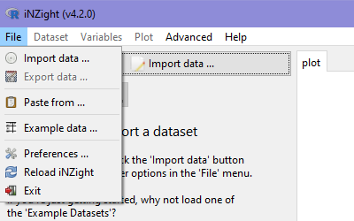{.borderbox .fright .width300}

- [Import data ...](#import)(_from a file on computer or internet_)
  &emsp;&ensp;&bull;&ensp; [File types](#filetypes)
  &emsp;&ensp;&bull;&ensp; [Metadata in csv files](#metacsv)

- [Export data ...](#export)(_useful if have modified the dataset_)
- [Paste from ...](#paste) (_import by pasting copied data_)
- [Example data ...](#example) (_use an example dataset_)

- [Preferences ...](#preferences)(_change program behaviour_)
- **Exit ...** (_quit iNZight_)

##Import data {#import}

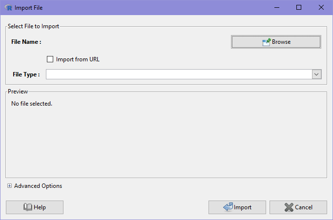{.borderbox .width400}

**_By default_** imports **_from a file_** on your computer. Throws up a **_browser_** button to initiate a dialog for navigating to the file you want.

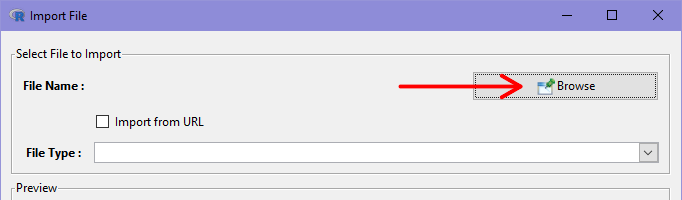{.borderbox .width400}

On clicking the **Import from url** _checkbox_ the behaviour changes (as below)

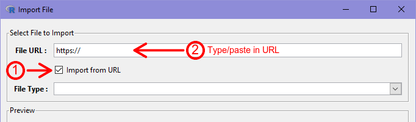{.borderbox .width400}

Type or paste in the url address of the file you want to import<br>
(_when pasting a full url, ensure the prepopulated “https:// ” is overwritten_)

###File types {#filetypes}
NZight assumes that data sets are in **rows = cases** by **columns = variables** format

iNZight can import files of the following types:<br>
&emsp;&ensp;&bull;&ensp; Comma Separated Values text files (.csv)<br>
&emsp;&ensp;&bull;&ensp;Tab-delimited Text files (.txt)<br>
&emsp;&ensp;&bull;&ensp;97-2003 Excel files (.xls)<br>
&emsp;&ensp;&bull;&ensp;2007 Excel files (.xlsx)<br>
&emsp;&ensp;&bull;&ensp;SPSS files (.sav)<br>
&emsp;&ensp;&bull;&ensp;SAS Data files (.sas7bdat)<br>
&emsp;&ensp;&bull;&ensp;SAS Xport files (.xpt)<br>
&emsp;&ensp;&bull;&ensp;STATA fles (.dta)<br>
&emsp;&ensp;&bull;&ensp;R Object files (.rds)<br>
&emsp;&ensp;&bull;&ensp;RData files (.RData, .rda)<br>

**_By default_**, iNZight identifies the type of the file being imported by looking for one of these filename extensions. iNZight attempts to read the file and populate the **Preview panel**. If no preview appears iNZight has been unable to read the file.

Click the **Import** button (at bottom right) when you are happy with what appears in the Preview panel.

The **Advanced Options** at the bottom-left of the Import dialog box (Click on the “**+**” to expand) allows you to change default behaviour.

###Metadata in csv files {#metacsv}
(**Metadata** is _information about the data_.)

When .csv files and are .txt files are imported into iNZight, all lines in the data file beginning with a "#" are ignored (there is one exception below).

This enables you to include **metadata** in your .csv or .txt data files by starting each line of metadata information with a "#".

**_With .csv files_**, you can go further and include **_instructions telling iNZight to treat variables in various ways_**. This is particularly useful for instructing iNZight to order the levels of a categorical variable in a desired way, rather than the default way.

Lines starting with \#' @ are interpreted by iNZight's smart read function as containing instructions of this form

**Example:**
We will use the following lines from the top of the file at ... https://www.stat.auckland.ac.nz/~wild/data/test/CensusAtSchool-500-w-meta.csv to show how this works.

```
## --- Meta Data --- ##
#' @factor gender[male,female]
#' @factor cellsource[pocket,parent,job,other]
#' @factor getlunch[home,tuckshop,dairy,school,friend,none]
#' @numeric age
#' @factor year
#' @factor school=year[primary=5|6,intermediate=7|8,high=9|10|11]
#' @factor travel[walk,bike,car=motor,public=bus|train,other]
#' @factor cellsource
#' @numeric phonebill=cellcost
## --- Data --- ##
```

**_Note:_** _By default in R, and therefore iNZight, the categories (levels) of a categorical variable (factor) are ordered alphanumerically._

The 1st (real) line above is an instruction for **gender** to be treated as a categorical variable (factor) with levels in the order "male, female", rather than the alphabetic default "female, male".
The next 2 lines are doing the same sort of reorderings for **cellsource** and **getlunch**.

**year** in the data file has numeric values ranging from 4 to 13 and so by default will be treated as a numeric variable. `\#' @factor year` is an instruction to treat it as a categorical variable (factor).

The next line, `\#' @factor school=year[primary=5|6,intermediate=7|8,high=9|10|11]` is an instruction to construct a new categorical variable called **school** from **year** in which students in year-levels 5 & 6 become a category called "primary", ..., those in year-levels 9 to 11 become a category called "high". Year-levels 4, 12 an 13 are not mentioned in the statement so those categories remain unchanged and sort after those mentioned in the statement.

The next line redefines **travel** by combining categories "bus" and "train" into a category called "public".

##Export data ... {#export}

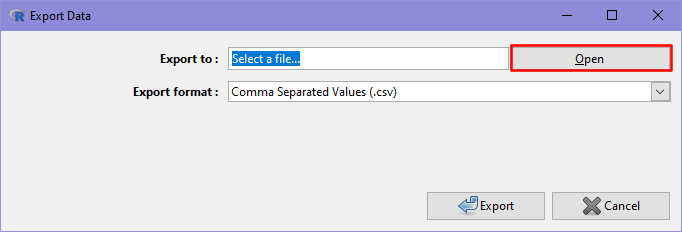{.borderbox .width400}

**Clicking “Open”** initiates this dialog ...

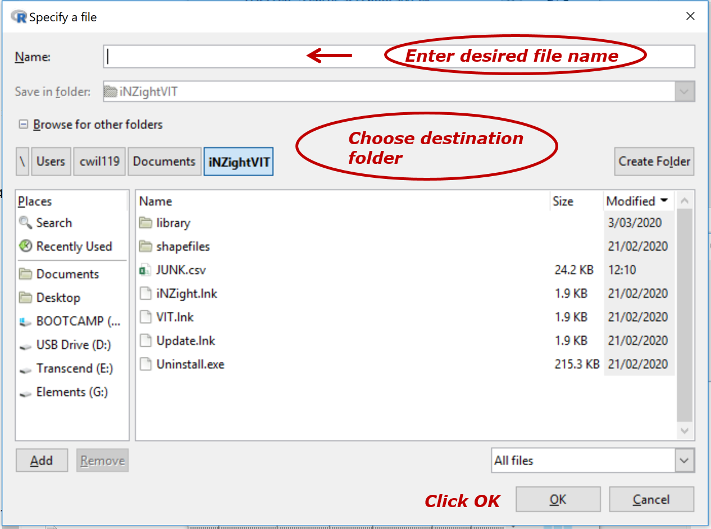{.borderbox .width400}

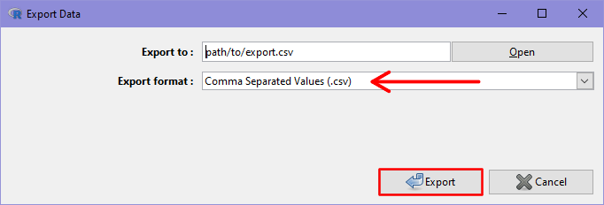{.borderbox .fright .width300}
This brings you back to ...

**Choose** from allowable file extensions and **click OK**

(_If you have already put the correct extension on your filename you can click OK without choosing an file type extension_)
<br><br>

##Paste from ... {#paste}
This enables copying and pasting data from sources like Excel files or Google sheets

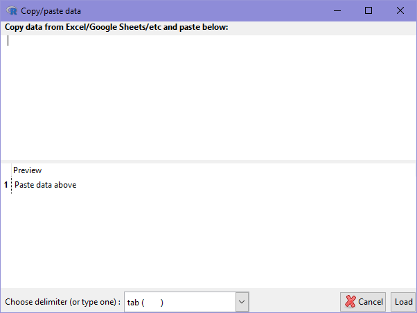{.borderbox .width400}

Click **Load** when finished

##Example data ... {#example}
Enables the loading of data files stored inside iNZight.

**_First select_** a Module (package) and _then_ a **Dataset** stored with that Module.

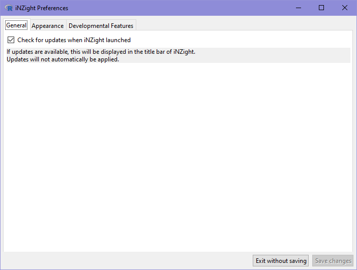{.borderbox .fright .width500}
##Preferences ... {#preferences}
**Preferences** enables changing some of the behaviours of iNZight such as default window and font sizes.

**_Preference changes do not take effect until_** the next time you start up iNZIght.

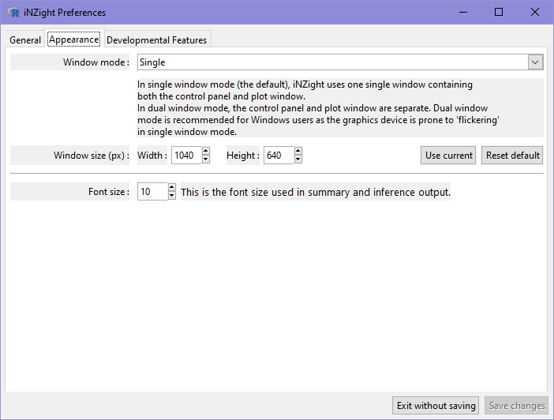{.borderbox .width500}

**Single window versus Dual-window display**<br>
While _single-window_ is the default, _dual-window_ mode is better for all Windows users except computer novices.

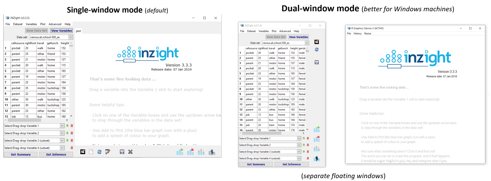{.borderbox .width1200}

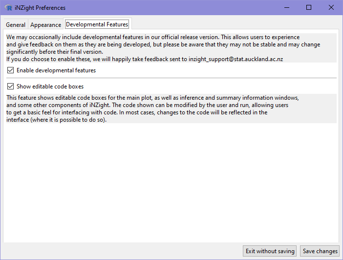{.borderbox .fright .width500}

**_Developmental features_**

These are turned off by default, and should be turned on by users interested in testing them out. They are likely to be buggy, but we welcome bug reports if you run into issues.

Currently, only one feature is available: editable code boxes, which are displayed at the bottom of the interface and allow editing of the code used to generate the current plot.
