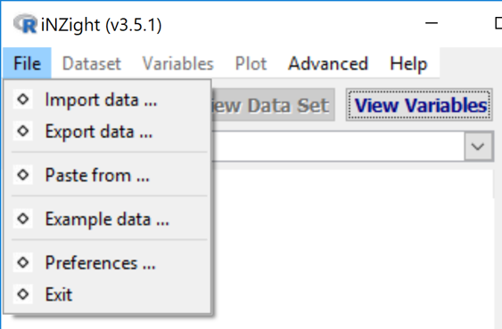
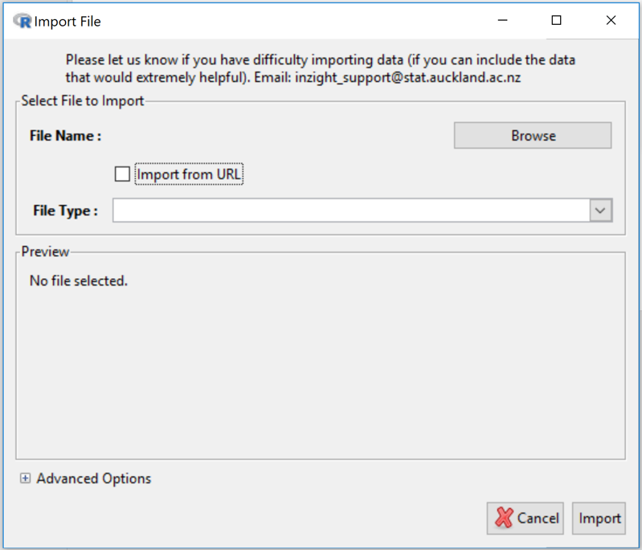
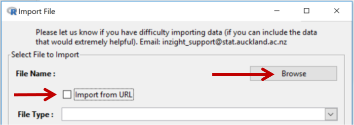
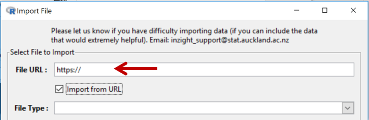
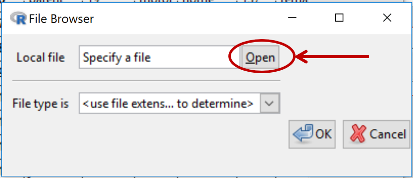
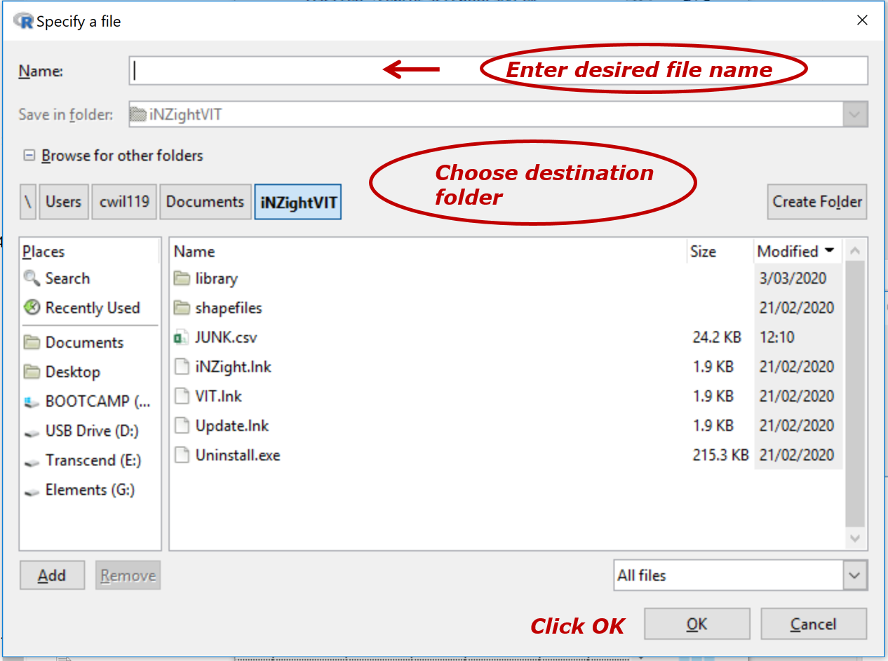
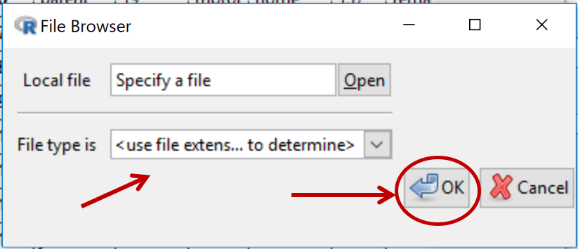
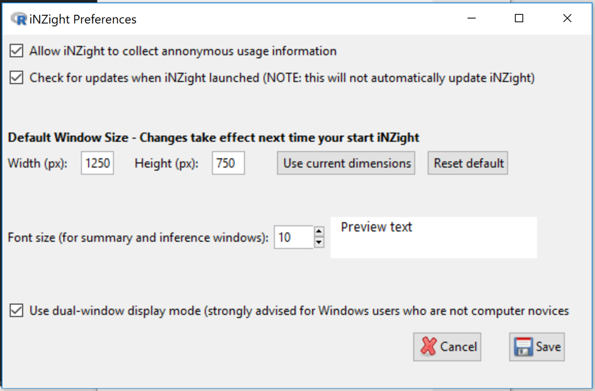
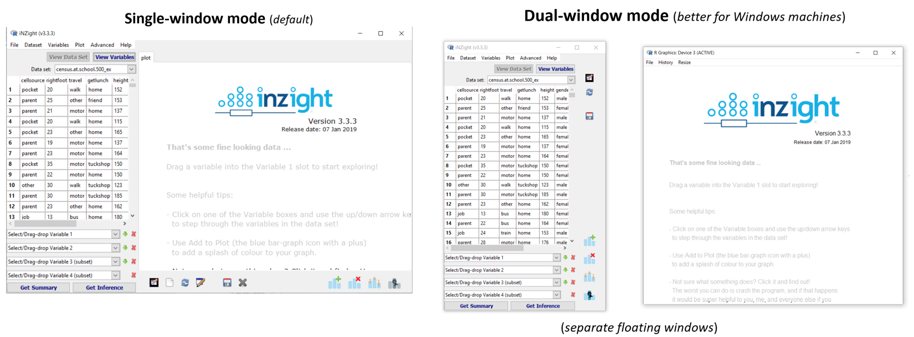

# File Menu
(_Getting data into and out of iNZight (Import, Paste, Examples, Export); Preferences=program controls_)

The __File menu__ provides 4 ways of getting data into iNZight  
   &emsp;&ensp;&bull;&ensp; ___Importing a file on your computer___ (_Import data …_)  
   &emsp;&ensp;&bull;&ensp; ___Importing a file from an internet url___ (_Import data …_)  
   &emsp;&ensp;&bull;&ensp; ___Copying and pasting___ data from programs like from Excel or Google sheets (_Paste from …_)  
   &emsp;&ensp;&bull;&ensp; Built-in ___Example data sets___ (_Example data …_)

The __File menu also__ allows for ___saving/exporting___ data. e.g., if you have modified it in some way in iNZight  (_Export data …_)

## Contents

{.borderbox .fright .width300}
* [Import data ...](#import)(_from a file on computer or internet_)  
    &emsp;&ensp;&bull;&ensp; [File types](#filetypes)  
    &emsp;&ensp;&bull;&ensp; [Metadata in csv files](#metacsv)  

* [Export data ...](#export)(_useful if have modified the dataset_)
* [Paste from ...](#paste) (_import by pasting copied data_)
* [Example data ...](#example) (_use an example dataset_)

* [Preferences ...](#preferences)(_change program behaviour_)
* __Exit ...__ (_quit iNZight_)

##Import data {#import}

{.borderbox .width400}

___By default___ imports ___from a file___ on your computer. Throws up a ___browser___ button to initiate a dialog for navigating to the file you want.

{.borderbox .width300}

On clicking the __Import from url__ _checkbox_ the behaviour changes (as below)

{.borderbox .width300}

Type or paste in the url address of the file you want to import 
(_when pasting a full url, ensure the prepopulated “https:// ” is overwritten_)

###File types {#filetypes}
NZight assumes that data sets are in __rows = cases__ by __columns = variables__ format

iNZight can import files of the following types:  
   &emsp;&ensp;&bull;&ensp; Comma Separated Values text files (.csv) 
   &emsp;&ensp;&bull;&ensp;Tab-delimited Text files (.txt) 
   &emsp;&ensp;&bull;&ensp;97-2003 Excel files (.xls) 
   &emsp;&ensp;&bull;&ensp;2007 Excel files (.xlsx) 
   &emsp;&ensp;&bull;&ensp;SPSS files (.sav) 
   &emsp;&ensp;&bull;&ensp;SAS Data files (.sas7bdat) 
   &emsp;&ensp;&bull;&ensp;SAS Xport files (.xpt) 
   &emsp;&ensp;&bull;&ensp;STATA fles (.dta) 
   &emsp;&ensp;&bull;&ensp;R Object files (.rds) 
   &emsp;&ensp;&bull;&ensp;RData files (.RData, .rda) 

___By default___, iNZight identifies the type of the file being imported by looking for one of these filename extensions. iNZight attempts to read the file and populate the __Preview panel__. If no preview appears iNZight has been unable to read the file.

Click the __Import__ button (at bottom right) when you are happy with what appears in the Preview panel.

The __Advanced Options__ at the bottom-left of the Import dialog box (Click on the “__+__” to expand) allows you to change default behaviour.

###Metadata in csv files {#metacsv}
(__Metadata__ is _information about the data_.)

When .csv files and are .txt files are imported into iNZight, all lines in the data file beginning with a "#" are ignored (there is one exception below).

This enables you to include __metadata__ in your .csv or .txt data files by starting each line of metadata information with a "#". 

___With .csv files___, you can go further and include ___instructions telling iNZight to treat variables in various ways___. This is particularly useful for instructing iNZight to order the levels of a categorical variable in a desired way, rather than the default way.

Lines starting with \#' @ are interpreted by iNZight's smart read function as containing instructions of this form  

__Example:__  
We will use the following lines from the top of  the file at ... https://www.stat.auckland.ac.nz/~wild/data/test/Census%20at%20School-500&meta.csv
to show how this works.

\## --- Meta Data --- ##  
\#' @factor gender[male,female]  
\#' @factor cellsource[pocket,parent,job,other]  
\#' @factor getlunch[home,tuckshop,dairy,school,friend,none]  
\#' @numeric age  
\#' @factor year  
\#' @factor school=year[primary=5|6,intermediate=7|8,high=9|10|11]  
\#' @factor travel[walk,bike,car=motor,public=bus|train,other]  
\#' @factor cellsource  
\#' @numeric phonebill=cellcost  
\## --- Data --- ##

___Note:___ _By default in R, and therefore iNZight, the categories (levels) of a categorical variable (factor) are ordered alphanumerically._
  
The 1st (real) line above is an instruction for __gender__ to be treated as a categorical variable (factor) with levels in the order "male, female", rather than the alphabetic default "female, male". 
The next 2 lines are doing the same sort of reorderings for __cellsource__ and __getlunch__.

__year__ in the data file has numeric values ranging from 4 to 13 and so by default will be treated as a numeric variable. "\#' @factor year " is an instruction to treat it as a categorical variable (factor).

The next line, "\#' @factor school=year[primary=5|6,intermediate=7|8,high=9|10|11]" is an instruction to construct a new categorical variable called __school__ from __year__ in which students in year-levels 5 & 6 become a category called "primary", ..., those in year-levels 9 to 11 become a category called "high". Year-levels 4, 12 an 13 are not mentioned in the statement so those categories remain unchanged and sort after those mentioned in the statement.

The next line redefines __travel__ by combining categories "bus" and "train" into a category called "public".

{.borderbox .fright .width300}
##Export data ... {#export}
     
__Clicking “Open”__ initiates this dialog ...
  

{.borderbox .fright .width400}
                  

{.borderbox .fright .width300}
This brings you back to ...

__Choose__ from allowable file extensions and __click OK__

(_If you have already put the correct extension on your filename you can click OK without choosing an file type extension_)
  

##Paste from ... {#paste}
This enables copying and pasting data from sources like Excel files or Google sheets 

Click __Load__ when finished

##Example data ... {#example}
Enables the loading of data files stored inside iNZight.

___First select___ a Module (package) and _then_ a __Dataset__ stored with that Module. 

{.borderbox .fright .width500}
##Preferences ... {#preferences}
__Preferences__ enables changing some of the behaviours of iNZight such as default window and font sizes.

___Preference changes do not take effect until___ the next time you start up iNZIght.
  

__Single window versus Dual-window display__ 
While _single-window_ is the default, _dual-window_ mode is better for all Windows users except computer novices.

{.borderbox .width1200}

