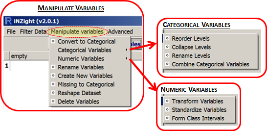

# Manipulating Variables

__iNZight assumes that data sets are in rows = cases by columns = variables format.__

For example, the cases (also often called units) may be individual people and the columns = variables contain different types of "measures" on those people.

By default, if __all the values__ of a variable are __numbers__, then that variable will be treated as as a __numeric variable__.

If __any of the values__ contains even one __alphabetic character__, then the whole variable will be treated as a __categorical variable__ (i.e., one that gives group membership). The one exception is  the value `NA`, which is treated as a missing-value code in both numeric and categorical variables.

### Convert to Categorical

Creates a categorical version of a numeric variable.

### Transform Variables

Creates a new variable that is a transformed version of the parent variable. Transformations available are `log` (base `e` or base 10), exponential, square, square root and reciprocal.

### Collapse Levels

Combine levels within a categorical parent variable to make a new variable with a smaller number of levels. (The levels of a categorical variable are the set of unique, or distinct, values it takes).

### Reorder Levels

By default, the levels of a categorical variable are displayed in alpha-numeric order. This enables you to change from the default order of display to something more natural; e.g. from {"adolescent", "adult", "child", "elder"} to {"child", "adolescent", "adult", "elder"}.

### Rename Levels

Change the names of the levels of a categorical variable, e.g. from (ages) {"< 12", "12-17", "18-69", "> 69"} to {"child", "adolescent", "adult", "elder"}.

### Reshape Dataset

For use with data concerning a single variable in which different columns correspond to the measurements from different groups. Such data will be converted into the standard cases by variables format (example given in __Reshape Dataset__'s dialog window).

### Combine Categorical Variables

Take two categorical variables and create a new categorical variable whose levels are all combinations of those two (e.g., the combinations of ethnicity and gender).

### Create New Variable

A very flexible facility for creating new variables from existing variables, essentially by doing arithmetic on them.

For example,
- `income = hours * payrate`
- `weight.diff = end.weight - begin.weight`
- `average.weight = ( begin.weight + endweight) / 2`

This new variable can take any valid __R__ expression.

### Form Class Intervals

Create a categorical variable whose levels are class intervals of a numeric variable.

For example, take `age` and create `age.f` with levels {"{0,20]", "(20,60]", "(60,110]"}.

### Standardise Variables

Create a __standardised__ version of a variable (or __z-score__) by subtracting the mean of the variable from each value and dividing by its standard deviation.
