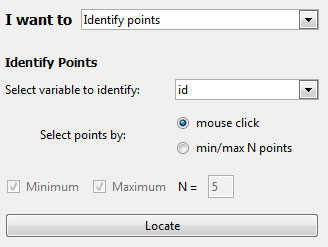

# Add to Plot

The Add to Plot menu allows you to code extra variables, add lines, and change the general appearance of the graph. The choice of additions presented to the user changes according to the type of plot drawn.

Once the additions are in place, they can be removed at any time using the __Remove Additions__ button on the plot toolbar, found beneath the graphics window.

The __Add to Plot__ options vary depending on the type of plot drawn:
- [Scatter plots](#scatterplots)
- [Dot plots](#dotplots)
- [Bar charts](#barplots)

## Options for Scatter Plots        {#scatterplots}

1. __Code more variables__
  {.fright}

  __Colour by levels of__: this gives the option to colour code the data points by any variable. If a numeric variable is chosen, a gradient of colours going from blue to purple to red is used to signify progressively larger values. If a categorical variable is used, different levels are represented by different colours.

  __Resize points proportional to__: this option can be used to resize the points proportional to any numeric variable in the data set.

2. __Add trend curves__
  {.fright}

  Provides the user with the option to fit linear, quadratic and cubic trend curves to the data shown on the scatter plot. The user is also allowed to control the colour of the trend lines.

  Users can also add a smoother to the plot, the smoothness of which is controlled by the slider.
  Alternatively, quantile smoothers can be fit by checking the appropriate box.

  For trends and smoothers, if the points have been coloured by a categorical variable, users can have the curves fitted to the individual levels of these factors. Additionally, these curves can either be parallel (equal slope, different intercepts) or have unique intercepts and slopes.

3. __Add x=y line__

  Draws a dotted y = x line on the plot to add perspective.

4. __Add a jitter__

  In a scatter plot where there is a large number of overlapping data points, the user may want to add a slight amount of irregular movement (or noise) to the data. Using jitter allows for a better impression of the density of points in a region.

  The variation or jitter can be added to the x-axis as well as the y-axis, thereby revealing all the available data points.

5. __Add rugs__

  User can add ticks on both axes in order to make it easy to read off the x and y values for data points.

6. __Join points by lines__
  {.fright}

  Joins up data points in a continuous line. However, if the points are already colour coded by a variable, then separate lines are drawn connecting points belonging to each level of the coding variable.

7. __Change plot appearance__
  {.fright}

  This brings up a menu that allows the user to customize the following aspects of the scatter plot.

  - Users can change the colour of the data point symbols by either choosing from a drop down menu OR typing in a desired colour. Users can opt to colour the interior of the symbols as well.

  - Similarly the background of the plot can be changed by typing in a colour or by using the drop down menu.

  - The size of the symbols can be increased or decreased by using sliders.

8. __Identify points__
  {.fright}

  This allows users to label points by clicking on them.

9. __Customise Labels__
  {.fright}

  iNZight attempts to make sensible titles and axis labels automatically. However, you can use your own if you prefer by typing in your own and pressing the `Enter` key on your keyboard.

__NOTE__:
If any typed in colours are not available the user would be notified via a pop up dialogue box. If colour coding by a variable is active while a user tries to change data point colours, the coding colours would take precedence over the user's choice until it is switched off (using Remove Additions).

## Options for Dot Plots        {#dotplots}

1. __Code more variables__
  {.fright}

  Colour code the data points by any variable. This is identical to that of the scatter plot (see above).

2. __Change plot appearance__
  {.fright}

  This is identical to the customization choices of the scatter plot (see above).

3. __Identify points__
  {.fright}

  This allows users to label points by clicking on them.

4. __Customise Labels__
  {.fright}

  iNZight attempts to make sensible titles and axis labels automatically. However, you can use your own if you prefer by typing in your own and pressing the `Enter` key on your keyboard.

## Options for Bar Plots        {#barplots}

1. __Code more variables__
  {.fright}

  This feature is accessible for one-way bar plot (i.e., Variable 1 is categorical and Variable 2 is empty.) This option will segement the bars to show the distribution of the chosen variable.

2. __Change plot appearance__
  {.fright}

  This allows users to change colours used in the plot.

3.  __Customise Labels__
  {.fright}

  iNZight attempts to make sensible titles and axis labels automatically. However, you can use your own if you prefer by typing in your own and pressing the `Enter` key on your keyboard.

