# Add to Plot

The Add to Plot menu allows you to code extra variables, add lines, and change the general appearance of the graph. The choice of additions presented to the user changes according to the type of plot drawn.

Once the additions are in place, they can be removed at any time using the __Remove Additions__ button on the plot toolbar, found beneath the graphics window.

The __Add to Plot__ options vary depending on the type of plot drawn:
- [Scatter plots](#scatterplots)
- [Dot plots](#dotplots)
- [Bar charts](#barplots)

See also:
- [Ways of choosing colours](#ColourChoices)

## Options for Scatter Plots        {#scatterplots}

1. __Code more variables__
  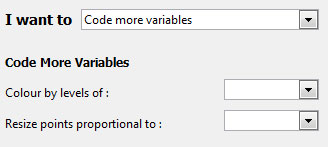{.fright}

  __Colour by levels of__: this gives the option to colour code the data points by any variable. If a numeric variable is chosen, a rainbow spectrum of colours is used to signify progressively larger values. If a categorical variable is used, different levels are represented by different colours. (See [ways of choosing colours](#ColourChoices) for alternatives to selecting from the drop-down menu.)

  __Resize points proportional to__: this option can be used to resize the points proportional to any numeric variable in the data set.

2. __Add trend curves__
  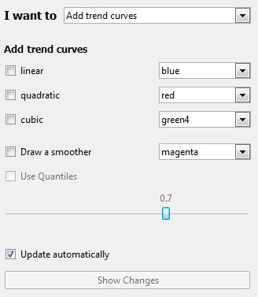{.fright}

  Provides the user with the option to fit linear, quadratic and cubic trend curves to the data shown on the scatter plot. The user is also allowed to control the colour of the trend lines. (See [ways of choosing colours](#ColourChoices) for alternatives to selecting from the drop-down menu.)

  Users can also add a smoother to the plot, the smoothness of which is controlled by the slider.
  Alternatively, quantile smoothers can be fit by checking the appropriate box.

  For trends and smoothers, if the points have been coloured by a categorical variable, users can have the curves fitted to the individual levels of these factors. Additionally, these curves can either be parallel (equal slope, different intercepts) or have unique intercepts and slopes.

3. __Add x=y line__

  Draws a dotted y = x line on the plot to add perspective.

4. __Add a jitter__

  In a scatter plot where there is a large number of overlapping data points, the user may want to add a slight amount of irregular movement (or noise) to the data. Using jitter allows for a better impression of the density of points in a region.

  The variation or jitter can be added to the x-axis as well as the y-axis, thereby revealing all the available data points.

5. __Add rugs__

  User can add ticks on both axes in order to make it easy to read off the x and y values for data points.

6. __Join points by lines__
  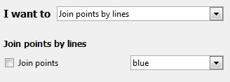{.fright}

  Joins up data points in a continuous line. However, if the points are already colour coded by a variable, then separate lines are drawn connecting points belonging to each level of the coding variable.

7. __Change plot appearance__
  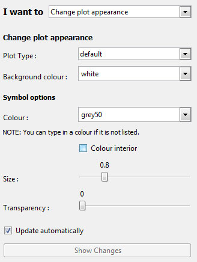{.fright}

  This brings up a menu that allows the user to customize the following aspects of the scatter plot.

  - Users can change the colour of the data point symbols and opt to colour the interior of the symbols as well.
  
  - Similarly the background of the plot can be changed by typing in a colour or by using the drop down menu.

  - The size of the symbols can be increased or decreased by using sliders.
  
   (See [ways of choosing colours](#ColourChoices) for alternatives to selecting from the drop-down menu.)

8. __Identify points__
  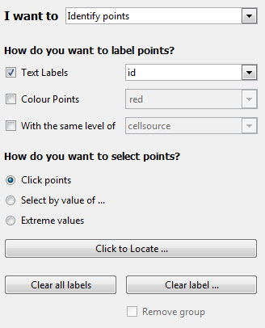{.fright}

  This allows users to label points in one of three ways (text labels, colour labels, and related points), using one of three methods (clicking, selecting values, or labelling extreme points).

  ___How do you want to label points?___

  - __Text labels__ allows you to select a variable from the data set with which to label selected points
  - __Colour points__ allows selected points to be filled in with a selected color. (See [ways of choosing colours](#ColourChoices).)
  - __With the same level of__ allows you to easily locate points related to the selected points.

     The main use of this would be to locate points with the same level of a chosen factor (e.g., if you are exploring survey data, you may wish to identify observations in the same cluster), or you may want to retain points selected over multiple graphs (e.g., in the Gap Minder data set, included in the `Data` folder, has several observations of countries over multiple years. In this case you can label certain coutries and track them over time).

     _Note_: when you do this, the point you clicked will be highlighted for easier reference.

  ___How do you want to select points?___

  - __Clicking with the mouse__: After clicking "Click to Locate ...", you can then click a point on the plot.
    iNZight will then label it using the options you defined above. You can select multiple points by clicking the button again and locating new points without losing the current selection.

     _Note_: due to the way the software works, you may see a "Busy" cursor after you click the "Click to Locate ..." button. This will not go away until you click a point, so go ahead and click points ignoring the cursor.

  - __Select by value of ...__: this will allow you to select a variable to use to select points.

     If the variable is a factor (or a numeric with less than 20 unique values) a slider will appear allowing you so quickly select the levels you wish to label. If the variable is numeric, or you want to select multiple levels, you can click the "Select levels ..." button to do so.

  - __Extreme values__: This will use a very simple algorithm that will select the points "farthest away" from the bulk of the data.

     This will display a slider, allowing you to select more or less points as desired. Once you have selected the points, you can optionally save the selection (e.g., if you want to track the same observations over multiple plots) you can click the "Save these points ..." button. From there you can use the "With the same level of" option to select related points, etc.

     The statistic used is [Mahalanobis' distance](http://en.wikipedia.org/wiki/Mahalanobis_distance).

9. __Customise Labels__
  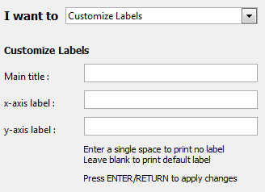{.fright}

  iNZight attempts to make sensible titles and axis labels automatically. However, you can use your own if you prefer by typing in your own and pressing the `Enter` key on your keyboard.

## Ways of choosing colours {#ColourChoices}
 
If ___colour coding by a variable___ is active while a user tries to change data point colours, the coding colours ___takes precedence___ over the user's choice until it is switched off (using Remove Additions).

__Colours__ can be chosen from a ___drop-down___ menu OR by typing in the ___name___ of a desired colour OR its ___Hex code___ (e.g. #C80000). 
 See [colour chart pdf](http://research.stowers-institute.org/efg/R/Color/Chart/ColorChart.pdf) (8 pages) for the names and codes of the huge range of colours available.  Increasingly, if any typed in colours are not available the user is notified via a pop up dialogue box. 
 
 Adding a 7th and 8th digit to a 6-character Hex code allows you to include percent opacity (= 100 - percent transparency; compare #204090 with #20409030 and #20409070). (One way of specifying the main hex code is to use 6 numbers corresponding to 2 digits each for %Red, %Green and % Blue; FF can be used to specify 100%.)
 

## Options for Dot Plots        {#dotplots}

1. __Code more variables__
  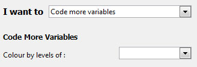{.fright}

  Colour code the data points by any variable. This is identical to that of the scatter plot (see above).

2. __Change plot appearance__
  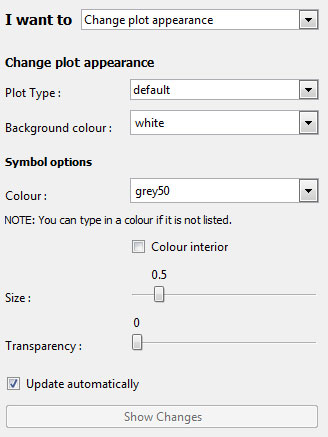{.fright}

  This is identical to the customization choices of the scatter plot (see above).

3. __Identify points__
  {.fright}

  This allows users to label points by clicking on them, and works much the same as it does for scatter plots (see above).

  The main difference is in the location of extreme points, where users are now presented with two sliders: one for the number of lower points, and one for the number of upper points, to label..

4. __Customise Labels__
  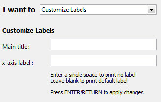{.fright}

  iNZight attempts to make sensible titles and axis labels automatically. However, you can use your own if you prefer by typing in your own and pressing the `Enter` key on your keyboard.

## Options for Bar Plots        {#barplots}

1. __Code more variables__
  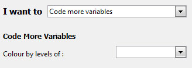{.fright}

  This feature is accessible for one-way bar plot (i.e., Variable 1 is categorical and Variable 2 is empty.) This option will segement the bars to show the distribution of the chosen variable.

2. __Change plot appearance__
  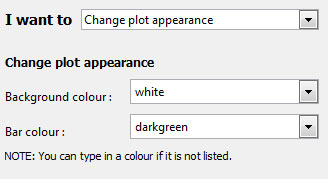{.fright}

  This allows users to change colours used in the plot.

3.  __Customise Labels__
  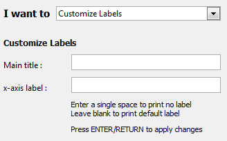{.fright}

  iNZight attempts to make sensible titles and axis labels automatically. However, you can use your own if you prefer by typing in your own and pressing the `Enter` key on your keyboard.
