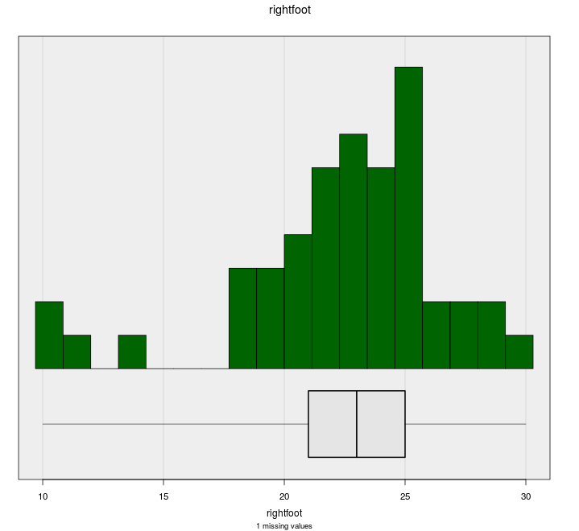
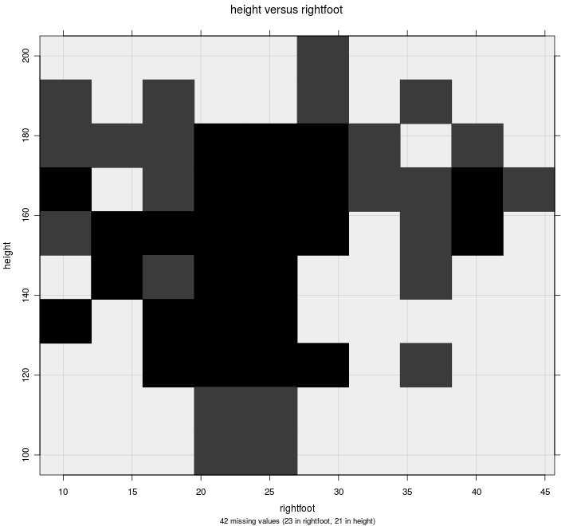

# Add to Plot

The Add to Plot window lets your customise your graph, explore patterns in the data,
and highlight important features.
The options available to you depend on the type of variables you have selected and the plot drawn.

At the top of the Add to Plot window is a drop down that lets you select from one of the available panels:
- [Customise Plot Appearance](#appearance)
- [Trend Lines and Curves](#lines) (scatter/hexbin/grid-density plots only)
- [Axes and Labels](#axes)
- [Identify Points](#identify)

***
## Customise Plot Appearance {#appearance}

This panel allows you to control most of the visual aspects of the graph,
including size and colour.

### General Appearance {#general}

  

    
    

      <small>All plots (bar plots exclude "Plot type" option)</small>
    

  

  <!-- 

    
    

      <small>Bar plots (no plot type option)</small>
    

  
 -->

This section is common across all graphs, with the exception of the
options listed in the "Plot type" dropdown.

- __Plot type__:
  allows overriding the default plot chosen by iNZight,
  which is based on dataset size.

  <!-- <a href="#" id="togglePlottypes">Show/hide available plot types</a> -->
  <button type="button" class="btn btn-info btn-sm" data-toggle="modal" data-target="#plottypes">
    Available Plot Types
  </button>

  

    

      

        

          <h4>Types of plots in iNZight</h4>
        

        

          
<strong>One numeric variable (and optionally one categorical variable)</strong>

          

            

              

                
                

                  
Dot plot default for small samples

                

              

            

            

              

                
                

                  
Histogram default for large samples

                

              

            

          

          

          
<strong>Two numeric variables</strong>

          

            

              

                
                

                  
Scatter plot default for small samples

                

              

            

            

              

                
                

                  
Hexbin Plot default for large samples

                

              

            

            

              

                
                

                  
Grid-density Plot ("2D histogram") useful as a teaching example

                

              

            

          

          

          
<strong>One or two categorical variables</strong>

          

            

              

                
                

                  
One-way bar chart

                

              

            

            

              

                
                

                  
Two-way bar chart

                

              

            

          

        

        

          <button type="button" class="btn btn-default" data-dismiss="modal">Close</button>
        

      

    

  

- __Background colour__:
  you can customise the background colour of your graphs to suit your preference,
  or make certain features easier to distinguish.

  You can [specify colours](../advanced/#colours) using names or HEX codes.

- __Overall size scale__:
  this lets you adjust the overall size of everything drawn on the screen.

  This works as a baseline, so all other size settings will be multiplied by this value.

### Size / Point Size

Control point sizes on scatter plots and dot plots,
hexagons on hexbin plots, and bar-widths on histograms.

__Size by variable__:
On scatter plots, you can choose a numeric variable to be used to resize the points.

  

    
  

### Colour / Point Colour

Change the colour of points, hexagons, and bars.
Colours can be chosen from the list,
or you can type your own.
[See choosing colours](../advanced/#colours) for more information.

__Colour by variable__:
(scatter plots / dot plots / hexbin plots / one-way barplots). 
Select a variable to code colours.
Several choices for colour palettes will be offered.

<button type="button" class="btn btn-info btn-sm" data-toggle="modal" data-target="#palettes">
  Read about iNZight's palettes
</button>

  #### iNZight Colour Palettes

  iNZight now uses some 3rd party colour palettes,
  which are available depending on the type of variable (categorical or numeric).

  The __numeric colour palettes__ we use by default come from the
  [`viridis` package](https://cran.r-project.org/web/packages/viridis/vignettes/intro-to-viridis.html).
  Besides being pretty, these palettes have some great features:
  - they are perceptually uniform, so changes at one of the spectrum reprent the same change in value as those at the other end
  - they retain this property when printed in grayscale
  - and they can be percieved by people with the more common types of colourblindness.

The __categorical colour palettes__ come from the [`RColourBrewer` package based on ColorBrewer2](http://colorbrewer2.org/#type=qualitative&scheme=Accent&n=3).

Lastly, we've included several other options for you to try out on the off change it suits your data, including the old iNZight "rainbow" we used as default in previous versions.

Try using different background colours too; the `viridis` colours go particularly well with a dark gray background.

  <button type="button" class="btn btn-default" data-dismiss="modal">Close</button>

- __Categorical variable__: Each category will be assigned a colour (depending on your chosen palette)

  _Scatter plots and dot plots_: Points are coloured according to the level of the variable.

  _Hexbin plots_: hexagons are coloured depending on the proportion of points in each category that fall within that hexagon.

  _One-way bar plots_: the bars are segmented depending on the proportions of each category and coloured accordingly.

- __Numeric variable__: a linear scale is set up from the lowest to the highest value, and each point is coloured based on its value.

  If you click the __Use rank__ checkbox, the colours will be based on quantiles,
  rather than absolute values. This can be helpful if you have a few very large values of the chosen variable.

  

    NOTE: if you choose a numeric variable on a __hexbin plot__,
    iNZight will convert it to a 4-level categorical variable.
  

  

    
    

      <small>Colour by a categorical variable Dot / Scatter / Hex / One-way Bar</small>
    

  

  

    
    

      <small>Colour by a numeric variable Dot / Scatter</small>
    

  

__Cycle levels__:
You can cycle through the various levels (or quantiles for numeric variables),
making it stand out from the others,
by clicking the left and right arrows.
You can adjust the number of quantiles to use by adjusting the number in the box.

### Point Symbols

Select different symbols to use on scatter plots and dot plots.

__Symbol by variable__:
You can also chose a categorical variable with 5 or fewer levels,
and iNZight will give each its own symbol.
This is particularly useful when creating colour-blind friendly plots,
or for black-and-white printed graphs.

  

    <strong>WARNING: transparency can make drawing very slow if you have a large dataset</strong>
  

  

  Diamonds and triangles can take a long time to draw if you have a big data set (at least on Windows).
  Circles (the default) and squares seem to be OK.

  iNZight will turn off transparency if you change plotting symbol to one of these; you can put transparency back,
  but iNZight may become unresponsive while it tries to draw the graph.
  

***
## Trend Lines and Curves  {#lines}

On _scatter plots_, _hexbin plots_, and _grid density plots_,
you can add various types of lines to the graph.

### Trend Curves

  

    
    <!-- 

      <small>Trend Lines and Curves</small>
    
 -->
  

///SCRIPT: https://cdn.mathjax.org/mathjax/latest/MathJax.js?config=TeX-AMS-MML_HTMLorMML ///

Trend curves are fitted using __linear regression__ models,
which minimises the overall vertical distance between points and the line.

The formula for the line (which can be found by clicking the __Get Summary__ button after adding a trend line) depends on the type of curve fitted.
In these equations, `y` is "Variable 1", the _primary variable of interest_,
and `x` is "Variable 2".
The greek letter \\\(\\beta\\\) ("beta") represents an __unknown value__,
and iNZight picks the best value to make the line fit the data as
well as possible.
The _subscripts_ (\\\(\\beta_0, \\beta_1, \\ldots\\\)) simply indicate __different__ unknown values.
- __Linear__: a straight line fitted through the points:
  $$ y = \\beta_0 + \\beta_1 x $$
  It has an __intercept__, \\\( \\beta_0 \\\),
  which represents the value of \\\(y\\\) when \\\(x=0\\\),
  and a __slope__, \\\(\\beta_1\\\),
  which describes the change in \\\(y\\\) for a unit change in \\\(x\\\).

- __Quadratic__: a curved line with at most one bend:
  $$ y = \\beta_0 + \\beta_1 x + \\beta_2 x^2 $$

- __Cubic__: a curved line with up to two bends:
  $$ y = \\beta_0 + \\beta_1 x + \\beta_2 x^2 + \\beta_3 x^3 $$

For more details, [see this page of the Data to Insight course](https://www.futurelearn.com/courses/data-to-insight/2/steps/47147).

### Smoothers

These curves are fitted without the restrictions of the regression models
shown above.
iNZight uses a __loess__ smoother,
and you can control the degree of "smoothness" using the slider.

If you have a large data set, you can add __quantile smoothers__,
which draw lines at not only the middle (median) of the data,
but also at the quartiles, 25% and 75%,
and the 10% and 90% quantiles if the sample size is large enough.

### Join Points

In some cases, you may have __ordered data__ that makes sense to connect
points,
for example a time series.
If you specified a categorical __colour by__ variable,
you can optionally connect points within each level of that variable.

### Trend Line Options

If you specified a categorical __colour by__ variable,
you can fit a trend curve through each level of that variable.
By default, the lines will have the same __slope__,
but different __intercepts__, so they will be parallel.
If you want the lines to be completely independent,
you can uncheck the parallel trend lines box and each level
will also be given its own intercept.

Line Width Multiplier will adjust the thickness of lines.

The line of equality is useful when the units of the two variables
are the same (for example, "before" and "after" measurements).

***
## Axes and Labels {#axes}

### Axis Labels

  

    
    <!-- 

      <small>Trend Lines and Curves</small>
    
 -->
  

Type your own labels to override those automatically created by iNZight.

To remove labels, just enter one or more spaces into the box and press <kbd>enter</kbd>.

### Axis Features

For __scatter plots__ only.

- __Jitter__:
  This adds a small amount of noise to each value,
  which helps to separate out discrete variables (for example, age).

- __Rugs__:
  This adds a small line on the axis for each point,
  making it easier to read values for extreme points.

### Axis Limits

This allows you to adjust the limits of the axes,
effectively allowing you to "zoom in" on specific regions.

### Number of bars

On bar charts, you can adjust the total number of bars shown at a time.
This is useful if a categorical factor has too many levels to display all at ones.

***
## Identify Points   {#identify}

This allows users to label points in one of three ways (text labels, colour labels, and related points), using one of three methods (clicking, selecting values, or labelling extreme points).

___How do you want to label points?___

  

    
    <!-- 

      <small>Trend Lines and Curves</small>
    
 -->
  

- __Text labels__ allows you to select a variable from the data set with which to label selected points
- __Colour points__ allows selected points to be filled in with a selected color. (See [ways of choosing colours](#ColourChoices).)
- __With the same level of__ allows you to easily locate points related to the selected points.

   The main use of this would be to locate points with the same level of a chosen factor (e.g., if you are exploring survey data, you may wish to identify observations in the same cluster), or you may want to retain points selected over multiple graphs (e.g., in the Gap Minder data set, included in the `Data` folder, has several observations of countries over multiple years. In this case you can label certain coutries and track them over time).

   _Note_: when you do this, the point you clicked will be highlighted for easier reference.

___How do you want to select points?___

  

    
    <!-- 

      <small>Trend Lines and Curves</small>
    
 -->
  

- __Clicking with the mouse__: After clicking "Click to Locate ...", you can then click a point on the plot.
  iNZight will then label it using the options you defined above. You can select multiple points by clicking the button again and locating new points without losing the current selection.

   _Note_: due to the way the software works, you may see a "Busy" cursor after you click the "Click to Locate ..." button. This will not go away until you click a point, so go ahead and click points ignoring the cursor.

  

    
    <!-- 

      <small>Trend Lines and Curves</small>
    
 -->
  

- __Select by value of ...__: this will allow you to select a variable to use to select points.

   If the variable is a factor (or a numeric with less than 20 unique values) a slider will appear allowing you so quickly select the levels you wish to label. If the variable is numeric, or you want to select multiple levels, you can click the "Select levels ..." button to do so.

  

    
    <!-- 

      <small>Trend Lines and Curves</small>
    
 -->
  

- __Extreme values__: This will use a very simple algorithm that will select the points "farthest away" from the bulk of the data.

   This will display a slider, allowing you to select more or less points as desired. Once you have selected the points, you can optionally save the selection (e.g., if you want to track the same observations over multiple plots) you can click the "Save these points ..." button. From there you can use the "With the same level of" option to select related points, etc.

   The statistic used is [Mahalanobis' distance](http://en.wikipedia.org/wiki/Mahalanobis_distance).

