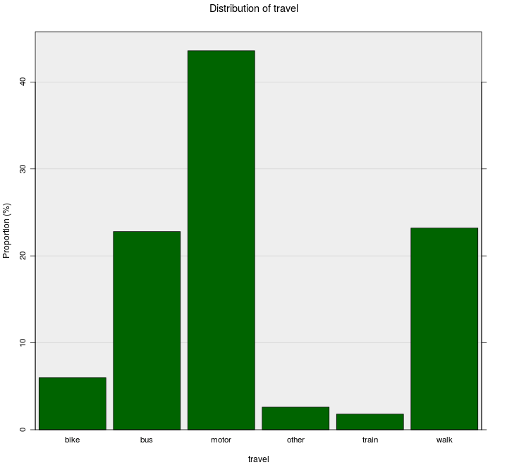

# Add to Plot

The Add to Plot window lets your customise your graph, explore patterns in the data,
and highlight important features.
The options available to you depend on the type of variables you have selected and the plot drawn.
<!--
- [Dot plots](#dotplots) | [Histograms](#histograms)
- [Scatter plots](#scatterplots)
- [Bar charts](#barplots) -->

At the top of the Add to Plot window is a drop down that lets you select from one of the available panels:
- [Customise Plot Appearance](#appearance)
- [Trend Lines and Curves](#lines) (scatter/hexbin/grid-density plots only)
- [Axes and Labels](#axes)
- [Identify Points](#identify)

***
## Customise Plot Appearance {#appearance}

This panel allows you to control most of the visual aspects of the graph,
including size and colour.

### General Appearance {#general}

- __Plot type__:
  this allows you to override the default plot generated by iNZight,
  which is based on the size of your data set.

  <table class="plottypes">
    <thead>
      <tr>
        <th>Variables</th>
        <th colspan="3" align="center">Plot Types</th>
      </tr>
    </thead>
    <tbody>
      <tr>
        <td>
          Numeric 
          Numeric + Categorical
        </td>
        <td markdown="1" align="center">
 {.width200}

  __Dot plot__
        </td>
        <td markdown="1" align="center">
 {.width200}

  __Histogram__
        </td>
        <td></td>
      </tr>

      <tr>
        <td>
          Numeric + Numeric
        </td>
        <td markdown="1" align="center">
 {.width200}

  __Scatter plot__
        </td>
        <td markdown="1" align="center">
 {.width200}

  __Hexbin plot__
        </td>
        <td markdown="1" align="center">
 {.width200}

  __Grid Density plot__
        </td>
      </tr>

      <tr>
        <td>
          Categorical 
          Categorical + Categorical
        </td>
        <td markdown="1" align="center">
 {.width200}

  __Bar plot__
        </td>
        <td></td><td></td>
      </tr>
    </tbody>
  </table>

- __Background colour__:
  you can customise the background colour of your graphs to suit your preference,
  or make certain features easier to distinguish.

  You can [specify colours](#colour) using names or HEX codes.

- __Overall size scale__:
  this lets you adjust the overall size of everything drawn on the screen.

  This works as a baseline, so all other size settings will be multiplied by this value.

***

# Dot plots   {#dotplots}

## Point Size

You can adjust the size of the dots.
This is especially useful if your _Y_ axis isn't big enough to fit all of the dots,
in which case they get "squashed" together,
or when some of the gaps between stacks of dots aren't quite wide enough,
resulting in some strange "floating" stacks.
Adjust the point size until it looks right to you.

## Point Colour

You can change the colour of the dots to suit your preference,
and additionally you can adjust the transparency of points.
Doing so will cause the dots to become "filled".

You can also __colour code a variable__, allowing you to explore trends in the data.
When you do so, you'll be able to select a colour palette
(this will replace the colour menu).
The choice of palettes depends on the variable you choose:
- __Categorical variable__:
  Each level of the variable is assigned a colour, and points are coloured accordingly.
  The colour palettes are chosen to make it easy to distinguise points in different groups.
  Note that this only works well if you have a categorical variable with a few levels.
- __Numeric variable__:
  By default, points are coloured based on their value,
  which is computed linearly from the minimum to the maximum value.

  If you check the __Use Ranks__ box,
  the points will be coloured depending on the __order__.
  This is expecially useful if you have a variable that has a few extreme values,
  causing most of the points' colours to be difficult to distinguish.

  

    iNZight uses the `viridis` colour palettes ("viridis", "magma", "plasma", and "inferno"),
    which are colourblind friendly and can even be printed in grayscale!
    [Viridis R package](https://cran.r-project.org/web/packages/viridis/vignettes/intro-to-viridis.html).
  

You can also check the __reverse palette__ box, which will inverse the order colours are assigned to values.

__Cycle levels/quantiles__:
To help pick out trends, you can also cycle through the various levels of a categorical variable
(or quantiles of a numeric one) by clicking the arrows.
This can help if you have lots of factor levels that are difficult to distinguish.
iNZight will place these points _on top of the others_ to help them stand out.

  NOTE: this currently works best if you have a __light__ coloured background.

## Point Symbol

Now iNZight gives you control of the symbols used.

- __Symbol__:
  Choose your prefered symbol: circle, square, diamond, or triangle!
- __Symbol by__:
  You can use different symbols to represent various levels of a factor variable,
  either in conjunction with colour (by clicking the __match with colour variable__ box)
  or separately.
  We've only made 5 symbols available now, so not all factor variables will show up on the list.

- __Symbol line width__ lets you control how thick the outlines of the symbols are.

- __Fill symbols__: checking this box will colour the interior of the symbols.

  

    Pluses (+) and crosses (x) are reserved for coding missingness.
  

  

    WARNING:
    On some devices (including Windows) using transparency and symbols other than circles or squares can
    be very slow when using a large data set.
  

