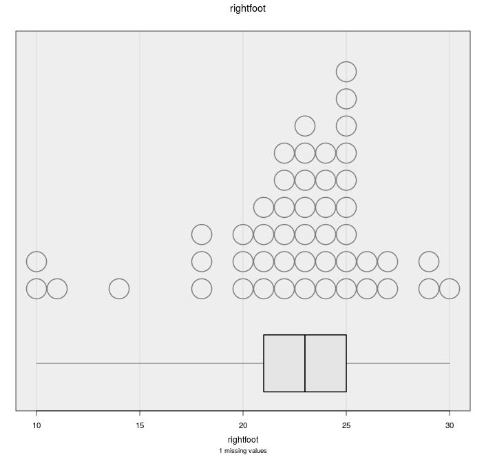
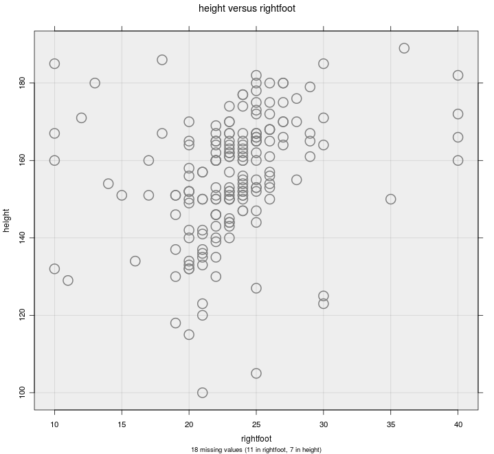
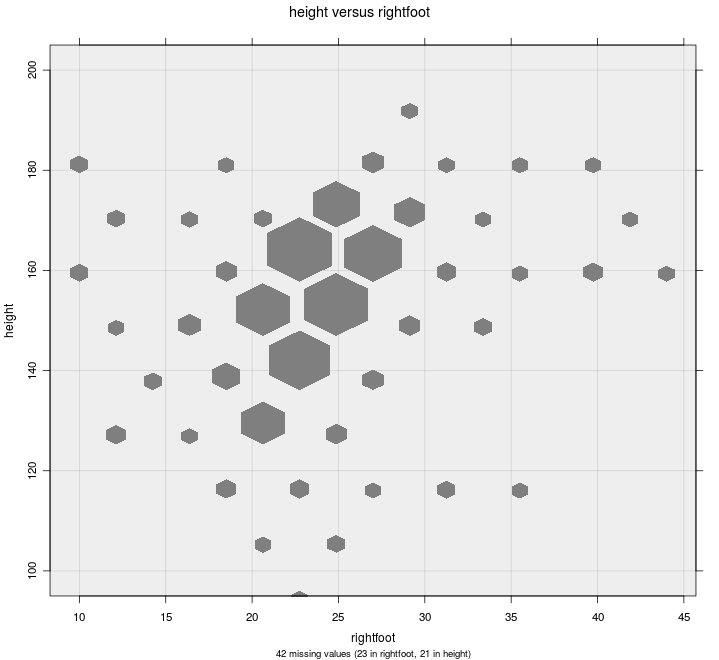

# Add to Plot

The Add to Plot window lets your customise your graph, explore patterns in the data,
and highlight important features.
The options available to you depend on the type of variables you have selected and the plot drawn.

At the top of the Add to Plot window is a drop down that lets you select from one of the available panels:
- [Customise Plot Appearance](#appearance)
- [Trend Lines and Curves](#lines) (scatter/hexbin/grid-density plots only)
- [Axes and Labels](#axes)
- [Identify Points](#identify)

***
## Customise Plot Appearance {#appearance}

This panel allows you to control most of the visual aspects of the graph,
including size and colour.

### General Appearance {#general}

This section is common across all graphs, with the exception of the
options listed in the "Plot type" dropdown.

- __Plot type__:
  this allows you to override the default plot generated by iNZight,
  which is based on the size of your data set.

  <a href="#" id="togglePlottypes">Show/hide available plot types</a>
  

    <table>
      <thead>
        <tr>
          <th align="center">Variables</th>
          <th colspan="3" align="center">Plot Types</th>
        </tr>
      </thead>
      <tbody>
        <tr>
          <td>
            Numeric 
            Numeric + Categorical
          </td>
          <td markdown="1" align="center">
 {.width200}

    __Dot plot__
          </td>
          <td markdown="1" align="center">
 {.width200}

    __Histogram__
          </td>
          <td></td>
        </tr>

        <tr>
          <td>
            Numeric + Numeric
          </td>
          <td markdown="1" align="center">
 {.width200}

    __Scatter plot__
          </td>
          <td markdown="1" align="center">
 {.width200}

    __Hexbin plot__
          </td>
          <td markdown="1" align="center">
 {.width200}

    __Grid Density plot__
          </td>
        </tr>

        <tr>
          <td>
            Categorical 
            Categorical + Categorical
          </td>
          <td markdown="1" align="center">
 {.width200}

    __Bar plot__
          </td>
          <td></td><td></td>
        </tr>
      </tbody>
    </table>
  

- __Background colour__:
  you can customise the background colour of your graphs to suit your preference,
  or make certain features easier to distinguish.

  You can [specify colours](../advanced/#colours) using names or HEX codes.

- __Overall size scale__:
  this lets you adjust the overall size of everything drawn on the screen.

  This works as a baseline, so all other size settings will be multiplied by this value.

### Size

Control point sizes on scatter plots and dot plots,
hexagons on hexbin plots, and bar-widths on histograms.

On scatter plots, you can choose a numeric variable to be used to resize the points.

### Colour

Change the colour of points, hexagons, and bars.
Colours can be chosen from the list,
or you can type your own.
[See choosing colours](../advanced/#colours) for more information.

Alternatively, on scatter plots, dot plots, hexbin plots and one-way barplots,
you can select a variable to colour by.
Doing so will give you the option of choosing a _palette_ from the drop down menu.

<a href="" id="togglePalettes">Show/hide colour palette details</a>

  __iNZight Colour Palettes__

  iNZight now uses some 3rd party colour palettes,
  which are available depending on the type of variable (categorical or numeric).

  The __numeric colour palettes__ we use by default come from the
  [`viridis` package](https://cran.r-project.org/web/packages/viridis/vignettes/intro-to-viridis.html).
  Besides being pretty, these palettes have some great features:
  - they are perceptually uniform, so changes at one of the spectrum reprent the same change in value as those at the other end
  - they retain this property when printed in grayscale
  - and they can be percieved by people with the more common types of colourblindness.

The __categorical colour palettes__ come from the [`RColourBrewer` package based on ColorBrewer2](http://colorbrewer2.org/#type=qualitative&scheme=Accent&n=3).

Lastly, we've included several other options for you to try out on the off change it suits your data, including the old iNZight "rainbow" we used as default in previous versions.

Try using different background colours too; the `viridis` colours go particularly well with a dark gray background.

- __Categorical variable__: Each category will be assigned a colour (depending on your chosen palette)

  _Scatter plots and dot plots_: Points are coloured according to the level of the variable.

  _Hexbin plots_: hexagons are coloured depending on the proportion of points in each category that fall within that hexagon.

  _One-way bar plots_: the bars are segmented depending on the proportions of each category and coloured accordingly.

- __Numeric variable__: a linear scale is set up from the lowest to the highest value, and each point is coloured based on its value.

  If you click the __Use rank__ checkbox, the colours will be based on quantiles,
  rather than absolute values. This can be helpful if you have a few very large values of the chosen variable.

  

    NOTE: if you choose a numeric variable on a __hexbin plot__,
    iNZight will convert it to a 4-level categorical variable.
  

You can cycle through the various levels (or quantiles for numeric variables),
making it stand out from the others,
by clicking the left and right arrows.
You can adjust the number of quantiles to use by adjusting the number in the box.

### Plot Symbols

Select different symbols to use on scatter plots and dot plots.

You can also chose a categorical variable with 5 or fewer levels,
and iNZight will give each its own symbol.
This is particularly useful when creating colour-blind friendly plots,
or for black-and-white printed graphs.

  WARNING: circles and squares behave nicely when you adjust the transparency.
  However, transparent diamonds and triangles can take a long time to draw if you have a big data set (at least on Windows).
  iNZight will turn off transparency if you change plotting symbol to one of these.

***
## Trend Lines and Curves  {#lines}

On _scatter plots_, _hexbin plots_, and _grid density plots_,
you can add various types of lines to the graph.

### Trend Curves

///SCRIPT: https://cdn.mathjax.org/mathjax/latest/MathJax.js?config=TeX-AMS-MML_HTMLorMML ///

Trend curves are fitted using __linear regression__ models,
which minimises the overall vertical distance between points and the line.

The formula for the line (which can be found by clicking the __Get Summary__ button after adding a trend line) depends on the type of curve fitted.
In these equations, `y` is "Variable 1", the _primary variable of interest_,
and `x` is "Variable 2".
The greek letter \\\(\\beta\\\) ("beta") represents an __unknown value__,
and iNZight picks the best value to make the line fit the data as
well as possible.
The _subscripts_ (\\\(\\beta_0, \\beta_1, \\ldots\\\)) simply indicate __different__ unknown values.
- __Linear__: this is a straight line fitted through the points:
  $$ y = \\beta_0 + \\beta_1 x $$
  It has an __intercept__, \\\( \\beta_0 \\\),
  which represents the value of \\\(y\\\) when \\\(x=0\\\),
  and a __slope__, \\\(\\beta_1\\\),
  which describes the change in \\\(y\\\) for a unit change in \\\(x\\\).

- __Quadratic__: this is a curved line with a single bend:
  $$ y = \\beta_0 + \\beta_1 x + \\beta_2 x^2 $$

- __Cubic__: this is a curved line with two bends:
  $$ y = \\beta_0 + \\beta_1 x + \\beta_2 x^2 + \\beta_3 x^3 $$

### Smoothers

These curves are fitted without the restrictions of the regression models
shown above.
iNZight uses a __loess__ smoother,
and you can control the degree of "smoothness" using the slider.

If you have a large data set, you can add __quantile smoothers__,
which draw lines at not only the middle (median) of the data,
but also at the quartiles, 25% and 75%,
and the 10% and 90% quantiles if the sample size is large enough.

### Join Points

In some cases, you may have __ordered data__ that makes sense to connect
points,
for example a time series.
If you specified a categorical __colour by__ variable,
you can optionally connect points within each level of that variable.

### Trend Line Options

If you specified a categorical __colour by__ variable,
you can fit a trend curve through each level of that variable.
By default, the lines will have the same __slope__,
but different __intercepts__, so they will be parallel.
If you want the lines to be completely independent,
you can uncheck the parallel trend lines box and each level
will also be given its own intercept.

Line Width Multiplier will adjust the thickness of lines.

The line of equality is useful when the units of the two variables
are the same (for example, "before" and "after" measurements).

***
## Axes and Labels {#axes}

***
## Identify Points   {#identify}

///SCRIPT: ../../js/markdown.js///
