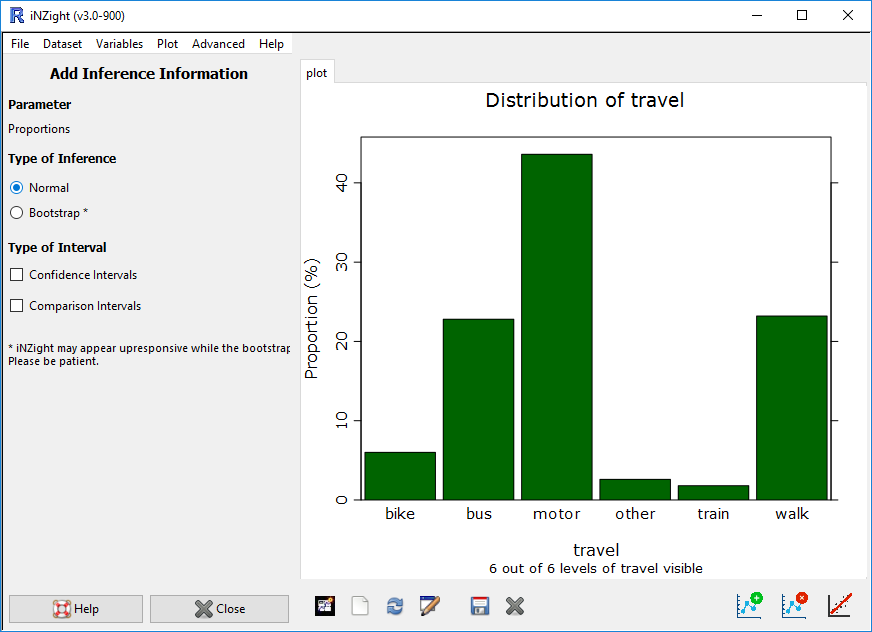

# Add Inference Information

iNZight provides users with an easy interface for adding inference information to plots,
using "normal theory" or bootstrap methods.
The inference options available again depend on the type of plot drawn.

## Scatter Plot Inference

If a scatter plot is drawn, you must first add trend lines before you can obtain inference information. This is done using the __Add to Plot__ button, selecting __Add trend line__ and selecting one or more trends (this includes the smoother).

Having added a trend line or lines, the inference information will generate 30 bootstrap trend lines and display these on the graph, giving users an idea of the precision of the estimated curve.

## Dot Plot Inference
{.fright}

Dot plots, by default, provide a box plot which provides an estimate of the Median, as well as the 25% and 75% quantiles. Users are then presented with three options:

- __Parameter__: the parameter for which inference is obtained

  - __Mean__: this will generate inference of the mean of the data

  - __Median__: this will generate inference of the median of the data

- __Type of Inference__: Depending on the parameter, users can select the type of inference used to obtain the intervals displayed on the graph

  - __Normal__: this uses standard normal theory to approximate a confidence interval

  - __Year 12__: for __medians__, the year 12 (NCEA L3) method of computing an interval is used

  - __Bootstrap__: this method uses bootstrap sampling to obtain confidence or comparison intervals of the chosen parameter

- __Type of Interval__: the type of interval displayed

  - __Confidence Interval__: this displays a 95% confidence interval

  - __Comparison Interval__: if a numeric and categorical variable have been plotted, comparison intervals can be added to allow visual comparison of the mean or median of the numeric variable between different levels of the categorical variable.

## Bar Plot Inference
{.fright}

The inference information for bar plots is computed for the estimated proportions, using normal theory or bootstrap techniques.
