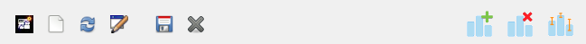

# Plot Toolbar Buttons

The plot toolbar lies below the graphics window, and provides several useful options to users.
The buttons are described below, from left to right.

## New Plot

This will create a new plot tab, allowing the currently displayed plot to be retained.
Subsequent plots will use the new tab.
You can switch between tabs by _double-clicking_ on the tab you wish to plot into.

## New

Clicking this button will open up a new graphics window that uses the default R device instead of the "container" used by iNZight. This has two particular uses:
- To permit copying and pasting of graphics (including in metafile form) by right-clicking on the graphics window,
- To permit easier resizing of the plotting window, including full screen.

## Rename

Used to rename the tab of the current plotting window.

## Refresh

Use if the plot window seems to have stopped working or is not displaying your plot properly. It re-plots the data and usually corrects the error.

## Save

Enables you to save the contents of the displayed plot as a file (in `.emf`, `.jpeg`, `.png`, or `.bmp` formats).

## Add to Plot

Allows inclusion of additional information on the plot or changes in plot appearance. [This is described in more detail here](./?topic=add_to_plot).

## Remove Additions

For removal of some or all additions made to a plot.

## Inference Information

Asks for inferential mark-up of the plot. [This is described in more detail here](./?topic=plot_inference).
