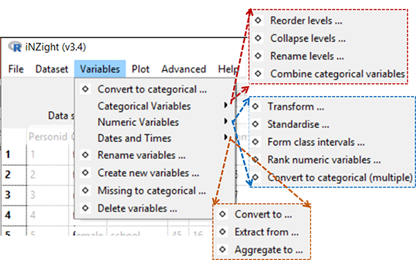
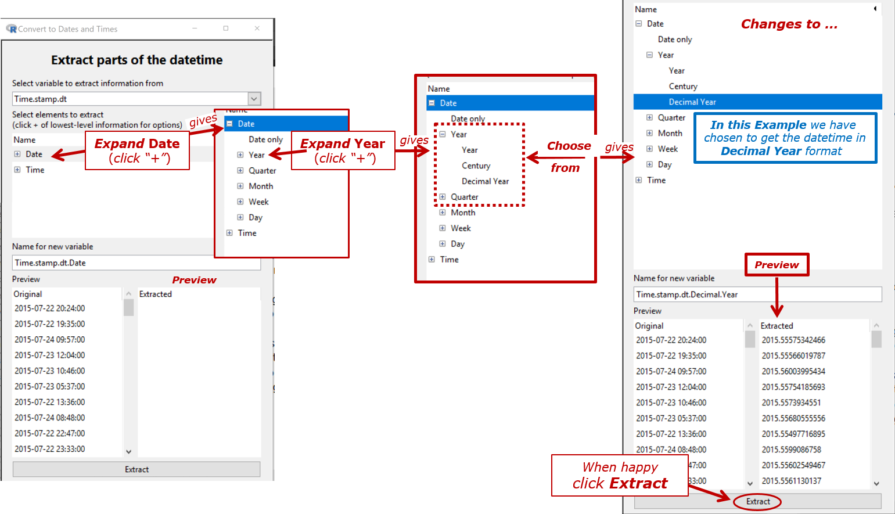
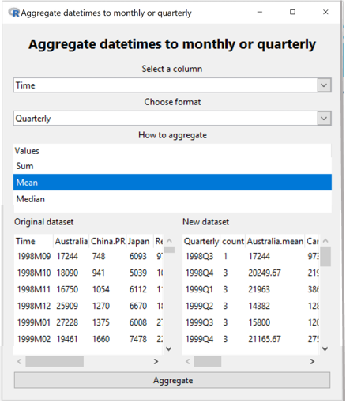

# Variables Menu
(_Called __'Manipulate Variables'__ in iNZight Lite  
Convert variables to new types, create new variables, and rename existing ones)_

__iNZight assumes that data sets are in rows = cases by columns = variables format.__ For example, the cases (also often called units) may be individual people and the columns = variables contain different types of "measures" on those people.

By default, if __all the values__ of a variable are __numbers__, then that variable will be treated as as a __numeric variable__.

If __any of the values__ contains even one __alphabetic character__, then (by default) the whole variable will be treated as a __categorical variable__ (i.e., one that gives group membership). The one exception is  the value `NA`, which is treated as a missing-value code in both numeric and categorical variables.

##Page Contents:
{.borderbox .fright .width600}
* [Convert to Categorical ...](#convert1)
* [Categorical Variables](#catvars)  
&emsp;&ensp;&bull; [Reorder Levels ...](#reorderlevs)   
&emsp;&ensp;&bull; [Collapse Levels ...](#collapse)   
&emsp;&ensp;&bull; [Rename Levels ...](#renamelevs)   
&emsp;&ensp;&bull; [Combine Categorical Variables ...](#catcombine)   
* [Numeric Variables](#numvars)  
&emsp;&ensp;&bull; [Transform Variables ...](#transform)   
&emsp;&ensp;&bull; [Standardise Variables ...](#standardize)   
&emsp;&ensp;&bull; [Form Class Intervals ...](#classints)   
&emsp;&ensp;&bull; [Rank Numerical Variables ...](#rank)   
&emsp;&ensp;&bull; [Convert to Categorical (Multiple) ...](#convert2)   
* [Dates and Times](#datetimes)  
&emsp;&ensp;&bull; [Convert to ...](#dtconvert)   
&emsp;&ensp;&bull; [Extract from ...](#dtextract)   
&emsp;&ensp;&bull; [Aggregate to ...](#dtaggregate) 
* [Rename variables ...](#renamevars)  
* [Create new variables ...](#create)  
* [Missing to categorical ...](#missingcat)  
* [Delete variables ...](#deletevars)  

## Convert to Categorical {#convert1}
Creates a categorical version of a numeric variable (for more sophisticated version see ...[Convert to Categorical (Multiple) ...](#convert2)).

## Categorical Variables     {#catvars}

### Reorder Levels {#reorderlevs}
{.borderbox .fright .width450}
By default, the levels of a categorical variable are displayed in alpha-numeric order. This enables you to change from the default order of display to something more natural; e.g. from {"adolescent", "adult", "child", "elder"} to {"child", "adolescent", "adult", "elder"}.

### Collapse Levels {#collapse}
Combine levels within a categorical parent variable to make a new variable with a smaller number of levels. (The levels of a categorical variable are the set of unique, or distinct, values it takes).

### Rename Levels {#renamelevs}
Change the names of the levels of a categorical variable, e.g. from (ages) {"< 12", "12-17", "18-69", "> 69"} to {"child", "adolescent", "adult", "elder"}.

### Combine Categorical Variables {#catcombine}
Take two categorical variables and create a new categorical variable whose levels are all combinations of those two (e.g., the combinations of ethnicity and gender).

## Numeric Variables       {#numvars}

### Transform Variables {#transform}
{.borderbox .fright .width500}
Creates a new variable that is a transformed version of the parent variable. Transformations available are `log` (base `e` or base 10), exponential, square, square root and reciprocal.

### Standardise Variables  {#standardize}
Create a __standardised__ version of a variable (or __z-score__) by subtracting the mean of the variable from each value and dividing by its standard deviation.

### Form Class Intervals {#classints}
Create a categorical variable whose levels are class intervals of a numeric variable.
For example, take `age` and create `age.f` with levels {"{0,20]", "(20,60]", "(60,110]"}.

### Rank Numerical Variables  {#rank}
Creates a new numeric variable containing the _rank_, or _order_ of the selected variable.
This is often used when the order of the values (but not the values themselves) is of interest.

For example, the variable `age = {15, 12, 19, 16}` would result in the new variable `age.rank = {2, 1, 4, 3}`.

### Convert to Categorical (Multiple) {#convert2}
This has the same result as the previous "Convert to Categorical" tool, however it allows users to convert multiple variables at once.

{.borderbox .fright .width400}
## Dates and Times {#datetimes}
* [Convert to ...](#dtconvert)  
* [Extract  from ...](#dtextract)  
* [Aggregate to ...](#dtaggregate)

   
   
   

#### {.clear}

### (Date-times) Convert to ... {#dtconvert}
Convert a variable to a standard dates and times (POSIXct) format and ___saves___ as a ___new variable___.
___
_In the example that follows_, Time.stamp _is a categorical variable that we wish to convert to a 
variable that iNZight recognises as a datetime variable._

{.borderbox .width800}

### (Date-times) Extract from ...  {#dtextract}

Creates a new variable by extracting specific component (e.g. data, year, time...) from a dates and times variable in a large variety of levels of detail and of format.  
* The pattern is to ___expand the option___ (click the "+") referring to the ___most detailed level of information___ you want in the result. The preview will show you what the result of your choice  will look like.

_In the example that follows_, Time.stamp.dt _is a categorical variable that we wish to convert to a 
variable that iNZight recognises as a datetime variable_ Timestamp.dt. _What we want to do is extract a new variable containing the Year and the decimal part of the Year ("Decimal Year")_ 

{.borderbox .width00}

{.borderbox .fright .width400}
### (Date-times) Aggregate over ...  {#dtaggregate}
Converts to   
* a ___weekly___ (_e.g. 2019 W7_), ___monthly___ (_e.g. 2019 M5_), ___quarterly___ (_e.g. 2019 Q3_) or ___yearly___ (_e.g. 2019_) variable in the form that the time series variable likes

and aggregates using ___sum___, ___mean___, or ___median___.

_In the Example_, `origintime` _is a date-time variable_ [thus, annotated `(t)` in View Variables] _and we have chosen to convert it to monthly_ (`yyyy Myy`) _with all of the values in the same month aggregated to their_ `mean`.

The `count` column shows how many values have been aggregated. If there are missing values present in a variable being aggregated, then another column of the form `variable.missing`. Missing values are ignored when aggregating.

   
   
   
   

_In the Example below a categorical variable in monthly_ (`yyyy Mzz`) _format is aggregated to quarterly (`yyyy Qz`)._
{.borderbox .fright .width400}

   
   
   
   
   
   
   
   
   
   
   

### Rename Variables {#renamevars}
Rename variables in the dataset. Especially useful for variables created by iNZight.
  

### Create New Variable {#create}
A very flexible facility for creating new variables from existing variables, essentially by doing arithmetic on them.
  
{.borderbox .fright .width400}
_Left-hand box_: desired name for new variable  
_Right-hand box_: any valid __R__ expression  

Examples
- `income = hours * payrate`
- `weight.diff = end.weight - begin.weight`
- `average.weight = ( begin.weight + endweight) / 2`

## Missing to Categorical {#missingcat}

- __Categorical variables__:
  Any missing observations for the variable we be given a new level, `missing`. All others remain the same.

- __Numeric variables__:
  The variable will be converted into a categorical variable with two levels: `missing` and `observed`.

## Delete Variables {#deletevars}
Delete variables from the dataset. Click variable names using the __Shift__ and __Control__ keys to choose multiple variables for deletion.

