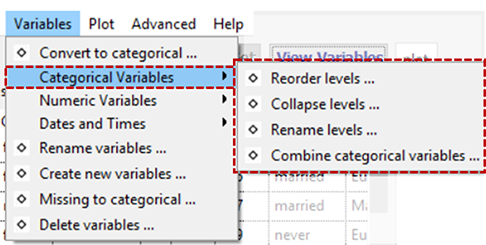
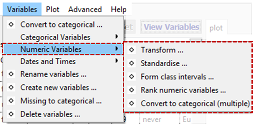
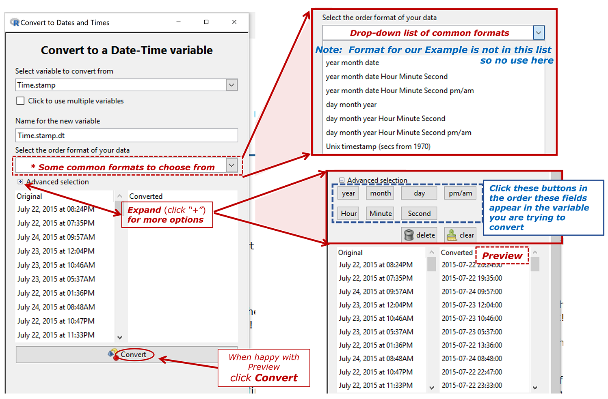

# Variables
_(Previously called __'Manipulate Variables'__)_

__iNZight assumes that data sets are in rows = cases by columns = variables format.__

For example, the cases (also often called units) may be individual people and the columns = variables contain different types of "measures" on those people.

By default, if __all the values__ of a variable are __numbers__, then that variable will be treated as as a __numeric variable__.

If __any of the values__ contains even one __alphabetic character__, then the whole variable will be treated as a __categorical variable__ (i.e., one that gives group membership). The one exception is  the value `NA`, which is treated as a missing-value code in both numeric and categorical variables.

{.borderbox}

Type-specific submenus: [Categorical Variables](#catvars), [Numeric Variables](#numvars), [Dates and Times](#datetimes)

### Convert to Categorical

Creates a categorical version of a numeric variable.

### Rename Variables

Rename variables in the dataset. Especially useful for variables created by iNZight.

### Create New Variable

A very flexible facility for creating new variables from existing variables, essentially by doing arithmetic on them.

For example,
- `income = hours * payrate`
- `weight.diff = end.weight - begin.weight`
- `average.weight = ( begin.weight + endweight) / 2`

This new variable can take any valid __R__ expression.

### Missing to Categorical

- __Categorical variables__:
  Any missing observations for the variable we be given a new level, `missing`. All others remain the same.

- __Numeric variables__:
  The variable will be converted into a categorical variable with two levels: `missing` and `observed`.

### Reshape Dataset

For use with data concerning a single variable in which different columns correspond to the measurements from different groups. Such data will be converted into the standard cases by variables format (example given in __Reshape Dataset__'s dialog window).

### Delete Variables

Delete variables from the dataset.

## Categorical Variables     {#catvars}
{.borderbox}

### Reorder Levels

By default, the levels of a categorical variable are displayed in alpha-numeric order. This enables you to change from the default order of display to something more natural; e.g. from {"adolescent", "adult", "child", "elder"} to {"child", "adolescent", "adult", "elder"}.

### Collapse Levels

Combine levels within a categorical parent variable to make a new variable with a smaller number of levels. (The levels of a categorical variable are the set of unique, or distinct, values it takes).

### Rename Levels

Change the names of the levels of a categorical variable, e.g. from (ages) {"< 12", "12-17", "18-69", "> 69"} to {"child", "adolescent", "adult", "elder"}.

### Combine Categorical Variables

Take two categorical variables and create a new categorical variable whose levels are all combinations of those two (e.g., the combinations of ethnicity and gender).

## Numeric Variables       {#numvars}
{.borderbox}

### Transform Variables

Creates a new variable that is a transformed version of the parent variable. Transformations available are `log` (base `e` or base 10), exponential, square, square root and reciprocal.

### Standardise Variables

Create a __standardised__ version of a variable (or __z-score__) by subtracting the mean of the variable from each value and dividing by its standard deviation.

### Form Class Intervals

Create a categorical variable whose levels are class intervals of a numeric variable.

For example, take `age` and create `age.f` with levels {"{0,20]", "(20,60]", "(60,110]"}.

### Rank Numerical Variables

Creates a new numeric variable containing the _rank_, or _order_ of the selected variable.
This is often used when the order of the values (but not the values themselves) is of interest.

For example, the variable `age = {15, 12, 19, 16}` would result in the new variable `age.rank = {2, 1, 4, 3}`.

### Convert to Categorical (Multiple)

This works the same as the previous "Convert to Categorical" tool, however it allows users to convert multiple variables at once.

## Dates and Times {#datetimes}
{.borderbox}

### Convert to ... {#dtconvert}
Convert a variable to a standard dates and times (POSIXct) format and ___saves___ as a ___new variable___.
___
_In the example that follows_, Time.stamp _is a categorical variable that we wish to convert to a 
variable that iNZight recognises as a datetime variable._

{.borderbox}

### Extract from ...  {#dtextract}

Creates a new variable by extracting specific component (e.g. data, year, time...) from a dates and times variable in a large variety of levels of detail and of format.  
* The pattern is to ___expand the option___ (click the "+") referring to the ___most detailed level of information___ you want in the result. The preview will show you what the result of your choice  will look like.

_In the example that follows_, Time.stamp.dt _is a categorical variable that we wish to convert to a 
variable that iNZight recognises as a datetime variable_ Timestamp.dt. _Whaty we want to do is extract a new variable containing the Year and the decimal part of the Year ("Decimal Year")_ 

{.borderbox}

### Aggregate to ...  {#dtaggregate}

Creates a categorical variable by aggregating a single times series variable to a weekly, monthly, quarterly or yearly time series variable.
